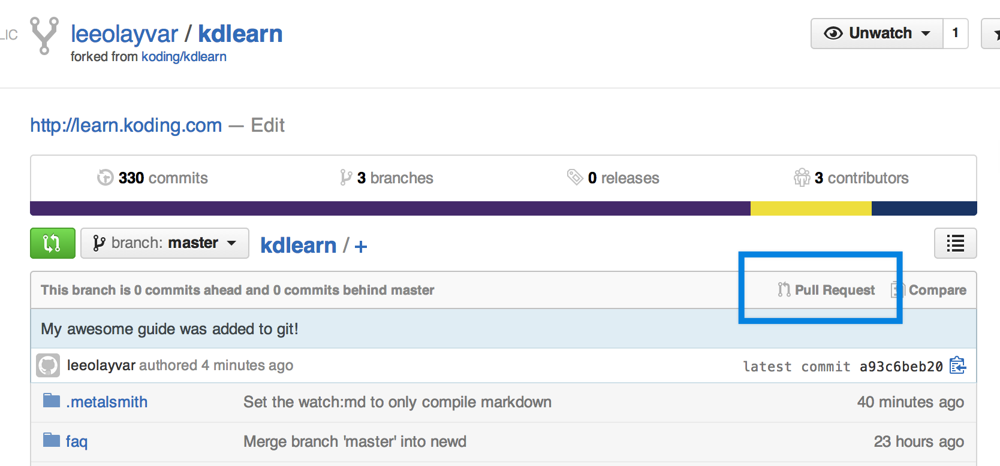

# Advanced


## Forking and Cloning

First up, we should cover the requirements.

1. A [Koding][kodingreg] Account
2. A [Github][github] Account
3. Git *(Comes with your Koding VM)*
4. SSH Key on Github. If you're not familiar with this, refer to [this 
tutorial][githubssh]

Next, we need to "Fork" the [KDLearn Repo][repo]. This will create your own 
version of the repo on Github, and lets you push your changes to this repo.

To do this, press the Fork button seen in the following image, from the 
[KDLearn repo][repo] page:


This will create a new Github repository with the name 
`github.com/yourUsername/kdlearn`. The purpose of this forked repository will 
become clear once we make our Pull Request.

Next, we will want to clone our newly forked repository. Head on over to your 
[Koding Terminal][terminal] and type in the following command:

```
git clone https://github.com/yourUsername/kdlearn.git
```

This will clone your Forked Repository to your Koding VM, into the folder 
`kdlearn`.


## Writing a new Guide

Now that we have our repo cloned, lets add our guide. Open up the [Ace 
editor][ace] and open a folder titled `kdlearn`. In this section we're going to 
write a guide, but if you just want to edit another guide, scroll down to the 
[edit](#editing-a-guide) section.

Lets create a file in the **guides** folder with the name `myguide.md`.  Name 
the file whatever you like, just try to keep it short and url friendly.


This is where we will write all of our content, in Markdown. For this tutorial 
i am just going to use the following text:

```markdown
# Awesome Guide

This is my **awesome** guide! Follow along, and learn to be awesome!

Lorem ipsum dolor sit amet, consectetur adipiscing elit. Suspendisse dui nulla, 
posuere non urna in, lobortis malesuada erat. Morbi ultricies fringilla 
condimentum. Aliquam vel sodales mi, ornare ullamcorper est. Nulla laoreet 
dapibus libero, in consectetur dolor fermentum vel. Etiam quis magna eget orci 
fringilla tincidunt et non justo. Phasellus porta dictum libero. Suspendisse 
fringilla gravida arcu, eu venenatis nunc fermentum sed. Phasellus est libero, 
auctor ac dignissim ac, consequat a libero. Pellentesque iaculis sem tortor.  
Suspendisse viverra, arcu ac viverra dapibus, massa odio adipiscing neque, eget 
adipiscing magna quam id dui. Morbi semper nisi ac accumsan tincidunt.
```

Now that we have written our guide, we need to add some metadata to it.


## Metadata

Metadata is, as the name says, data about our data. This is where you can 
specify the title of your document, the author, the date, and categories. Lets 
take a look at our above markdown with some of this metadata.

```markdown
---
author: Lee Olayvar
username: leeolayvar
date: 2014-06-11
description: 'My awesome guide, about awesome stuff.'
categories: [awesome]
---

# Awesome Guide

This is my **awesome** guide! Follow along, and learn to be awesome!

Lorem ipsum dolor sit amet, consectetur adipiscing elit. Suspendisse dui nulla, 
posuere non urna in, lobortis malesuada erat. Morbi ultricies fringilla 
condimentum. Aliquam vel sodales mi, ornare ullamcorper est. Nulla laoreet 
dapibus libero, in consectetur dolor fermentum vel. Etiam quis magna eget orci 
fringilla tincidunt et non justo. Phasellus porta dictum libero. Suspendisse 
fringilla gravida arcu, eu venenatis nunc fermentum sed. Phasellus est libero, 
auctor ac dignissim ac, consequat a libero. Pellentesque iaculis sem tortor.  
Suspendisse viverra, arcu ac viverra dapibus, massa odio adipiscing neque, eget 
adipiscing magna quam id dui. Morbi semper nisi ac accumsan tincidunt.
```

Most of that is pretty logical. The `---` before and after signifies the 
metadata start and end, and `author`, `date`, `description`, and `categories` 
should be standard nomenclature to you.


## Editing a Guide

If you're just looking to update a guide, fix typos, or make general 
improvements you have it even easier.

Just like before, open up [Ace][ace] and find the file you want to edit. If 
you're not sure where the proper markdown is located, find the url of the page 
you want to edit and think of them like folders. Then, review the [File 
Structre](#file-structure) section and you should have a pretty good idea where 
the files are located.

Make your edits, and follow onto the next section!


## Adding, Committing, Pushing

Now that we have made our changes, whether it's a new guide or an edited guide, 
we need to add the file, commit it, and push it to our repo. Open up the 
[Terminal][terminal] one last time.

To add your changes, run:
```
git add guides/myguide.md
```
Replacing `myguide` with the files you changed.

To commit your changes, run:
```
git commit -m "I added an awesome guide"
```
Replacing `I added an awesome guide` with a message that clearly describes your 
changes. You can also ommit the whole `-m "message"` flag and use an editor 
such as Nano or Vim to make your changes. But the above is more simple, for 
this guide.

And finally, lets push our changes to our repo on Github.
```
git push origin master
```

If you're not familiar with Git at all, run each of these commands in sequence.  
We won't be covering Git in full, so for more information please see the 
official documentation.


## Making a Pull Request

Now that you pushed to Github you can visit your forked Github repository and 
make a pull request. To do this, look for the "Pull Request" button on your 
forked repo:



This will take you to a page where you can review all of the commits you made, 
and ensure that you want to make a pull request. Please review your changes for 
typos, spelling, and grammar.

If you spot an issue, and need to make more changes, go back to 
[Koding][ace] and make the edits you need. Make sure to add, commit, and 
push them just like before.

If you're happy with your changes, press the big green **Create Pull Request** 
button.


## Waiting for your PR to be Accepted

Once your PR is made, you're done! The Koding Team will review your edits or 
new guides and make feedback.

If we need you to make corrections, formatting or otherwise, go through the 
same steps as before. Your changes, once pushed to Github, will automatically 
be reflected in your Pull Request.

Once they are accepted, and your pull request is merged, the site will be 
updated and you're changes will be live. Thanks for your contribution!


[repo]:              https://github.com/koding/kdlearn
[contributeonrepo]:  https://github.com/koding/kdlearn/blob/master/contribute.md
[kodingreg]:         https://koding.com/Register
[github]:            https://github.com
[githubssh]:         https://help.github.com/articles/generating-ssh-keys
[terminal]:          https://koding.com/Terminal
[ace]:               https://koding.com/Ace
