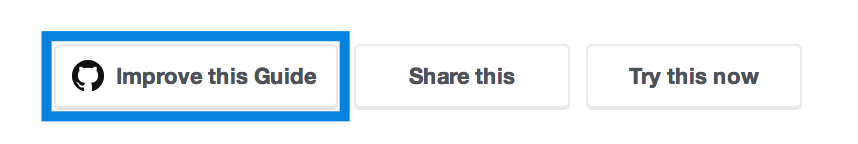
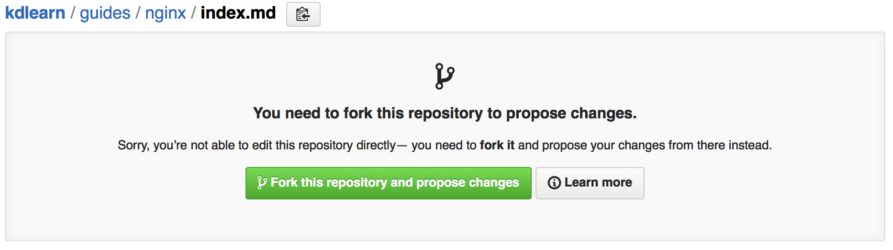
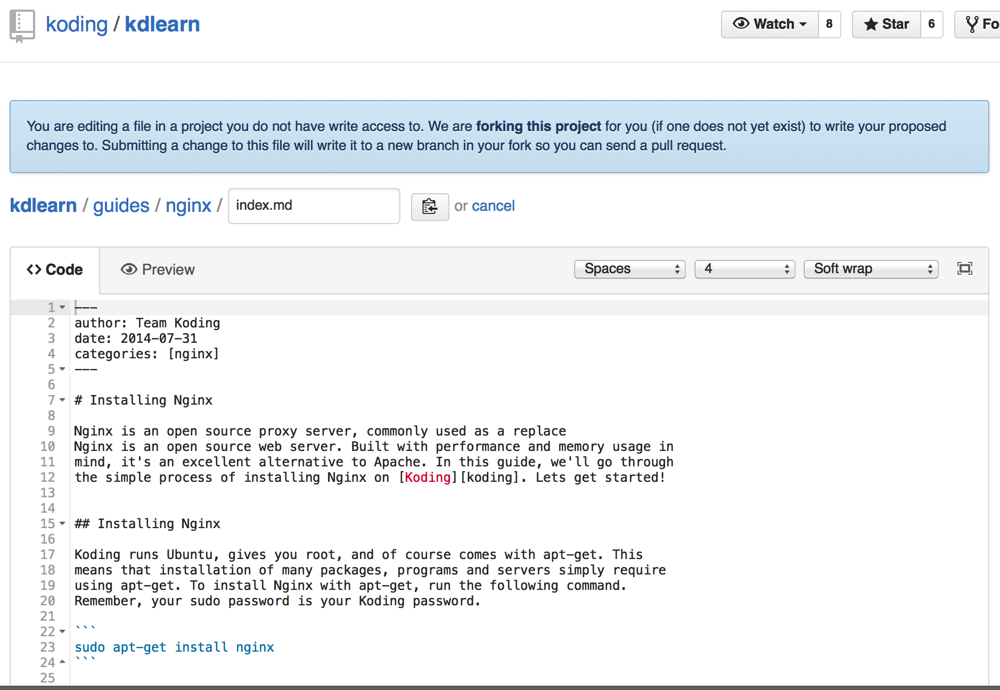
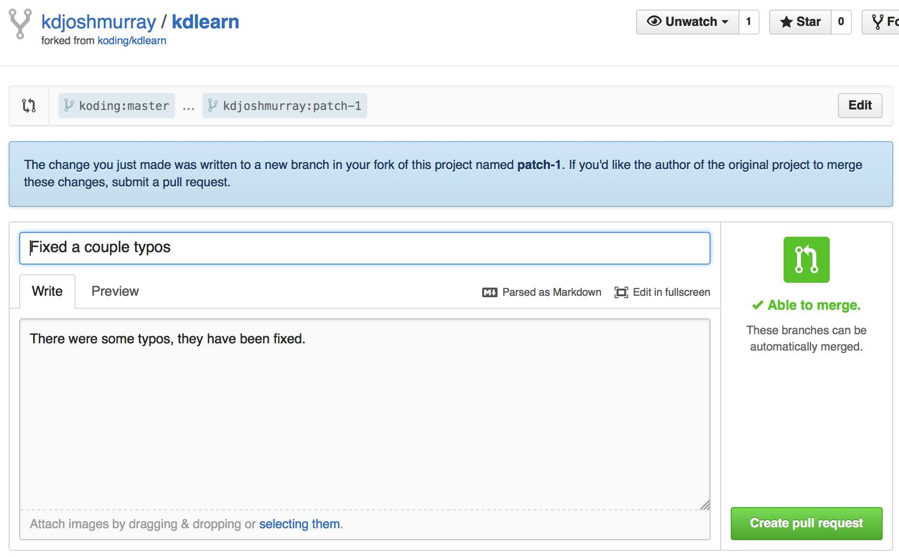
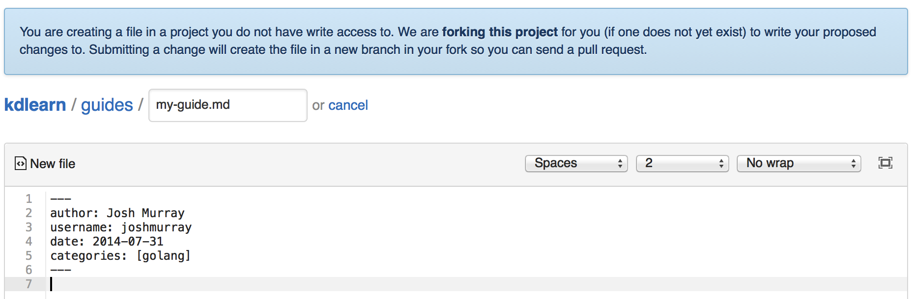

# Basic

In this guide we'll go over how to contribute to the Koding University 
the easy way. We'll be using Github's built in editor, to make the 
forking & merging process easy. If you're unfamiliar with Git, but you 
still want to contribute to Learn, this is the guide for you. So, lets 
get started!

## Edit on Github

Each Koding guide comes with a simple "Edit this on Github" link. This 
link directs you back to a file editor on Github. Github will 
automatically fork the repo if you have not yet, and even create a branch 
so that your eventual pull request does not cause any unintended 
contributions. Lets look at how this works.

First up, find the guide that you want to edit, and look for the 
**Improve this Guide** button at the bottom of all guides.



## Fork the Repository

If you have not contributed before you likely do not have the repository 
forked yet. Press the green button seen below, and Github will fork the 
repository for you.



## Make your Edits

After forking, or if you already had Koding University Forked, you'll be 
presented with a text editor for the guide that you chose to edit. From 
here, look through the guide and make your edits as you desire.



Don't forget that there is a preview tab as well. The guide will look 
slightly different on Github than on Koding University; but because 
everything is formatted in Markdown you can preview it Github to ensure 
the correctness of your markdown syntax.

## Propose File Changes

After you have made your edits to the document, scroll down and enter a 
title and description for the edits you've made. After you're satisfied, 
press **Propose file change**.


This will create a new branch of your Fork and store your changes into 
that branch. To repeat, your changes have been added to your **Fork**, 
not to the official Koding University repository yet. To do that, you 
need to create a Pull Request.

## Create Pull Request

A pull request lets Koding Staff review and merge your changes into the 
official repository. To do that, after proposing your file changes you 
will see a page like the one below.



This is your branch, on your forked repository. If you press the **Create 
Pull Request** button, your changes in that branch will be sent to the 
official repository to be reviewed and merged in.

This is it! You've gone from the guide on University, to editing it and 
submitting your changes for review, all without leaving your browser or 
using any complex Git commands.

## Creating a New Guide

The above process is nice and simple, but there's one core thing missing. 
We didn't *create* a guide, we only edited a guide. What if we want to 
create a new guide? Luckily this Basic workflow also works with new 
guides! Lets go over that real quick.

First, [click here][newguide]. That link will send you to the Github 
editor with no file loaded. You can write in the editor, add a file name, 
and propose changes just like the above instructions. Remember to name 
your file with the `.md` extension, and adhere to the 
[Guidelines][guidelines].

Because you're creating a new file though, you want to make sure and add 
the proper *metadata* to the file. Copy the following code, and place it 
into the editor.

```yaml
---
author: Your Name
username: yourUsername
date: 2014-07-31
categories: [nginx]
---
```

Fill in `Your Name` with your name, and `yourUsername` with your *Koding* 
Username. The date field should be formatted in `YYYY-MM-DD` format, and 
the `categories` list is just a comma separated list of strings.



Once that's all taken care of, start writing your guide! Once you're 
done, follow the Propose and Pull Request instructions above, as they are 
identical.

You should note that with this method, you cannot add images to the 
repository. For that to work, have a look at the next section which uses 
Koding's Editor and Git to make changes to this Koding University.


[newguide]: https://github.com/koding/kdlearn/new/master/guides
[guidelines]: ../guidelines
