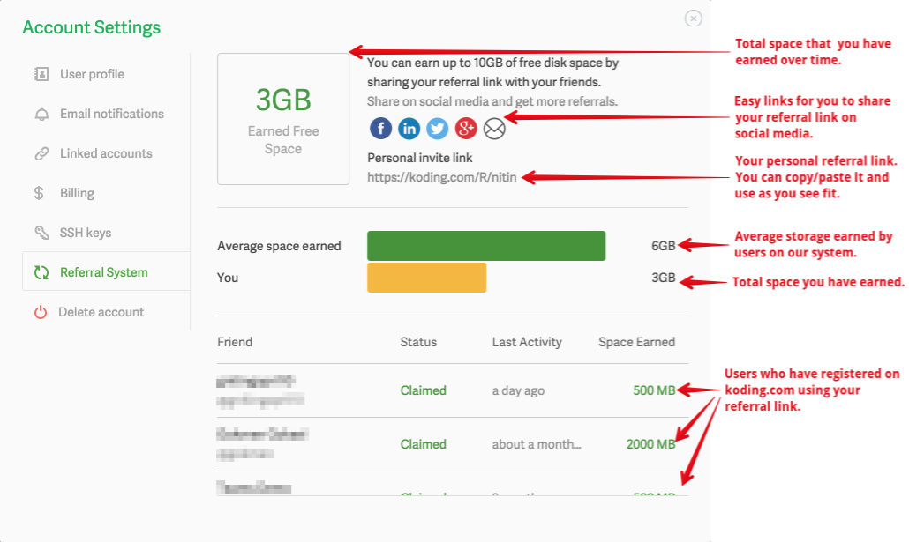

### Earning free referral space
You can earn up to 500MB per referral on Koding. Earning referrals is as easy as
inviting your friends, colleagues, classmates, students, etc. to join Koding! 

To get started, head over to [Account Settings](https://koding.com/Account/Referral) and
grab your personalized referral link (see location details in the graphic below). 
You can then use the easy to use social media share buttons to distribute your personal
referral link or send/share the link directly via your preferred distribution method.

Each **new** user who signs up and verifies a Koding account earns you 500MB in extra
storage space! Your friend also gets an extra 500MB. It's a win-win!

**Note:** The maximum storage that can be earned via referrals is 7GB (or 14 referrals) which
means you can grow the storage of your free Koding account to 10GB (3GB default + 7GB earned
through referrals). Referrals can be earned by paid or free accounts. The maximum earned storage
limit is the same for both types.

> type:tip
> The section below outlines how you can redeem space once you have earned it. Please
> note that redemption can only happen in multiples of whole number GBs. Read more below.

### Redeeeming your earned referral storage
If you have earned extra stroage space on your Koding account as a result of referrals
or other offers we've made available to our users, then reclaiming that earned space
is now easier than ever.

> type:warning
> Before we proceed, please note that referral space can only be claimed in increments of
> whole number GBs. That means if you have referred one person and earned 500MB (0.5GB) then
> you will need to wait until another person signs up using your referral link so that you get to a 
> whole number (1GB) of earned space which can then be redeemed by following the process
> outlined below.

To add earned space to your VM, head over to VM settings and click the plus sign located
next to the disk size indicator (as shown in the image below).

Once you click the plus sign, you will be shown a modal that will allow you to resize 
your existing disk and add all or some of your earned storage.

> type:error
> If you feel there's an error in your reported earned storage space, please [send us a note](mailto:support@koding.com).
