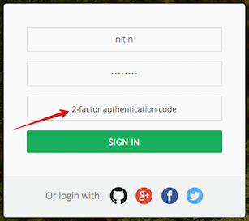
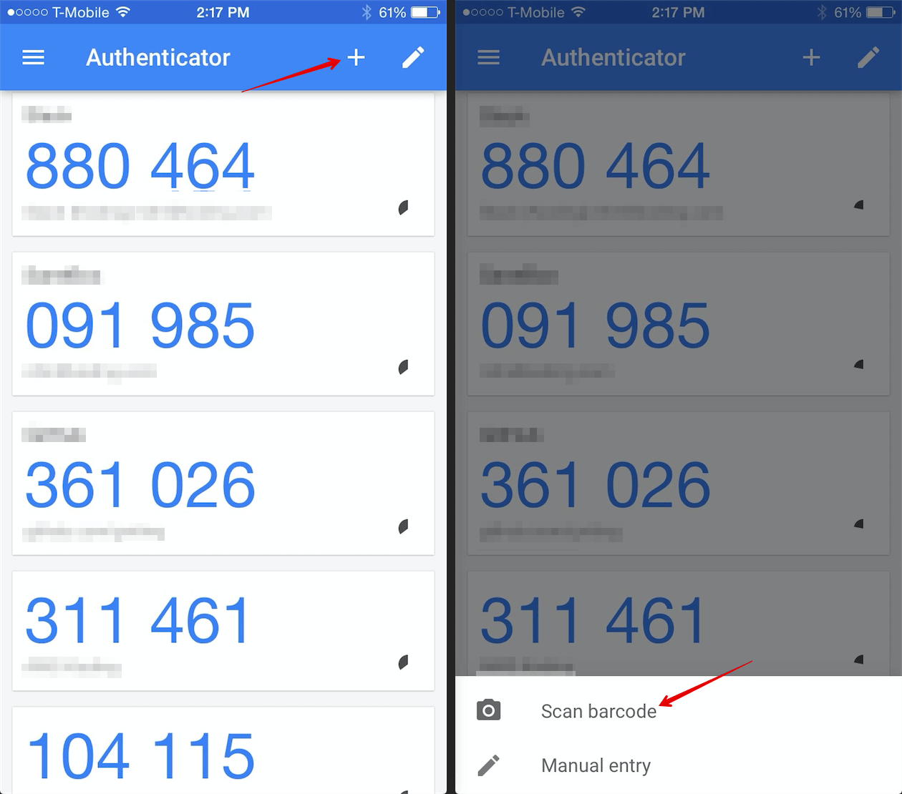

2-factor authentication (2FA) gives your Koding account an added layer of security and protection. Once enabled,
you will be required to provide a verification code along with your password each time you sign in to Koding.

2FA is increasingly become a required standard and many of the leading companies in the world [now support](https://twofactorauth.org/) 2FA.

### How do I enable 2FA on my Koding account?
To enable 2FA, you will first need to install the Google Authenticator app on your mobile device.
1. [Download for iPhone](https://itunes.apple.com/us/app/google-authenticator/id388497605?mt=8)
2. [Download for Android](https://play.google.com/store/apps/details?id=com.google.android.apps.authenticator2)

Once you have installed the app, follow these steps to enable 2FA on your Koding account.
1. Log in to your Koding account
2. Go to the 2FA section in [Account Settings](https://koding.com/Account/TwoFactorAuth)
3. Open up the Google Authenticator app on your phone and click the + icon (as shown in the image below)
4. Select "Scan Barcode"
5. Scan the code shown in the Account Settings
6. The Google Authenticator app will add your Koding account to the list and generate a code
7. Enter the code into Account Settings to verify and activate 2FA

### How do I diable 2FA on my Koding account?
To disable 2FA, follow these simple steps:
1. visit the 2FA tab in [Account Settings](https://koding.com/Account/TwoFactorAuth)
2. enter your Koding password and click the "Disable" button
