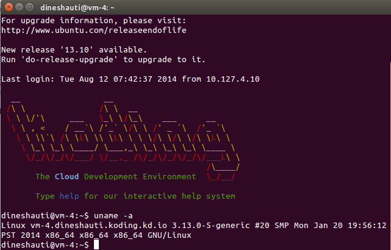

The VM’s that are provided by Koding are 64-bit. Almost all the applications work on this. But there are some apps that are available only in 32-bit versions. In order to make them work we need to install the 32-bit libraries separately.

To know the version of Ubuntu you have installed type the below command

```
uname -a
```
It will show you something like this



See that x86_64 --> Its 64-bit

I have written a post on how to install a 32-bit app on 64-bit Ubuntu. I tried that same procedure here … but it failed due to some error related to Koding’s Mirror. So I had to figure out something to work it out. With some Q & A on Koding .. found out that I can change the default Mirrors. So here is how I did it

*NOTE : Here I am assuming that you have Ubuntu installed on your Home PC or laptop.*


#### 1. Get the Default Ubuntu Mirrors

Navigate to the sources.list on your PC or Laptop and copy it’s content

```
sudo nano /etc/apt/sources.list
```
This will open the sources.list in a editor

### 2. Replace Koding’s Default Mirror

Now login into Koding’s terminal. Navigate to sources.list. Comment out the default Mirror’s (So that you can revert back). Paste the content that we copied in step 1. Press Ctrl + X. Say yes .. by pressing Y. & then press Enter.

```
sudo nano /etc/apt/sources.list
```

###  3. Update

Enter the following command

```
sudo apt-get update
```
That’s it you are ready to go. Here’s the tutorial to install Eagle CAD. Enjoy :-)