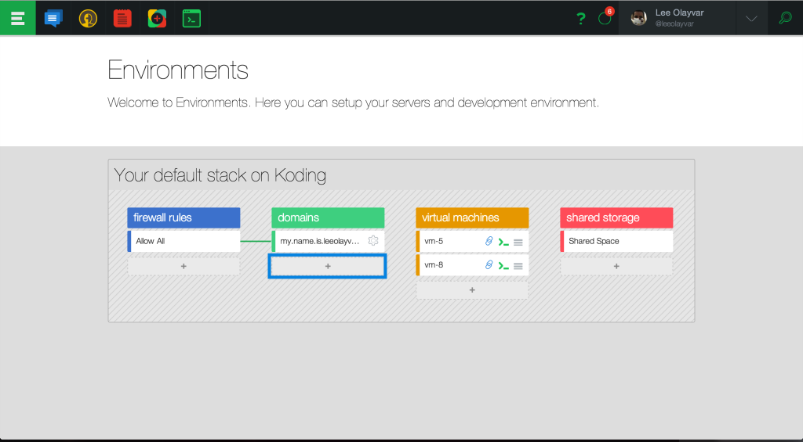
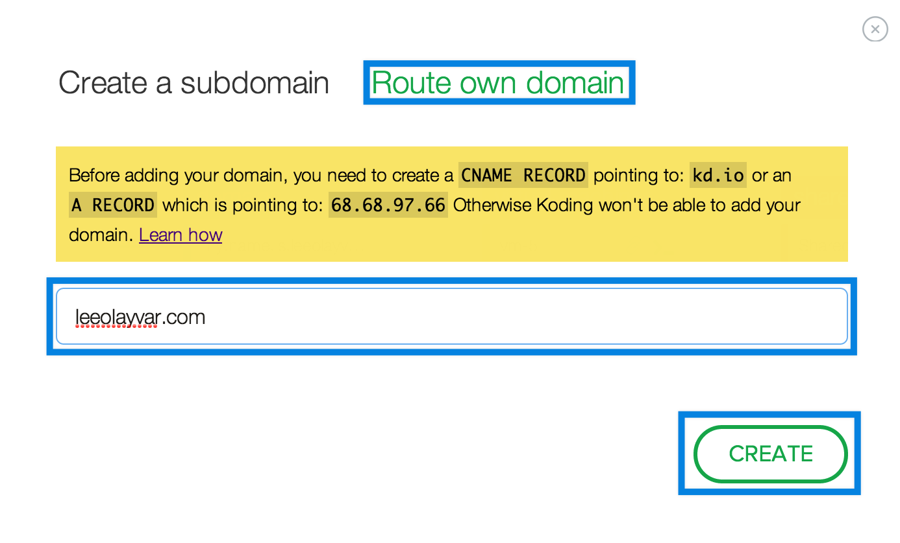
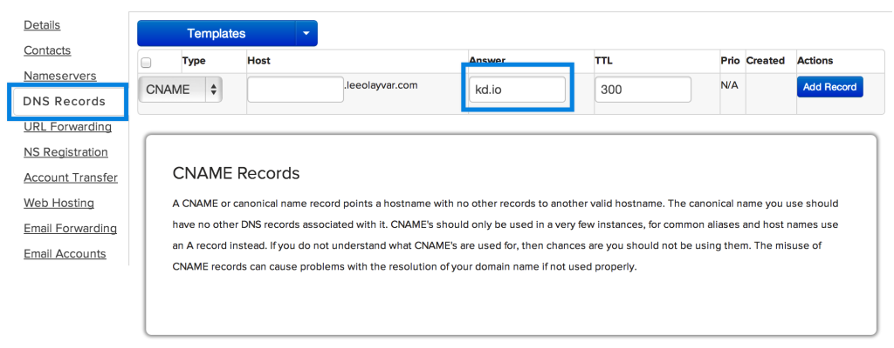

# Add CNAME records to your domain

  Mapping your own domains to Koding is now possible, and very easy. In this 
article, we'll go over this simple process.  

  1. First, navigate to your **Environments** page, located here: <https://koding.com/Environments>
  2. Next, click on the **Domain Plus button**, highlighted in this 
  image:
  3. Next, click on "**Route own domain**".
  4. If you want to create an **A RECORD**, copy the **IP** located in the 
  yellow box, as seen in this image: 
  5. Next, navigate to your **Domain Registrar**. In this demo, we're using Name.com, but any domain provider you choose will work with Koding, as long as they support custom **CNAME / A Records**.
  6. Once at your registrar, create a **CNAME**, or **A Record**, for your domain.
  7. If you want a **A Record**, set the Record value to the IP you copied from the yellow box on Koding.
  8. If you want a **CNAME** Record, type kd.io in the Record value. As an 
  example, the following image shows a filled out **CNAME** record: 

  9. Now save your Record on your domain, and on Koding, click the **Create** button.
  10. After that, drag your Domain, onto your VM.
That's it! Now visit your domain, and you should see your Koding VM.
