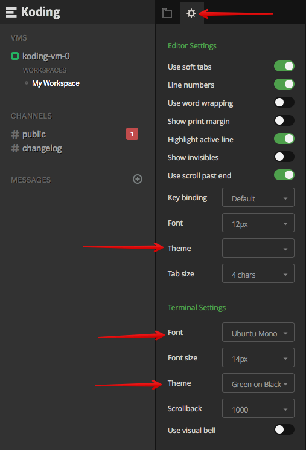

# Changing your IDE and Terminal themes

Changing your IDE and Terminal theme is very easy. Not everyone likes the default colors
and fonts so we've put together a slew of choices for you to pick from.

To get started, simply head over to your IDE settings panel (as shown in the image below)
and select the IDE and Terminal theme that suits you best. As you select a new theme, the
theme color scheme and font should reflect in the editor and Terminal in real time.

Enjoy your new theme!

