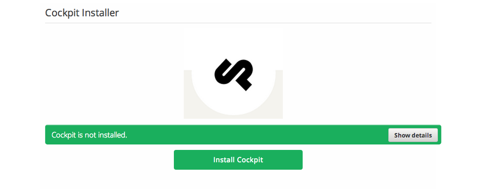
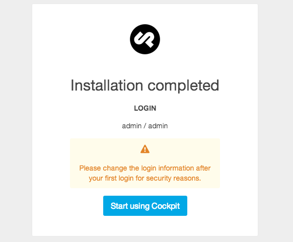
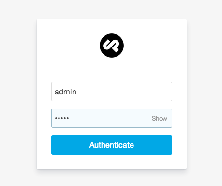
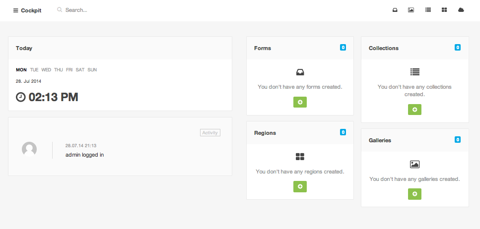

# DRAFT 3 Easy Steps to Setup Cockpit on Koding

**What is Cockpit?** 
Cockpit was born out of the need of building a simple dynamic site. Sure, Wordpress, Joomla, Drupal and all the other full-stack content management systems are possible solutions for that task ... but let's be honest, often they are just too bloated and too time consuming to setup, maintain and too complex implementing custom functionality. Cockpits goal is to be simple, but yet powerful and designed in that way that you can spend less time trying to squeeze your site into a theme or template.

Don't waste time on setting up a cms. You need a backup? Just zip your project folder or better, combine it with versioning systems like Git. Let Cockpit manage the content, implement and reuse the content the way you want. Everything is more stress free, everything is just more simple.

___

Getting started with Cockpit on [**Koding**](https://koding.com) is as simple as following these 3 steps!

**Step 1: **
Run the **[Cockpit Installer App](https://koding.com/Cockpit)**, which will install Cockpit and its dependencies on your VM. [Note: you have to be 
logged into your [Koding account](https://koding.com/Login) in order to run the app.]

This is what you'll see when you launch the app:

___

**Step 2: **
Once your installation is complete, a link will appear. Click on the link and you will be brought here:

___

**Step 3: **
Next, you'll be asked to enter a username and password. Enter **admin** for both and click **Authenticate**: 

___
That's it! Start using Cockpit!

