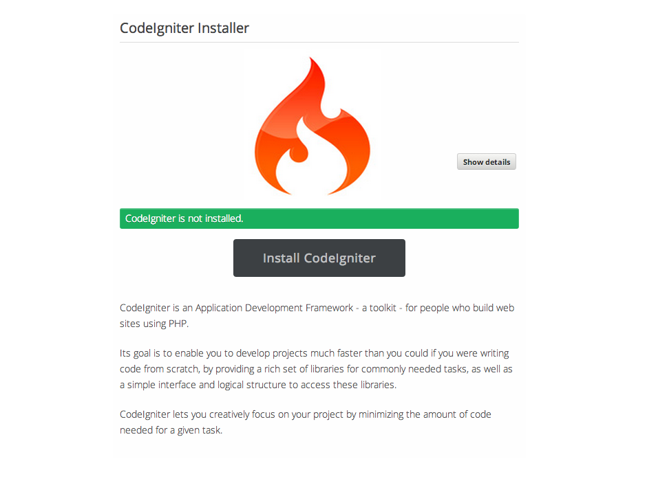
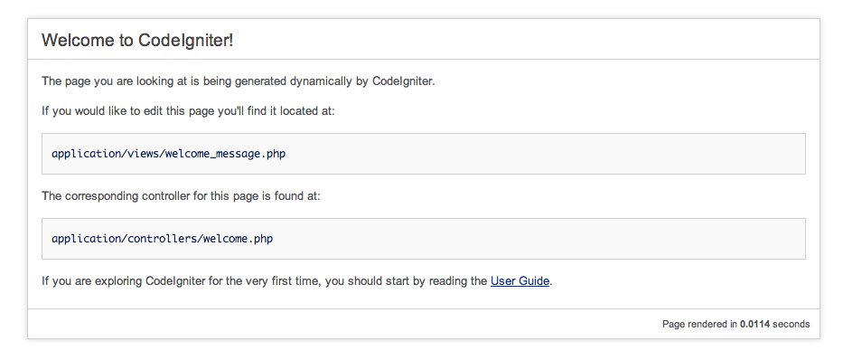

# DRAFT CodeIgniter Guide

To install CodeIgniter on Koding, run the **[CodeIgniter Installer App](https://koding.com/Codeigniter)**. [Note: you have to be 
logged into your [Koding account](https://koding.com/Login) in order to run the app.]
___

This is what you'll see when you launch the app:
___

Once your installation is complete, this is what you should see when clicking on the presented link: 
___

