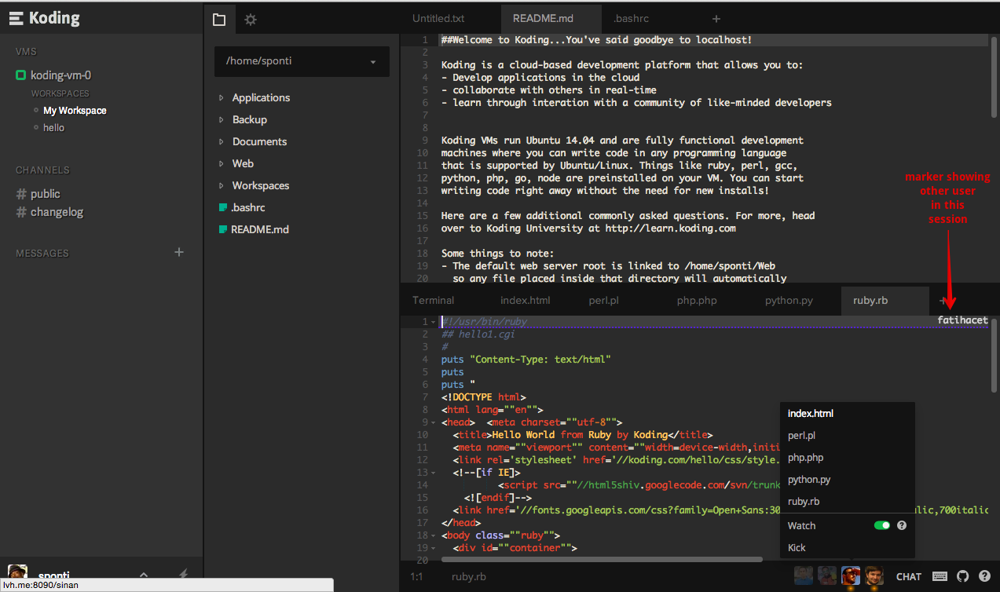
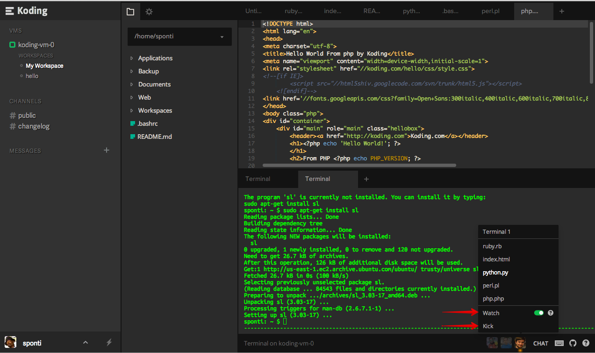

> type:alert
> This guide is not complete as the Collaboration feature is still under development. If you run into any
  issues while using it, please [let us know](mailto:support@koding.com).

### What is Collaboration?
Koding Collaboration allows you to easily and effectively collaborate and share resources with your
team, students, peers or friends. When you enable Collaboration, you are effectively sharing your
virtual machine (VM) with those whom you invite into the sharing session. The session remains active
until you hit "End Session". Every person you share a session with requires a Koding account (free or paid).

> type:alert
> Since the user(s) with whom you share your session have access to all the files on your VM, make sure that you are sharing with people that you know.

### What can I share?
When you collaborate with someone, you can give them full access to your VM. This means that an invited
user can view/edit files and directories on your VM.

Besides file sharing, you can also share your IDE, Terminal and your Drawing board. When you start a
sharing session, the contents of your entire workspace are shared. This includes any existing open IDE
or Terminal tabs or any new one's that you open during the sharing session.

During an active Collaboration session, anything typed by any user in the sharing session is automatically
reflected on the screens of the other users in the same session. If you have ever worked on a shared
Google doc with realtime editing, this should feel very natural in comparison to that experience.

### What can I use Collaboration for?
Collaboration is great for things like:
1. Collaborative programming
2. Interviews
3. Teaching
4. Bug hunting/fixing
5. Doing client work (with the client)

Since Koding Collaboration allows you to share your Terminal as well, it's great for those times when
you are stuck with that shell script and need someone to take a peek. Koding Collaboration also
allows you to share a white-board for all those times when a picture is just needed.

### What does "Watch" mode mean?
Watch mode, the default mode, shares your workspace and everyone in that session gets a replica of your
workspace on their screen. So if you open file tabs, new Terminals tabs and even switch tabs, other
sessions participants see it all and their screens also update in real time with these actions.

When a session participant chooses to "unwatch" your session, it means they are free to do what they
want on their end of the collaborative session without having to be distracted by the host changing
files or opening new tabs. This is very useful when you want to work on a few different files and
the users in the session can open files independently on the VM shared by the host yet not distract
each other. This is a bit confusing at first but then you'll wonder how else would Collaboration
ever happen!

### What does "Kick" do?
This is available to the host if they want to remove someone from a shared session without ending
the session.

### Do sessions "auto-close"?
Generally, we recommend that you exit/close your sessions yourself. However, there are situations when
you cannot close/end your session (e.g. browser crash). In such cases, you have up to one (1) minute
to reconnect otherwise at the end of a minute, all sessions are auto-terminated.
