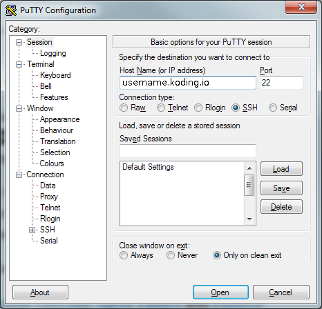
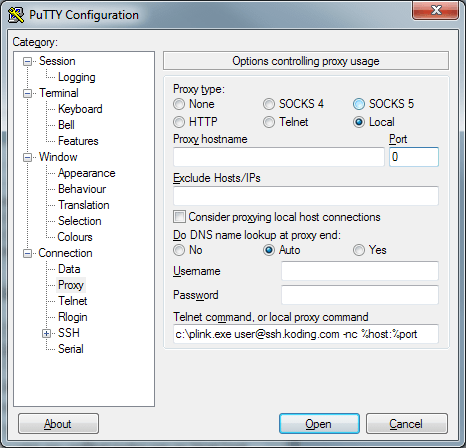
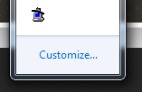
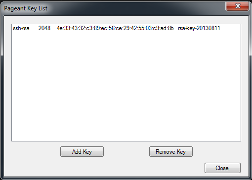
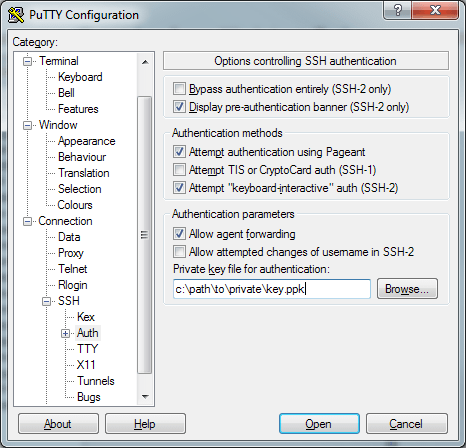

# Connect with SSH from Windows

Connecting to your VM with SSH will allow you to use another Terminal, outside
of Koding, to interact with your Koding VM. This is also required if you're interested in using [SSH Tunneling][tunneling]. If you're connecting from a Mac or Linux, have a look [here][connect-unix].

We are going to be connecting using PuTTY, and we are going to use the terminology "local" to represent the machine that you're connecting to Koding with.

> type:alert
> Note that PuTTY can be troublesome. You may want to consider [Cygwin][cygwin]
to easily connect with the [Unix instructions][connect-unix].

## Requirements

- Your [Koding][vmaddress] VM address
- [PuTTY][putty suite]
- A PuTTY Auth Key. If you need to generate one, please refer to
  [this][puttygen tutorial] tutorial.

## Connecting with PuTTY

For this connection method, you will need the [PuTTY SSH client suite][putty
suite] `putty.exe`, `plink.exe`, and `pageant.exe`.

> type:alert
> PuTTY has proven difficult to support due to the UI and ease of checking/configuring PuTTY incorrectly. With that said, we highly recommend using [Cygwin][cygwin], since it offers a real and normal Unix SSH Config.

* Copy the text contents of your PuTTY public key. If you are not sure what or where it is, please refer to the **Requirements** section of this guide.
* As in Step #2 of the Linux guide above, paste the entirety of your public key into the _SSH Keys_ section of your Koding account settings.
* Start up `putty.exe` and set the _Host Name (or IP address)_ to the
same VM address as above: `<username>.koding.io`



* In the _Category_ menu on the left, select _Data_ under _Connection_. Enter your Koding username in the _Auto-login username_ box.
* Select _Proxy_ under _Connection_, and change the _Proxy type_ to _Local_. Enter the following line (modified for your system) in the _Telnet command, or local proxy command_ box:

```
C:\your\path\to\plink.exe <username>@<username>.koding.io -nc %host:%port
```



* Go back up to the _"Session"_ settings and save this PuTTY configuration
to a new session by typing a name into the _"Saved Sessions"_ box, and
clicking on _"Save"_.
* In Step 7, we will cover setting up your Auth. This can be done two ways,
and we will cover both. **You only need to do one** method! Pageant has been
working for everyone, where as PuTTY-Auth has been a bit problematic but is
shorter. Choose whichever you like, but if you have issues, try Pagaent Auth
below.
* You’re done! You can now connect to Koding via PuTTY. To connect with
Pageant, you can right click the Pageant Icon, and under “Saved Sessions” click
on your Saved Session. This will automatically open up PuTTY and start
connecting.To connect from PuTTY itself, open PuTTY and select your Saved
Session from the list, then click Open.An example of a successful Koding
Connection is below.


## Pageant Auth

Open `pageant.exe`. It will launch into your Taskbar.



Right click the Pageant icon in the taskbar, and select _"View Keys"_. From there, click the _"Add Key"_ button. Navigate to your PuTTYGen **private** key and click _"Open"_. You should now have a key listed in your Pageant Key List. An example image is below.



If your key has been added to the Pageant Key List, close the window.

## PuTTY Auth

Reopen PuTTY and select your Session, then click Load. Next, under the
_Connection_ menu, open up the _SSH_ menu and select _Auth_. Enable the _Allow
agent forwarding_ checkbox. Under _Private key file for authentication_, browse
to your PuTTYGen private key.



Next, Plink needs to know the explicit location of your key. So go back to
_"Proxy"_ under _"Connection"_ and look for the _"Telnet command, or local
proxy command"_ box.  Currently, it should look like this:

```
C:\your\path\to\plink.exe <username>@<username>.koding.io -nc %host:%port
```

Modify it, by adding your private key location. So, it will look like this:

```
C:\your\path\to\plink.exe -i c:\path\to\private\key.ppk <username>@<username>.koding.io -nc %host:%port
```

## Important note

If you're having trouble SSH-ing into your VM, after pasting your SSH key in the box located in your Koding account settings, make sure there are **NO SPACES** in the key other than the one after `ssh-rsa` and one before your email address.

And that's it!

If you encounter any issues or have any questions please drop us an email [here](mailto:support@koding.com).

[koding]: https://koding.com
[putty suite]: http://www.chiark.greenend.org.uk/~sgtatham/putty/
[puttygen]: http://www.chiark.greenend.org.uk/~sgtatham/putty/download.html
[puttygen tutorial]: http://sshcontrol.com/help/puttygen_keys
[connect-unix]: /guides/ssh-into-your-vm
[cygwin]: https://www.cygwin.com/
[tunneling]: /guides/ssh-tunneling
[vmaddress]: /faq/vm-hostname/
