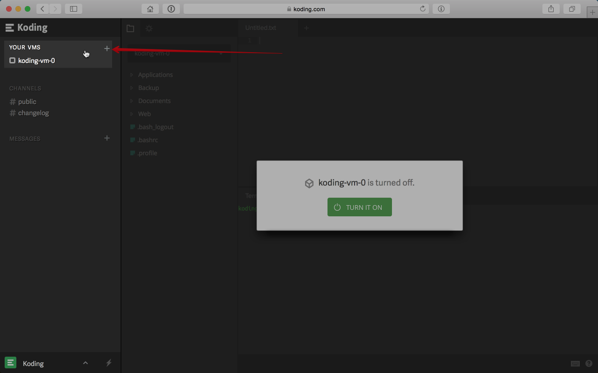
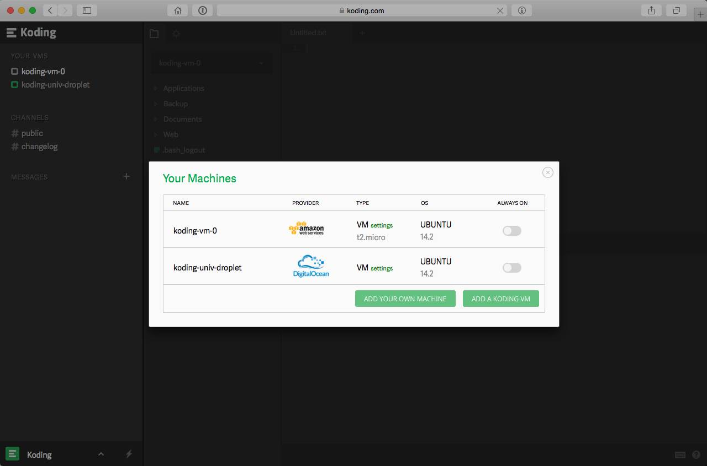
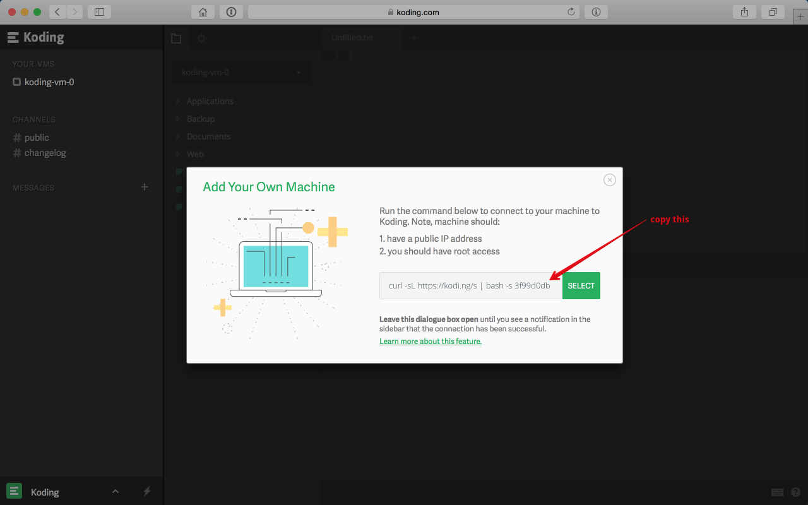
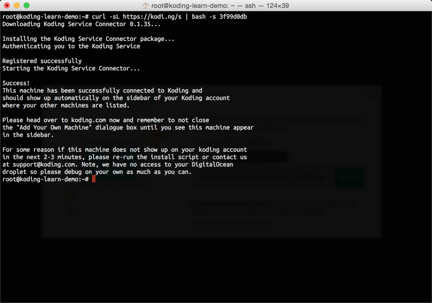
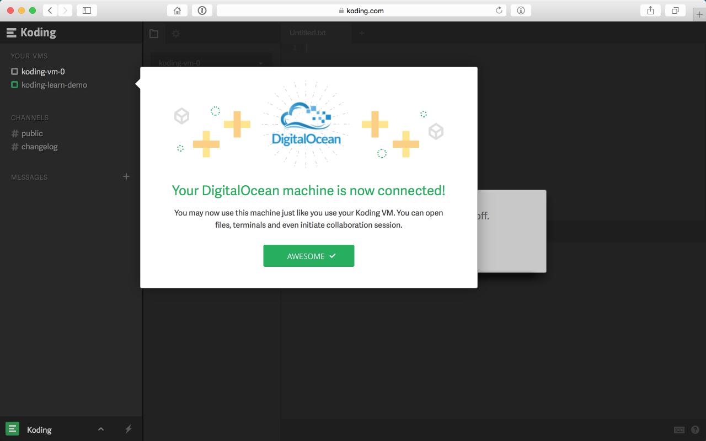

### What does "connect your own machine" mean?
This feature allows you to connect your own machine (physical or virtual) to your Koding account so that it will
show up in the sidebar just like a regular Koding VM. This means that once your machine is connected to Koding,
you can open a Terminal and any file on that machine directly from your Koding account! You can even start
[collaboration sessions](http://learn.koding.com/guides/collaboration/)!

### What types of machines can I connect to my Koding account?
Presently, the following are the requirements for any machine that can be connected to Koding:
1. the machine needs to have a public IP address
2. the machine must be running Ubuntu Linux 13 or above
3. you must have root/sudo access on the system

In addition to these machine related requirements, you must also ensure that you have the following
ports open (in case you are running a firewall):
1. 80/tcp
2. 22/tcp
3. 56789/tcp

### How does Koding make this happen?
The steps are outlined below but in a nutshell, what happens is that you download our "Koding Service Connector"
to your machine and this service acts like a "bridge" between your machine and your Koding account.

### How can I connect my own machine to Koding?
Connecting your machine to Koding is easy, just follow these steps but first make sure that the requirements
stated above are met:
1. Bring up the VMs list dialogue box as shown in the screen shot.


2. Click "Add Your Own VM"


3. In the dialogue box that appears, copy the install script and run it on your machine

> type:tip
> Leave the dialogue box open while you run the install script on your machine. This is a 
> requirement since we are "listening" for a connection from your machine. Also, make sure
> you have root access to run the install script otherwise it will fail.

4. The install script will download the necessary software, configure it and install it on your
machine.


5. Once the install script is done running on your machine, within a few seconds your machine
should show up in the sidebar.


### Are there any limits to how many machines I can connect?
Our free accounts are restricted to one external machine and paid accounts don't have any limits to the number
of machines/VMs they can connect to their Koding account.

### Video overview
 <center>
 <iframe width="650" height="445" src="https://www.youtube.com/embed/JU9MyMsX5XM" frameborder="0" allowfullscreen></iframe>
 </center>

### How can I disconnect a machine that I have connected to my Koding account?
To disconnect a machine, simply go over to machine/VM settings and then click the advanced tab. On that tab you will see
the disconnect button. Click the button to disconnect the machine from your Koding account.

> type:tip
> Note: Disconnecting will just break the connection between Koding and your machine. Your machine will
> still be running and all files will be available on it. 

If you wish to completely uninstall the Koding Connector Service from your machine, simply run this 
command on the machine that you had connected:
```
sudo dpkg -P klient
```
