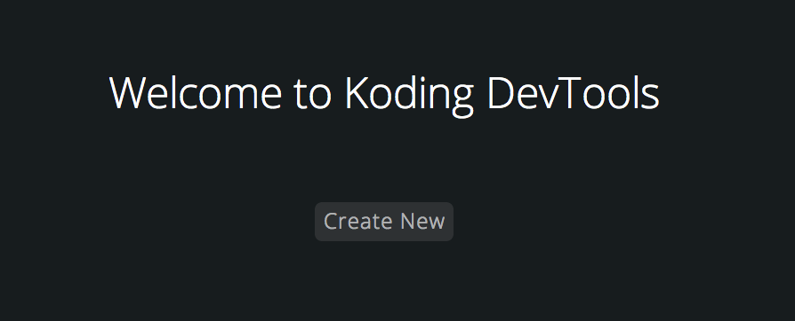
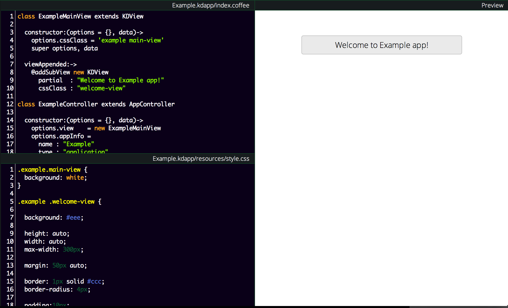
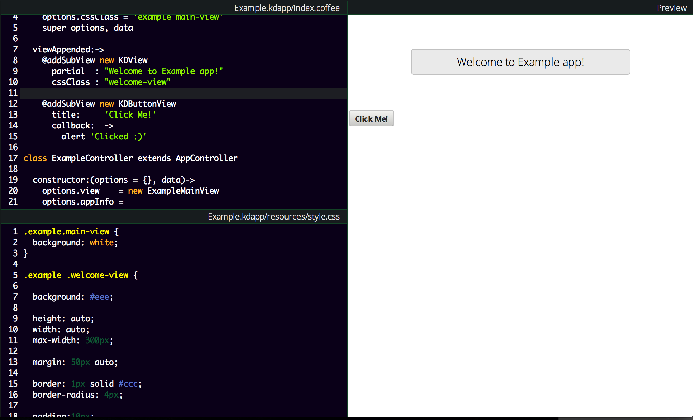
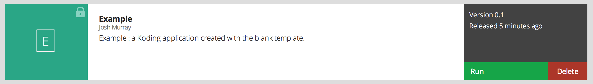
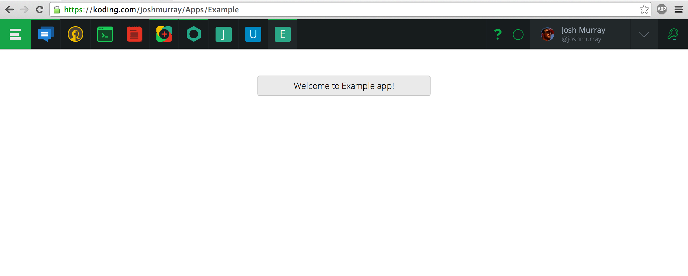

# Real World KDApp

We previously talked about what [Koding][koding] Apps are, now lets create a
basic application which can be deployed, and shared with other Koders.

## Create it on DevTools

Rather than copy code from this tutorial and paste it into DevTools, we're 
going to simply have it create one for us.

So, open up [DevTools][devtools] and press the **Create New** button in the 
center of the app.



If you already have a file open, you'll have to go to the DevTools menu in the 
upper right and choose **Create a new App**.

Choose whatever name for your app you like, and press Create. In this tutorial, 
the app is named "Example".

## Examine our new App

If we look into our newly created `~/Applications/Example.kdapp` folder, we can 
see that DevTools created a handful of files. Two of which are quite familiar, 
`index.coffee` and `manifest.json`.

We're going to ignore the Manifest file for the moment, but we'll cover that 
soon. Lets take a look at our friendly `index.coffee` file.

```coffee
class ExampleMainView extends KDView

  constructor:(options = {}, data)->
    options.cssClass = 'example main-view'
    super options, data

  viewAppended:->
    @addSubView new KDView
      partial  : "Welcome to Example app!"
      cssClass : "welcome-view"

class ExampleController extends AppController

  constructor:(options = {}, data)->
    options.view    = new ExampleMainView
    options.appInfo =
      name : "Example"
      type : "application"

    super options, data

do ->

  # In live mode you can add your App view to window's appView
  if appView?

    view = new ExampleMainView
    appView.addSubView view

  else

    KD.registerAppClass ExampleController,
      name     : "Example"
      routes   :
        "/:name?/Example" : null
        "/:name?/yourusername/Apps/Example" : null
      dockPath : "/yourusername/Apps/Example"
      behavior : "application"
```

Lets break this code down, piece by piece.

### ExampleMainView

First up, our friendly neighborhood `ExampleMainView`.

```coffee
class ExampleMainView extends KDView

  constructor:(options = {}, data)->
    options.cssClass = 'example main-view'
    super options, data

  viewAppended:->
    @addSubView new KDView
      partial  : "Welcome to Example app!"
      cssClass : "welcome-view"
```

`ExampleMainView` is a Koding View. Views are Kodings way of programmatically 
representing the DOM. Allowing you to define elements and modify them all from 
your code. In the above code, our view will be literally compiled to the 
following html

```html
<div class="kdview example main-view">
  <div class="kdview welcome-view">Welcome to Example app!</div>
</div>
```

You can modify these views by adding css, changing their content, adding 
subviews, or even removing them entirely at a later time.

When our View is added to another view, such as `appView`, our `viewAppended()` 
method is called. This event is a good place to add our views with the 
`KDView.prototype.addSubView` method.

The KDView itself will be rendered to a generic `div` element, with the partial 
*(contents)* of `"Welcome to Example app!"`, and a cssClass of `welcome-view`.

### ExampleController

```coffee
class ExampleController extends AppController

  constructor:(options = {}, data)->
    options.view    = new ExampleMainView
    options.appInfo =
      name : "Example"
      type : "application"

    super options, data
```

`AppController` is a recent addition to the KDFramework. It is used to register 
your App with Koding itself; Provided along with routes, names, and filepath 
information about your app.

### appView and KD.registerAppClass

```coffee
if appView?

  view = new ExampleMainView
  appView.addSubView view

else

  KD.registerAppClass ExampleController,
    name     : "Example"
    routes   :
      "/:name?/Example" : null
      "/:name?/yourusername/Apps/Example" : null
    dockPath : "/yourusername/Apps/Example"
    behavior : "application"
```

Here is where we actually *use* our `ExampleController`. We do so only if 
`appView` does not exist. If `appView` exists, we are already registered or the 
instance has already been created and loaded.

If it does not exist, we need to pass our ExampleController into the 
`kd.registerAppClass` function. 

The two main options given in this example are as follows:

- `name`: The displayed name for this application.
- `routes`: The routes that this application can be loaded from. In our 
  example, <https://koding.com/yourusername/Example> and 
<https://koding.com/yourusername/Apps/Example>.

Note that most applications won't need to modify routes their AppControllers.  
However, if more details are desired you can check out the [source][kdf] and 
soon the API Documentation will be posted.

## Compiling with DevTools

Compiling can be done in a number of ways, but we're going to focus on the 
easiest: Koding's [DevTools][devtools]. All we have to do with DevTools open it 
up, and then from the FileTree on the left hand side locate our `index.coffee`
file and open it up.

In this example though, we're already working in DevTools, so our app is 
already compiling instantly! It should look similar to the following image:



## Extending Functionality

Now that you have your app loaded, lets make some changes. Lets add a button to 
our application! Exciting right?

Since we'll likely want to have this button call a function in our code, we're 
going to create it using KDViews. Specifically, the `KDButtonView`. Take the 
following code, and insert it in our `viewAppended: ->` method.

```coffee
    @addSubView new KDButtonView
      title:     'Click Me!'
      callback:  ->
        alert 'Clicked :)'
```

**Remember**: In CoffeeScript, indentation matters. So make sure this is 
indented so that `@addSubView new KDView` and `@addSubView new KDButtonView` 
are at the same indentation level.

And just like that, you have a button in your Application! Lets take a look at 
it:



No surprise, we have added a button into our application. If you click it, it 
will run the code found within the `callback` option, which in this case is 
`alert 'Clicked :)'`.

The cool part here, is that we didn't write any HTML. We didn't write any DOM 
Events. We just wrote some simple JavaScript, and the KDFramework created the 
appropriate events needed.

## Publishing for Testing

All of that is well and good, but we came here for a Real World App, right? We 
need this to run *outside* of DevTools.

If you click the menu in the upper right of DevTools, you'll see two options.  
**Publish for Testing** and **Publish to AppStore**. Choose Publish for Testing 
for now.

You'll be presented with an AppStore link for your App, which looks like this:



This added your Application to the AppStore in **Private Mode**. Only you can 
run this app. But if you click Run, you'll see that your app does indeed run!



As you can see above, it loads into your App Bar, you'll get a real URL for it, 
and it is indeed a *Real* Koding App. This lets you test your app as if it was 
officially published, and use it under real conditions.


## Publishing to the AppStore

Testing is all well and good, but eventually you'll want to publish it right? 
Before publishing, make sure that you have your application source on Github 
with the full application name *(Example: 
`github.com/yourname/Example.kdapp`)*.

If you've got all that, go back to DevTools and choose the **Publish to 
AppStore** option your App will be published to the AppStore under the 
Unverified Apps Section.

While unverified, users will be able to go into that special section and run 
your application.

Your App will remain in this Unverified state until it is reviewed and approved 
by Koding Moderators. Once they look at it and ensure that your App works 
properly, they'll approve it! All Koding users will be able to load your 
awesome application, knowing that it is safe and great, and enjoy all the hard 
work you put into it!


## Where to go from here

You should now have a good understanding of what Koding Applications are, and 
what the creation, testing, and publishing process is like. Next, you'll want 
to add awesome functionality and gain a deep understanding of the Koding 
Framework, right?

To do this, proceed to the API Documentation*(coming soon)* and the 
[KDFramework Source][kdf]. These will cover all of the available Classes, large 
and small, of the Koding Framework.

Thanks for reading, and stay tuned for additions to this guide, going in more 
depth.


[koding]: https://koding.com
[kdf]: https://github.com/koding/kd
[kdfio]: http://www.kd.io
[devtools]: https://koding.com/DevTools
