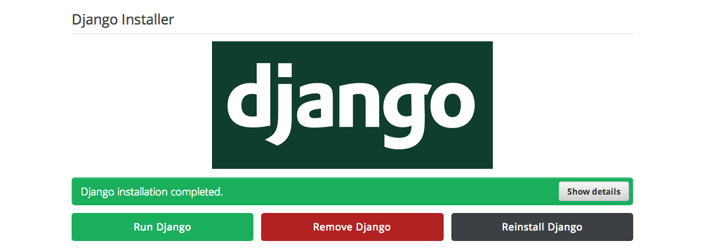
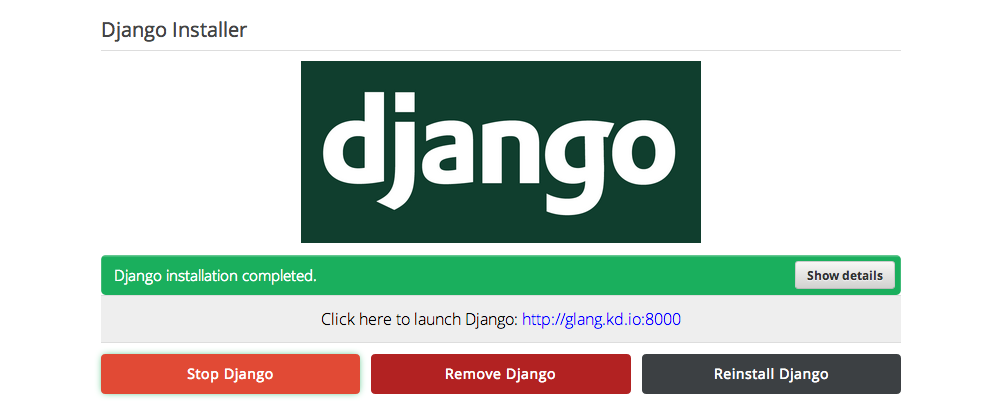

# Django Guide

To install Django on Koding, run the **[Django Installer App](https://koding.com/Django)**. [Note: you have to be 
logged into your [Koding account](https://koding.com/Login) in order to run the app.]

_________________________

This is what you'll see when you launch the app:

_________________________

Once your installation is complete, click "Run Django" to start your Django development server.  

_________________________

A link should be presented after you click the button. Go ahead and click on the link.

_________________________

You will now be brought to your first Django-powered page!

_________________________

Ready to build a Django app? Check out the **[Django documention](https://docs.djangoproject.com/en/1.6/)** to continue your adventure into the land of Django!

