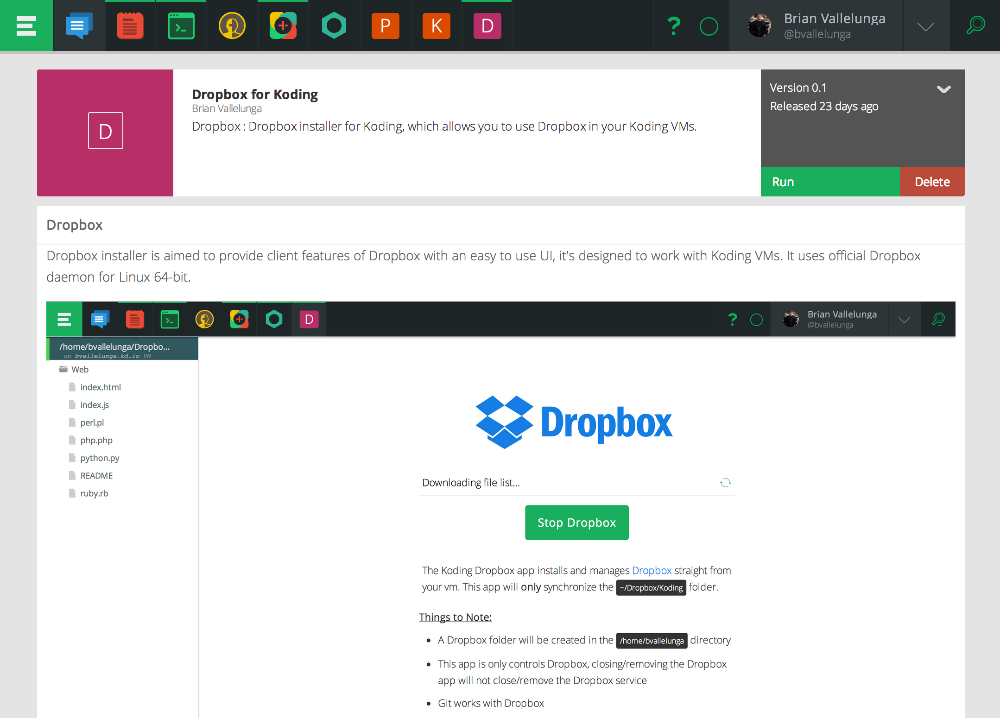
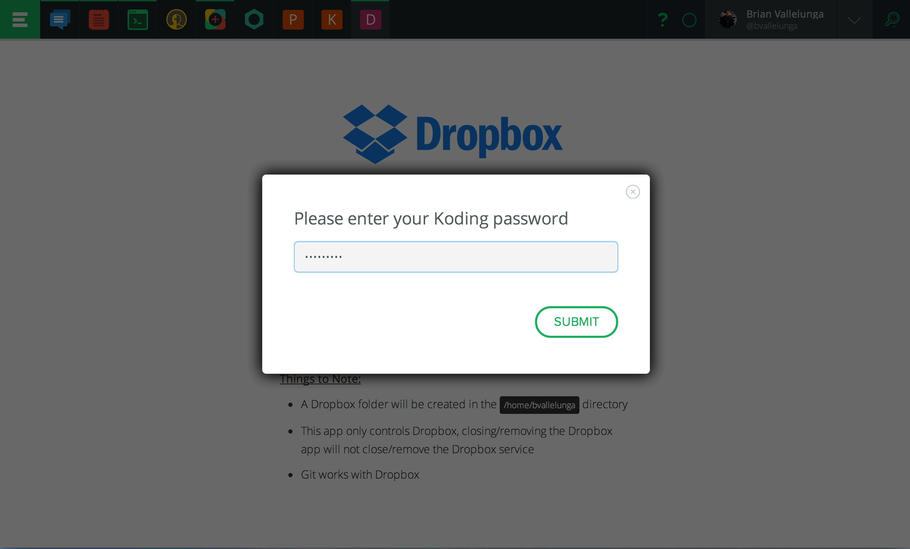
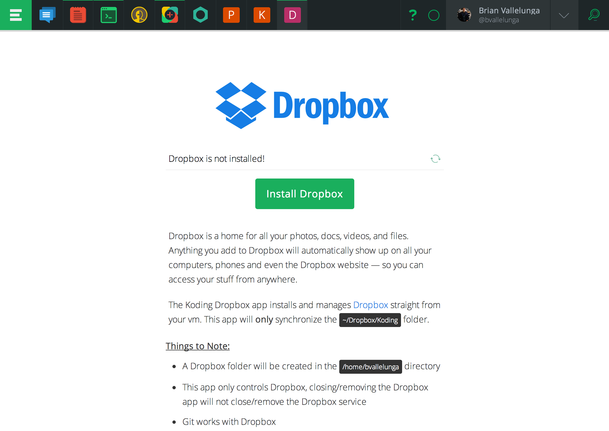
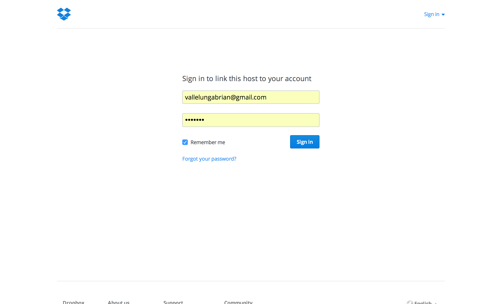
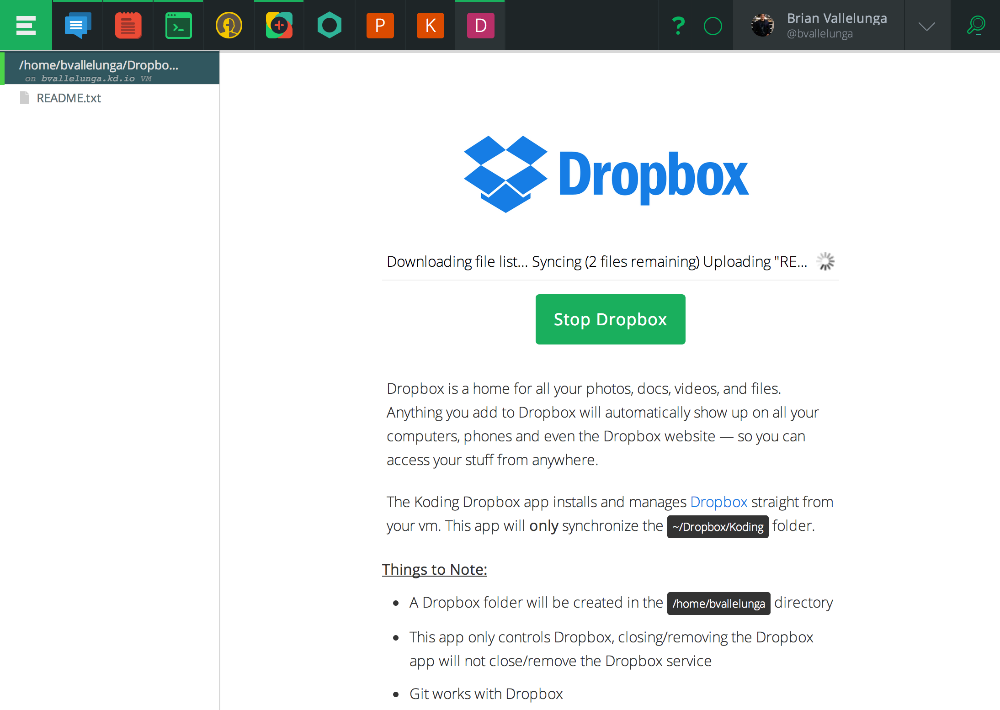

# BYO-IDE!
We often get asked the question: "Can I use my fav editor on my local system along with my Koding VM?" The answer to that question has always been **yes**. You can use [ftp](http://learn.koding.com/guides/setting-up-ftp-on-koding/) or [Google Drive](http://learn.koding.com/guides/sync-files-google-drive/) and this guide will walk you through how to set up Dropbox right on your Koding VM for a seamless sync experience between your local system and your Koding VM. Dropbox has built a best-in-class file sync and storage service and so we're excited to bring you the strength of their software as an add-on to your already robust and feature-rich Koding VM.

# Things you will need to get started
1. A Dropbox account (free or paid)
2. The Dropbox client installed and up and running on your local system (please check [this site](http://dropbox.com/download) to download the Dropbox client for your OS
3. A Koding account (free or paid)

# Steps to Install

1. Log in to your Koding account
2. Go to the [Koding App Store](https://koding.com/Apps) and select the Dropbox app. 
2. Click the **Run** button in the upper right corner
3. Enter your password! 
4. Click the **Install** button 
5. Click the **Start** button 
6. Authorize with Dropbox by clicking the link 
7. Your files should start syncing in a second, **it may take a minute or two** 

# What happens behind the scenes?

The Koding Dropbox app installs and manages Dropbox straight from your vm. Note, and this is very important, the app will **only** synchronize the `~/Dropbox/Koding` folder, so please put all your code in the `Koding` folder. If you don't have a `Koding` folder, please make one on your local computer. Any file in the `Koding` folder in your Dropbox account will get syncronized immediately when it is saved. Since Dropbox handles the synchronization, you don't have to deal with `ftp` or remember to send your changes up to your vm. And if there are any conflicts with your files, Dropbox will alert you and handle the problem gracefully. So all you have to do is fire up your favorite IDE and code away. Dropbox will sync the files to your Koding VM from where you can run your code on the VM's command line or access the application you are building over the VM's web server.

# Things to Note

- The Dropbox folder will be created in the `/home/<user>` directory of your VM
- The app only controls Dropbox, closing/removing the Dropbox app will not close/remove the Dropbox service
- Feel free to use git in the Dropbox folder, all changes in your repo will synced on the fly
