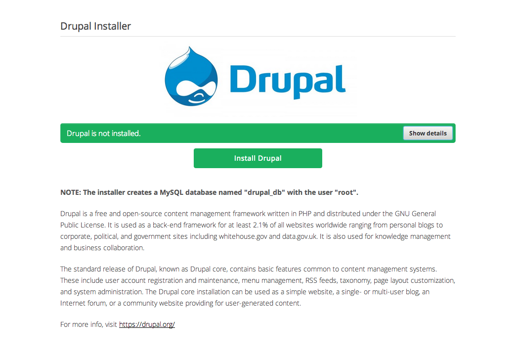
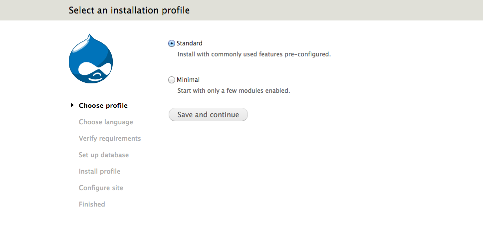
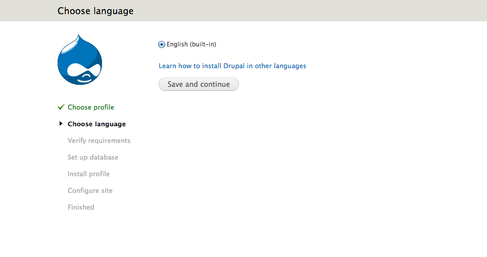
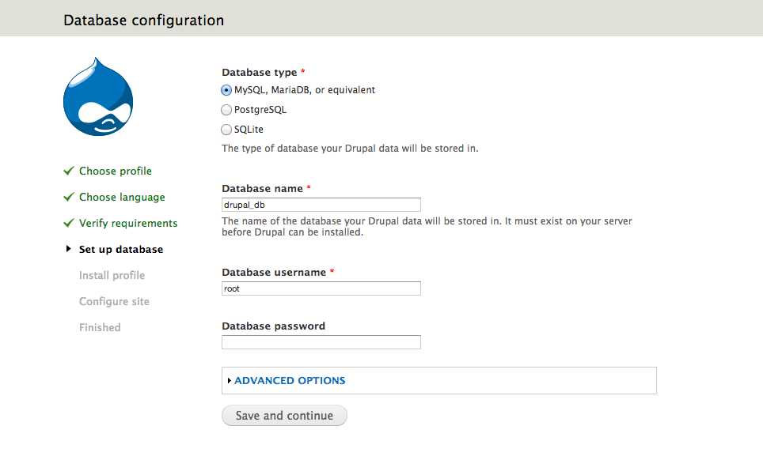
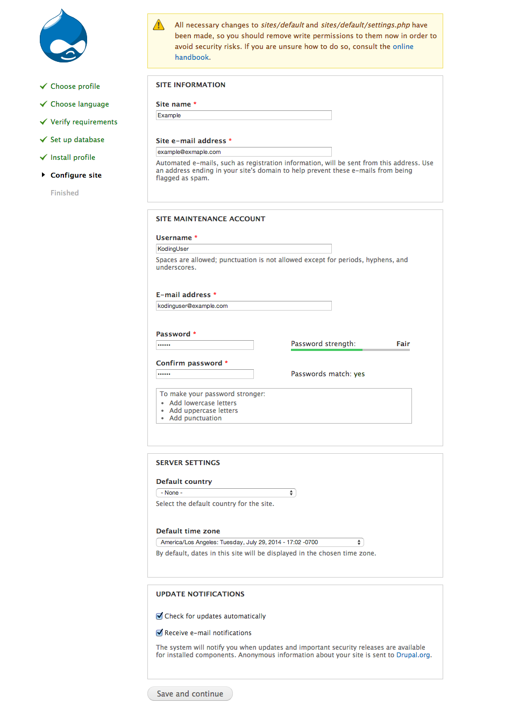
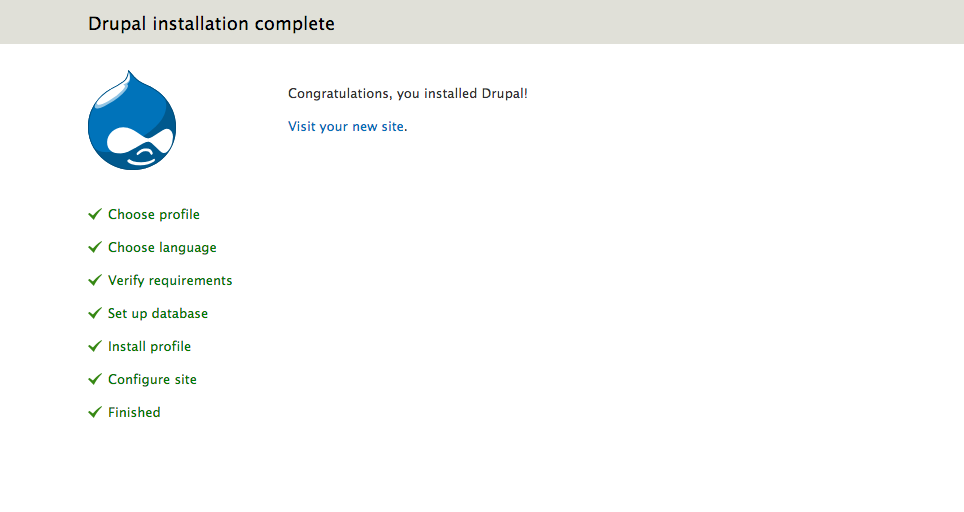
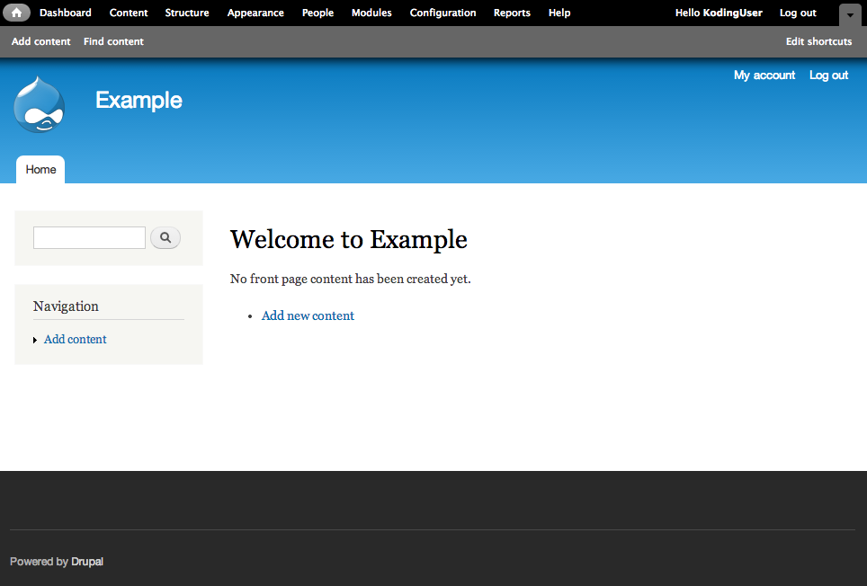

# DRAFT 5 Easy steps to getting started with Drupal on Koding

**What is Drupal?**
Drupal is an open source content management platform powering millions of websites and applications. It’s built, used, and supported by an active and diverse community of people around the world. [Learn more](http://drupal.org).

Getting started with your own Drupal environment on Koding is as simple as following these 5 easy steps!

**Step 1: **
To install Drupal on Koding, run the **[Drupal Installer App](https://koding.com/Drupal)**. [Note: you have to be 
logged into your [Koding account](https://koding.com/Login) in order to run the app.]

_________________________

This is what you'll see when you first launch the app from the Koding App Store. The app does the work to install all the required software and its dependencies.


_________________________

**Step 2: **
Once the setup is complete, the presented link will bring you to the Drupal installation profile selection page as shown below:



_________________________

**Step 3: **
Next, select the language shown. By default, there's only one choice. We recommend leaving it to English so that you can proceed with the install. You can change the language at a later stage once the installation is completed.



_________________________

**Step 4: **
You will then be brought to the database configuration page. When prompted, enter the following:

```
Database name: drupal_db
Database username: root
```


_________________________

**Step 5: **
Next, you will be brought to the site configuration page:



_________________________

Your drupal installation is now complete:


_________________________

Here is what you will see when you visit your new Drupal powered test site!



_________________________

That's it for the Drupal on Koding guide! Have fun!
