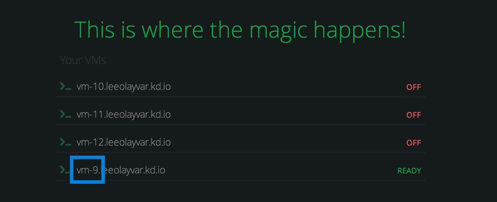

# Finding your Koding VM Number

In this guide we'll go over finding your [Koding][koding] Virtual Machine 
number, and what it's needed for.


## VM Number, what's that?

Koding Virtual Machines have a unique string that allows you to connect to them 
from the your browser, SSH, or FTP. The VM _Number_ of this string is a number 
that increments with each additional VM that you create. The string will always 
be formatted the same, but the number will change between your different VMs.

## Finding your VM Number

The [Terminal][terminal] page has a list of your VMs. The VM Number, is the 
number on the left most side of the string. In the image below, the highlighted 
`vm-9` is the VM Number.



## Using your VM Number

There are two ways in which you may see your VM Number used. Lets go over each.

The first is simply your VM's URL. You may create other URLs and point them to 
your VM, but your VM URL will always be accessible.

```text
http://vm-0.username.kd.io
```

The second is used to connect to your VM with FTP or SSH. This is a special URL 
which accepts FTP and SSH connections, proxying them to your VM.

```text
vm-0.username.koding.kd.io
```

Note the `koding` in the address, as it is important.


[koding]: https://koding.com
[terminal]: https://koding.com/Terminal
