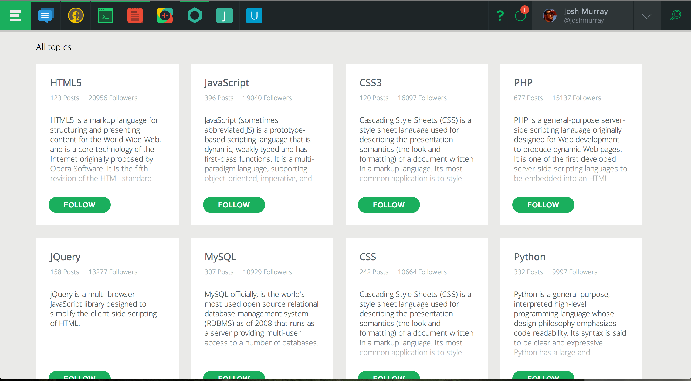

# Getting Started: The Activity Feed

The Activity Feed is the central location for discussion on Koding. A public or 
private message board, with markdown support, previewing, hashtag topics and 
more, it's a central component to Koding's Social experience.

## Posting and Formatting

To post to the activity feed, find the input box in the top of the page.

Simply type something in, and press the green submit button. Just plain text 
can get a bit boring though, so Koding supports full 
[Markdown](/guides/markdown), as seen below:

## Previewing

To preview your post, simply press the little eye on the right side of the 
input box. Your Markdown will be rendered and highlighted appropriately, as 
seen below:

## Tagging

Tagging your content is important. It allows us to categorize our content, 
which makes it easier to search and more likely to be seen by people who follow 
those topics.

When you type a hash character `#` followed by characters, a list of similar 
topics will popup. Keep typing and it will refine the list. At any time you can 
choose an existing topic, or keep your own.

In the above image i have half typed the tag `#markdown`. You can see the 
Markdown tag, as well as a handful of other tags.

## Searching

Searching the activity feed gets its own dedicated spot in the upper right of 
the Koding UI.

Searching the activity feed will search for the contents of a post, as well as 
topics.

## Topics

Topics can also be browsed from the [Topics page](https://koding.com/Topics).  
The topics page contains a searchable and browsable list of all of the Koding 
topics ever created.

As seen in the above image, the topics page has the advantage of being able to 
Follow a topic. Following is Koding's way of subscribing you to that Topic. And 
to browse it, check out the Followed section of the Activity Page.

## Followed

As mentioned above, the Followed section shows all of the content that you're 
subscribed to. These can be from people you are following, or from topics that 
you are following.

This is a great way to see only the content you are interested in.
