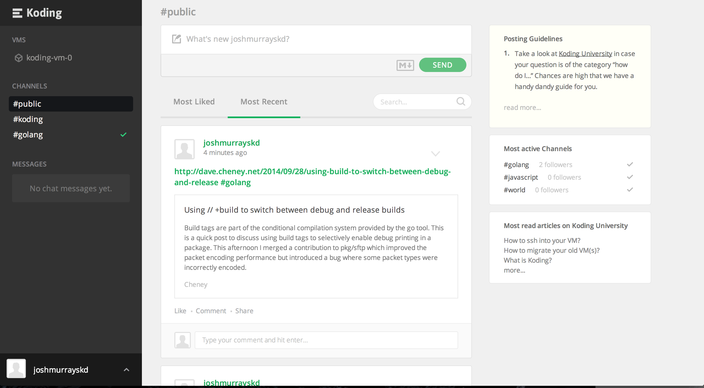
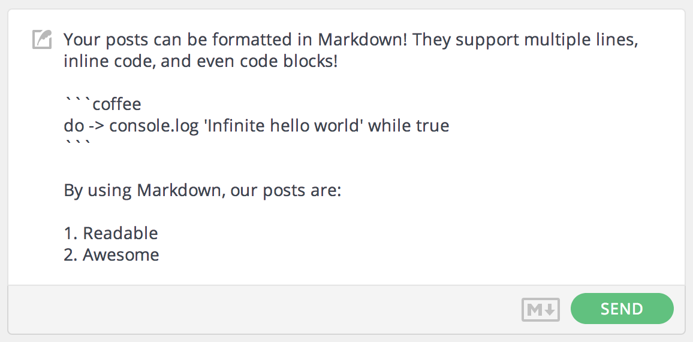
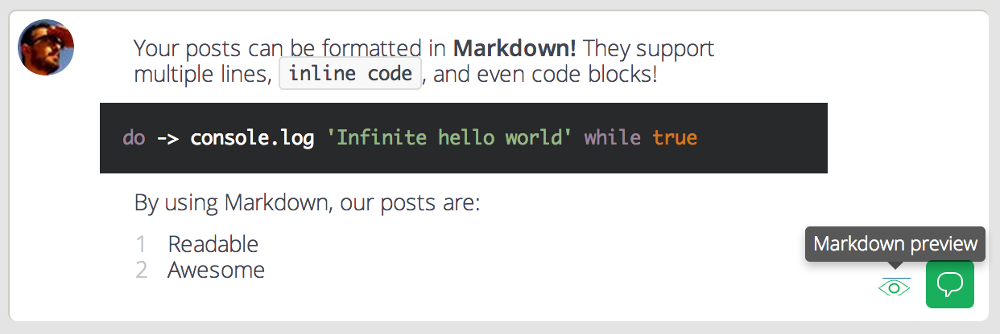
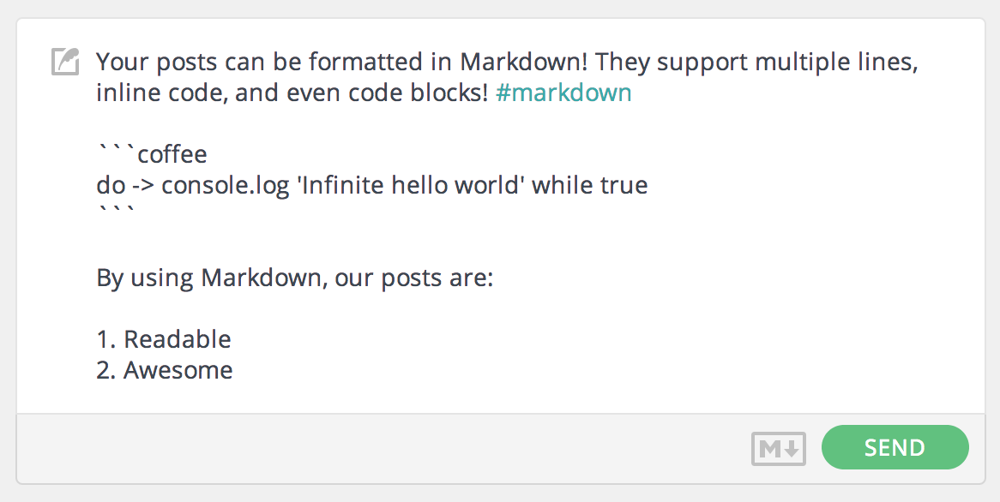
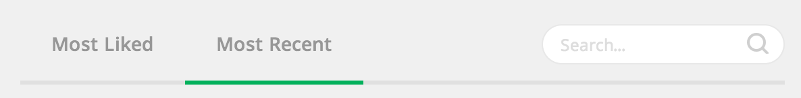
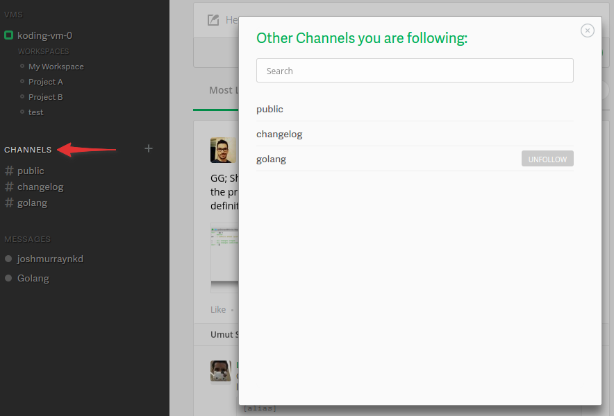
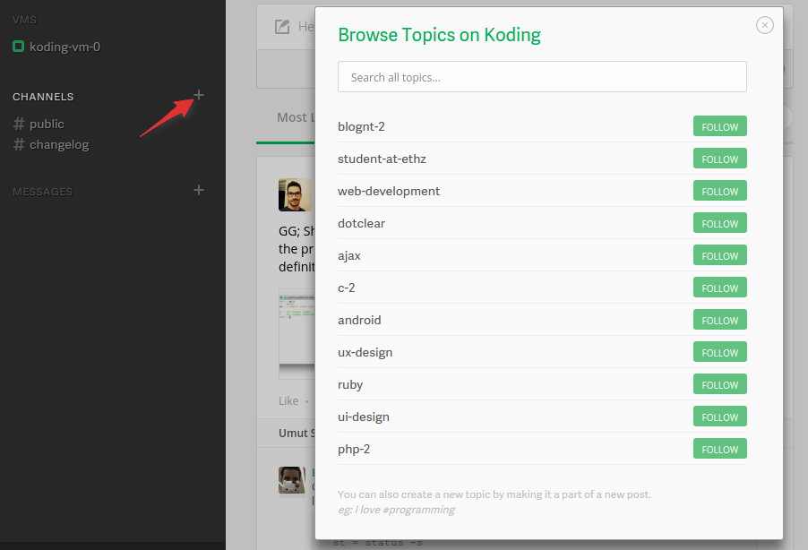

# Getting Started: The Activity Feed

The Activity Feed is the central location for discussion on Koding. A 
public message board, with markdown support, previewing, hashtag topics 
and more, it's a central component to Koding's Social experience.

## Posting and Formatting

To post to the activity feed, find the input box in the top of the page.

Simply type something in, and press the green submit button. Just plain text 
can get a bit boring though, so Koding supports full 
[Markdown](/guides/markdown), as seen below:

## Previewing

To preview your post, simply press the little eye on the right side of 
the input box. Your Markdown will be rendered and highlighted 
appropriately.

## Tagging

Tagging your content is important. With tags, your content can be
categorized, which makes it easier to search and more likely to be seen 
by people who follow those channels.

<!-- Redacted. Not a feature at the moment.
When you type a hash character `#` followed by characters, a list of similar 
topics will popup. Keep typing and it will refine the list. At any time you can 
choose an existing topic, or keep your own.

In the above image i have half typed the tag `#markdown`. You can see the 
Markdown tag, as well as a handful of other tags.
-->

Here you can see the previous Markdown example, tagged with the 
[#markdown][markdown channel] tag.

## Searching

On the [#public][public channel] channel there is a search field next to 
Most Liked / Most Recent, as seen below.

Searching the activity feed will search for the contents of a post, as 
well as the tags.

## Channels

Channels are how you view a steam of posts with a certain Tag. When you 
click on a tag, it opens a channel for that tag. Clicking on the Grey 
checkmark next to the channel name, will subscribe you to that channel, 
and keep it open anytime you visit Koding.

To browse channels that you might be interested in, you can click the 
Plus button next to "Channel" in the sidebar *(as seen below)*, and 
search for the channel you're interested in.

Following channels is a great way to stay active in content that matters 
to you.

[koding]: https://koding.com
[public channel]: https://koding.com/Activity/Public
[markdown channel]: https://koding.com/Activity/Topic/markdown
