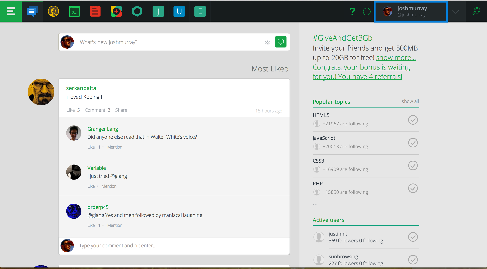
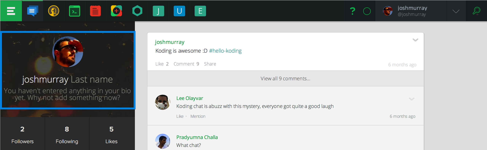
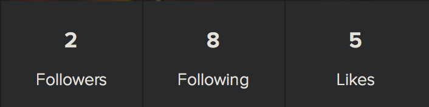

# Editing Your Profile

Your Koding profile is your public information page on Koding. Currently it 
shows your Avatar, Name and Description, recent Koding activity, and in the 
near future Badges and additional social information. In this guide we'll go 
over the basic usage of your Koding profile.

## Getting to your Profile

When you first sign up to Koding you'll be presented with the Koding Activity 
Feed *(as we previously discussed)*. To find your profile, look in the upper 
right of Koding, as highlighted below.

Clicking on it will navigate you to your profile.

## Avatar, Name and Description

When viewing your profile for the first time, you'll see that your first name 
is set to your Koding username, and your last name and description are grey 
text, as seen in the below image.

If you double click on this grey text, you can edit that field.

Likewise, if you double click on your Avatar, a window will pop up enabling you 
to change your avatar. If you have one, Koding will use your 
[Gravatar][gravatar] by default, but the Edit UI also supports avatar uploads 
directly to Koding.

To make this process even easier, you can use the **Take Photo** button to use 
your Laptop's camera and take a photo right then and there!

## Followers, Following, and Likes

Below the editable profile section is a little bit of information about your 
activity on Koding.

As previously discussed in the Activity Feed guide, Following someone allows 
you to subscribe to the content they post to the feed. The Followers number 
shows how many users you are currently following.

Following on the otherhand, shows how many people are following you. Finally, 
Likes show how many of your Activity Feed submissions have been liked by Koding 
users.

## Badges

Badges are a soon to come feature which will display achievements for your 
Koding experience.

The only current badge is the Staff badge. If you see that badge in a user's 
profile, they are a Koding Staff member. You'll see this quite frequently, and 
Koding takes pride in that.

This wraps up your Koding profile. In future Getting Started guides we'll be 
discussing all things about Koding, so stay tuned!

[koding]: https://koding.com
[gravatar]: https://gravatar.com
