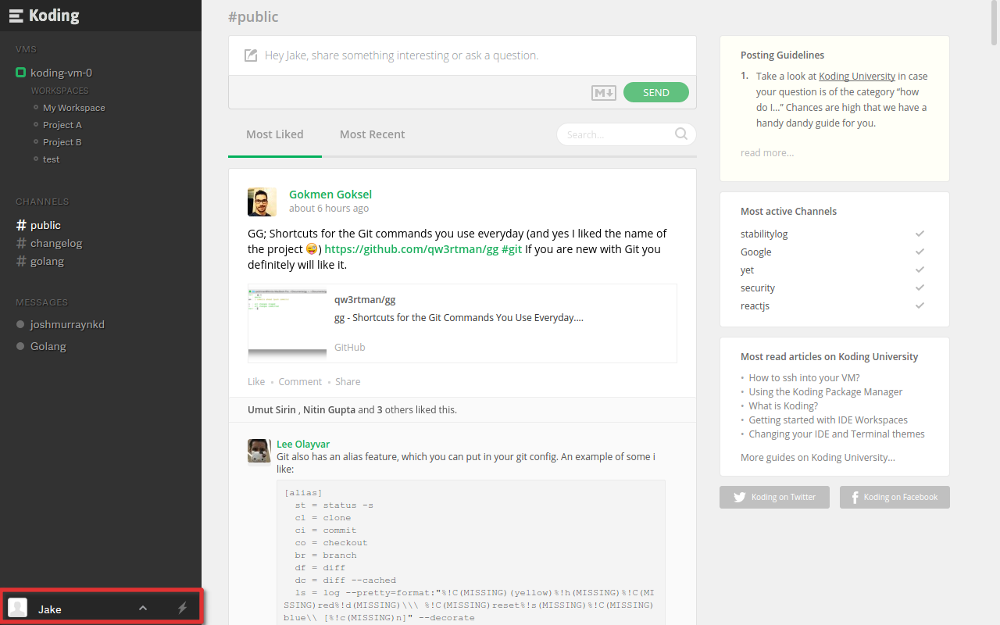

# Editing Your Profile

Your Koding profile is your public information page on Koding. Currently 
it shows your Avatar, Name and Description, recent Koding activity, and 
in the near future Badges and additional social information. In this 
guide we'll go over the basic usage of your Koding profile.

## Getting to your Profile

To find your profile, look in the lower left of Koding, as highlighted 
below.

Clicking on it will open your profile.

## Avatar, Name and Description

When viewing your profile for the first time, you'll see that your first 
name is set to your Koding username, and your last name and description 
are set to default values, as seen in the below image.

These default values are only seen by you, and if you double click them, 
you can edit that field.

<!-- Temporarily removed. Not currently working.
Likewise, if you double click on your Avatar, a window will pop up 
enabling you to change your avatar. If you have one, Koding will use your 
[Gravatar][gravatar] by default, but the Edit UI also supports avatar 
uploads directly to Koding.

To make this process even easier, you can use the **Take Photo** button to use 
your Laptop's camera and take a photo right then and there!
-->

[koding]: https://koding.com
[gravatar]: https://gravatar.com
