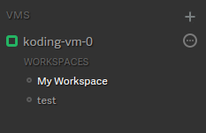
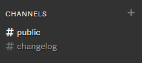
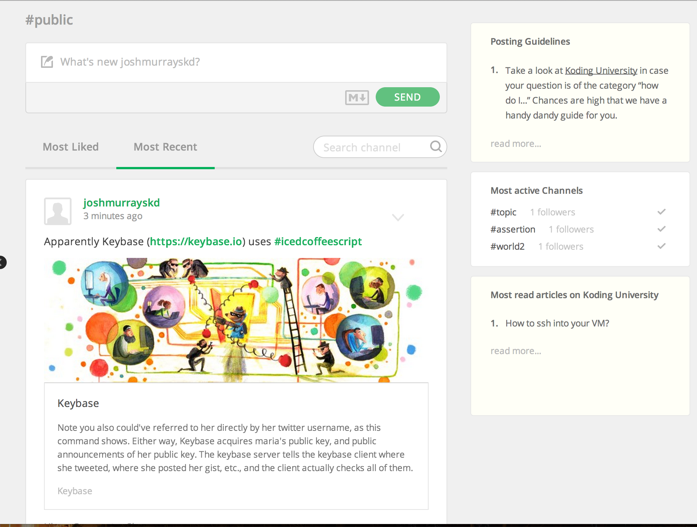
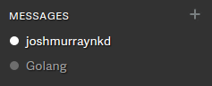
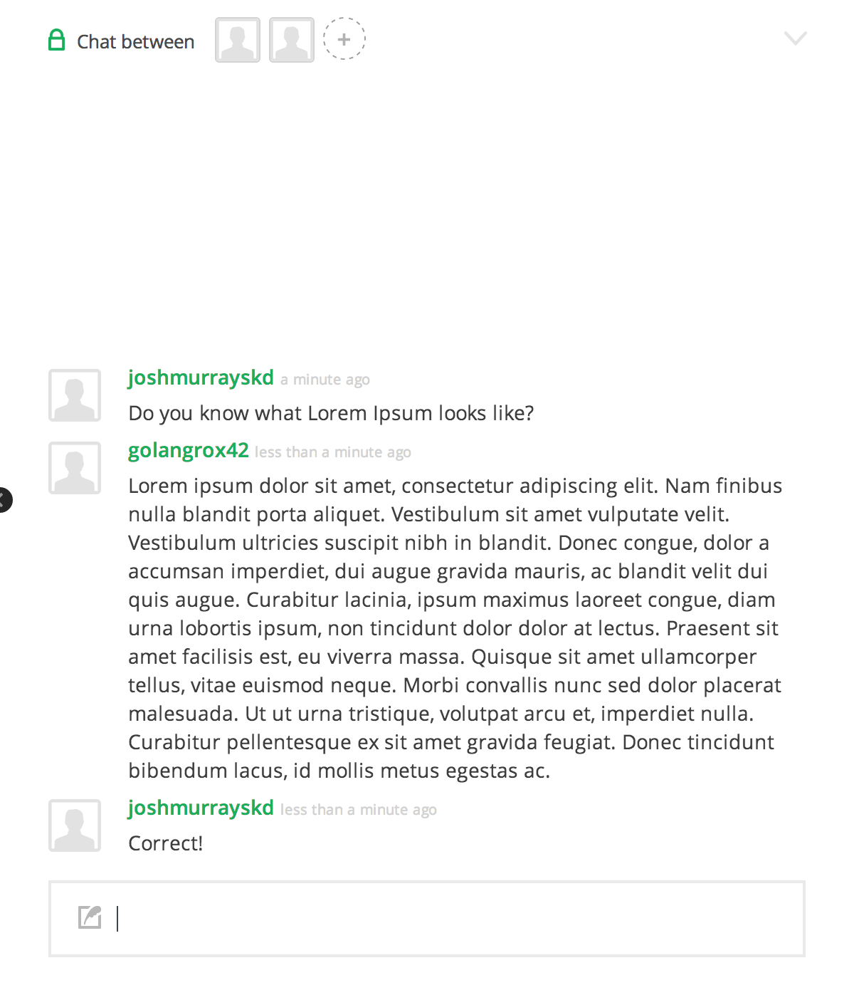
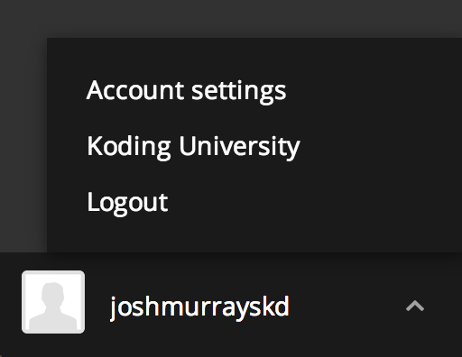

# The UI

In this guide we'll take a look at [Koding][koding]'s UI. We'll examine 
the major sections, and briefly explain some of the features. In future 
guides of this series we'll explain these parts in more detail. Lets get 
started!

## The Full UI

This is the Koding UI of a logged in user, with the [Koding IDE][ide] 
open. On the left side we have our VMs, Channels, Chats, and Account. To 
the right we have the Koding IDE. Lets look at each piece, and where they 
lead us.

## VMs, Workspaces and IDE

VMs, Workspaces, and the [Koding IDE][ide] can be found on the left hand 
side, under VMS, as seen in the image below.

Clicking on a VM Name, such as `koding-vm-0` in the above image, will 
open up the [Koding IDE][ide] for that specific VM.

The button to the immediate right of the VM Name is the VM Settings. Here 
you can find useful information, such as your VM Address and VM Specs.

Finally, below the VM Name are your Workspaces for that specific VM.  
Clicking on a Workspace will open all of the previous editors and 
Terminals that you had open on it, and opening new Workspaces provides 
shortcuts for varying tasks. We'll get into the specifics in the 
[Workspaces guide][workspaces].

## Channels and Activity

Below VMs, are your Channels. To follow a channel, click on a Grey check 
mark. Green check marks indicate a channel that you are following.

A channel is a stream of user submitted content for a certain hash tag, 
such as [#golang](http://koding.com/Activity/Topic/golang). When you 
click on a hash tag in the Activity Feed, it opens a channel for that 
tag, as seen below.

Activity Feed posts support [Markdown][markdown], including Markdown Code 
Blocks.

## Chat

Below Channels are your Chats. These are private conversations between 
you and any number of users you invite.

To open a new chat, click on the Plus button to the right of the Chat 
icon. Clicking on a already started chat, will open it as seen below.

Your chats will work much in the same way as the Activity Feed. You can 
invite more users by clicking the Plus next to user icons, or delete the 
conversation from the Chat Dropdown in the upper right.

## Account Settings

Your Account Settings can be located from the bottom of the navigation 
panel.

Here you'll be able to modify your Name, Password, and link your Koding 
account to various services.

[koding]: https:://koding.com
[ide]: https://koding.com
[workspaces]: /guides/getting-started/workspaces
[markdown]: /guides/markdown
