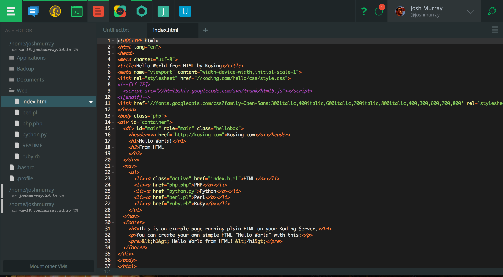
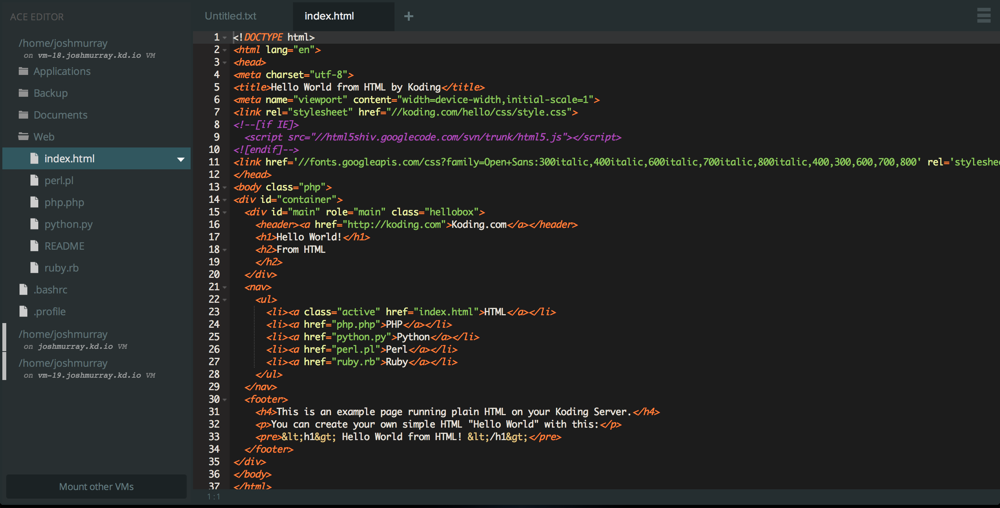
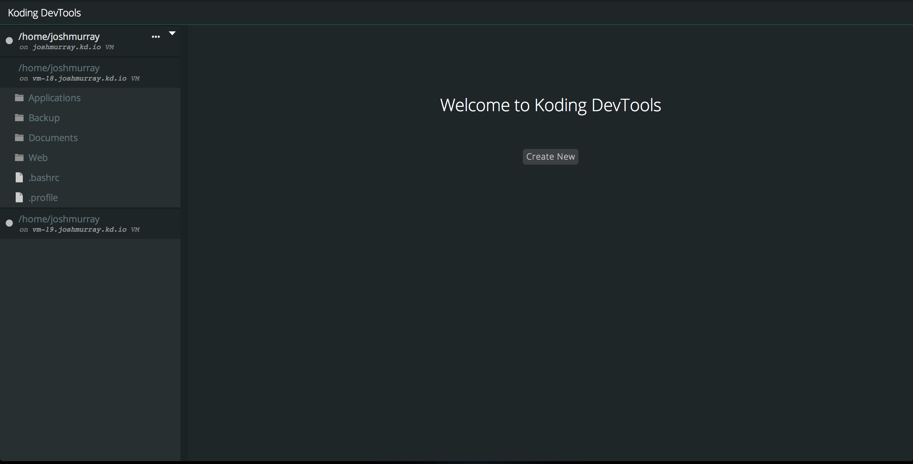
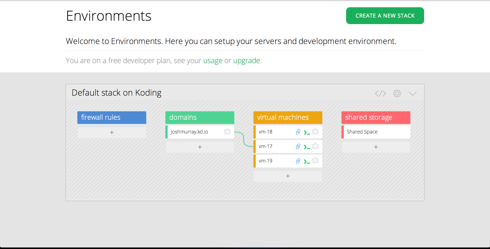
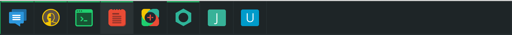
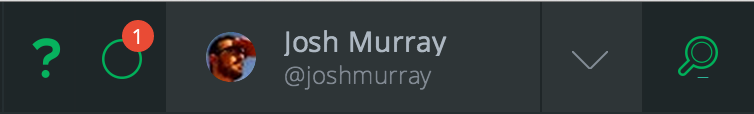

# Getting Started: The UI

Before we dive into specific features or applications of Koding, lets break 
down the UI at the most basic level. Understanding the UI will help you make 
sense of what different sections of the site are, which is important when 
running user applications that may not always look the same as Koding.

So, lets get started!

## The Full Thing

There it is in all it's glory. What we have here is an few applications open in 
the app dock, the Ace editor app is in focus, and we have a notification that 
we should probably look at.

But what does all this mean? Well, lets take a look at each area one by one.

## The Application

Two main features of Koding are its Applications and VMs. We won't go into the 
full scope of each of these just yet, but just know that *Applications* are 
important.  So important, that they take up almost all of it's UI!

What you see in the above image is considered a Koding Application. In this 
case, it's the Ace Editor. This area of the UI is reserved for all sorts of 
applications. Your Terminal, DevTools, Teamwork, and even Koding specific 
things such as Environments, the Activity Feed, and user Profiles are all Apps.  
As an example, here are two more apps:

DevTools

and Environments

Don't worry if you haven't seen these apps before, we'll get into them in the 
future. The key to remember here is that this area of the UI is reserved for 
Applications.

But how do we change applications you ask?

## The App Dock

We change applications with the App Dock!

Applications that you install will be located in your App Dock. You'll notice 
that the URL of Koding changes with each app too. Each application has it's own 
URL, which you can visit directly.  As an example, [Checkout the 
Terminal!](https://koding.com/Terminal)

When you click on an application, you *load* it into your session. A loaded 
application, even if not in focus, is indicated by a green bar above it's icon 
within the App Doc. In the above image you can see that I have multiple 
applications open.

The App Dock is pretty wide, but it doesn't quite take up the whole top bar.  
Lets take a look at the other side!

## Notifications, Profile, and Search

The right side of the top bar has some important features. The primary one 
being Notifications.

Notifications are Replies to your Activity Posts, or replies to a post that you 
are communicating in. The circle button next to your profile is a Notification 
drop down. Click it, and your recent notifications will open. The Red `1` seen 
in the above image represents 1 unread notification.

The Arrow next to your profile is a general Koding menu, with links to your 
[Account Settings](https://koding.com/Account), your 
[Environments](https://koding.com/Environments), and various other links.

Finally, the little magnifier is a search tool which can be used to search the 
Activity feed. The search tool always searches the activity feed because that 
is your central location for communicating with your development team, or the 
Koding Community in general.

This brings us right into the next page of this series, the Activity Feed!
