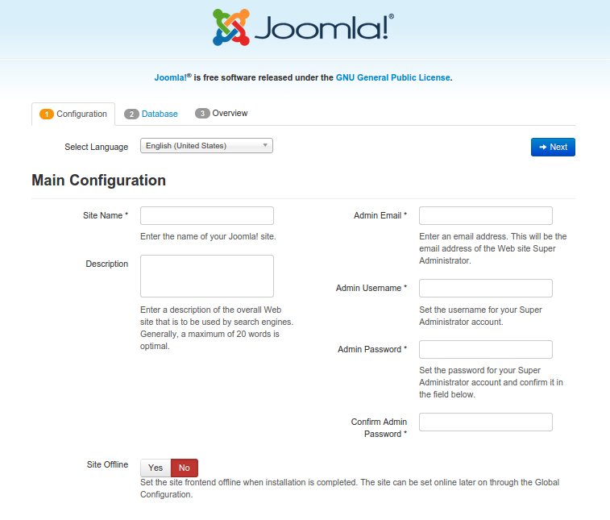

# How to install Joomla

Before you continue reading this guide why not try a more easy way, using the [Koding Package Manager (kpm)](http://learn.koding.com/guides/getting-started-kpm/) and install Joomla using just one command:

```
kpm install joomla
```

***

This guide will walk you through the steps required to install Joomla on your Koding VM. We will walk through the steps needed to download, install, configure and eventually run a full Joomla system.

## Joomla requirements

Before we begin you may want to make sure you have the following things installed on your Koding VM.

1. [PHP 5.3.10 or greater](http://learn.koding.com/guides/installing-php/)
2. [MySQL 5.1 or greater](http://learn.koding.com/guides/installing-mysql/)
3. [The mod_rewrite Apache module](http://learn.koding.com/guides/general-htaccess/#rewriteengine-amp-mod_rewrite)

Also make sure you have the PHP mySQL package installed. Use the following command if you do not have it.

```
sudo apt-get install -y php5-mysql
```

After you made sure and/or installed the above requirements you can go ahead a continue with the guide.

## Step 1 - Database creation

The first thing we need for our Joomla installation to work, is a new database. We can create one using either:
1. the command line
2. via [phpMyAdmin](http://learn.koding.com/guides/install-phpmyadmin/).

The rest of this guide will focus on the command line method to create a database for our Joomla installation.

### Setting up MySQL:

Type in the commands listed below in a Koding Terminal.

* Login to mySQL as the root user:

```
mysql -u root -p
```

* Create a new database:

```
CREATE DATABASE joomla;
```

* Create a new user and assign a password:

```
CREATE USER dbuser@localhost IDENTIFIED BY 'your_password';
```

* Give that user permission to access that database using the following command:

```
GRANT ALL PRIVILEGES ON joomla.* TO dbuser@localhost;
```

* Apply the changes so that mySQL knows about them:

```
FLUSH PRIVILEGES;

exit
```

Restart the Apache server to make sure everything is working properly

```
sudo service apache2 restart
```

## Step 2 - Configuring Joomla

The first thing we need to do is to head over to our Web folder like so type in the following command in Terminal:

```
cd ~/Web
```

Now, we need to download the latest Joomla release. We can do that using the following command:

```
wget https://github.com/joomla/joomla-cms/releases/download/3.4.0/Joomla_3.4.0-Stable-Full_Package.zip
```

Unzip the downloaded file:

```
unzip Joomla_3.4.0-Stable-Full_Package.zip -d joomla
```

All of the Joomla install files will now be extracted into a older named `joomla`.

> type:tip
> You can rename this folder afterwords anyway you like.

After the unzip has finished and the Joomla files are in the web directory, we need to modify some permissions to give access to the Joomla installer.

First we need to create a Joomla configuration file and make it temporarily world-writeable:

```
cd joomla
sudo touch configuration.php
sudo chmod 777 configuration.php
```

> type:alert
> After the installation is complete, we'll need to change the permissions back to 755.

## Step 3 - Finalizing the Joomla install

Open up a new browser tab and navigate to your VM's hostname and add **/joomla** at the end. If you don't know what you VM hostname is, follow [this guide](http://learn.koding.com/faq/vm-hostname/) to find out.

You should see the initial configuration page. It should look like this:



Now you just need to follow the instructions on screen and finish the install.


After the install process has finished, delete the installation folder, as per Joomla’s instructions, and change the permissions on the config file:

```
sudo rm -rf installation/
chmod 755 configuration.php
```

And thats it!

If you encounter any issues or have any questions regarding Joomla on Koding you can email us at [support@koding.com](mailto:support@koding.com) and we'll gladly help.
