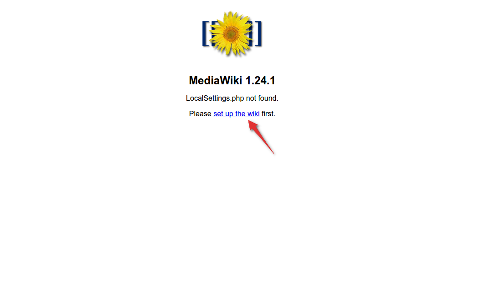

# How to install MediaWiki

Before you continue reading this guide why not try a more easy way, using the [Koding Package Manager (kpm)](http://learn.koding.com/guides/getting-started-kpm/) and install MediaWiki using just one command:

```
kpm install mediawiki
```

***

## MediaWiki requirements

Before we begin you may want to make sure you have the following things installed on your Koding VM.

1. [PHP 5.3.5 or greater](http://learn.koding.com/guides/installing-php/)
2. [MySQL 5.0.2 or greater](http://learn.koding.com/guides/installing-mysql/)
3. [The mod_rewrite Apache module](http://learn.koding.com/guides/general-htaccess/#rewriteengine-amp-mod_rewrite)


## Getting started

You'll need to update all of the apt-get packages first:

```
sudo apt-get update
```

## Database creation

The first thing we need for our MediaWiki installation to work, is a new database. We can create one using either:
1. the command line
2. via [phpMyAdmin](http://learn.koding.com/guides/install-phpmyadmin/).

The rest of this guide will focus on the command line method to create a database for our MediaWiki installation.

### Setting up MySQL

Type in the commands listed below in a Koding Terminal.

* Login to mySQL as the root user:

```
mysql -u root -p
```

* Create a new database:

```
CREATE DATABASE mediawiki;
```

* Create a new user and assign a password:

```
CREATE USER mediawikiuser@localhost IDENTIFIED BY 'your_password';
```

* Give that user permission to access that database using the following command:

```
GRANT ALL PRIVILEGES ON mediawiki.* TO mediawikiuser@localhost;
```

* Apply the changes so that mySQL knows about them:

```
FLUSH PRIVILEGES;

exit
```

> type:tip
> Keep the database user and password somewhere safe because you'll need them later on in the install process.

Restart the Apache and mySQL server to make sure everything is working properly:

```
sudo service apache2 restart
sudo service mysql restart
```

## Installing

First you'll need to download the Mediawiki package, like so:

```
cd Web
wget http://releases.wikimedia.org/mediawiki/1.24/mediawiki-1.24.1.tar.gz
```

Extract the archive:

```
tar zxvf mediawiki-1.24.1.tar.gz
```

Rename the folder:

```
mv mediawiki-1.24.1 mediawiki
```

> type:tip
> You can rename this folder afterwords anyway you like.

## Finalizing the MediaWiki install

Open up a new browser tab and navigate to your VM's hostname and add **/mediawiki** at the end. If you don't know what you VM hostname is, follow [this guide](http://learn.koding.com/faq/vm-hostname/) to find out.

You should see the initial setup page. It should look like this:



Press the **setup the wiki first** button and now you'll just need to follow the instructions on screen and finish the install.

At the very last step of the install process you'll need to download a file and place it's contents in your MediaWiki folder.

Download the file, open it with your local editor and copy it's contents to a newly created file in your MediaWiki folder. You can use the following commands to achieve this:

Create the file on your VM:

```
touch LocalSettings.php
```

Open it using `nano`:

```
nano LocalSettings.php
```

copy the contents from the file you just downloaded and then save the file.

And that's it! If you navigate to your VM's hostname and add **/mediawiki** at the end you should see a working wiki.

If you encounter any issues or have any questions please drop an email [here](mailto:support@koding.com).