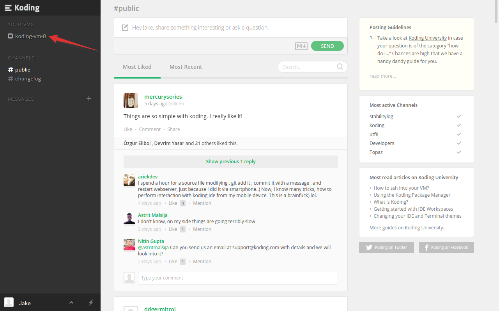
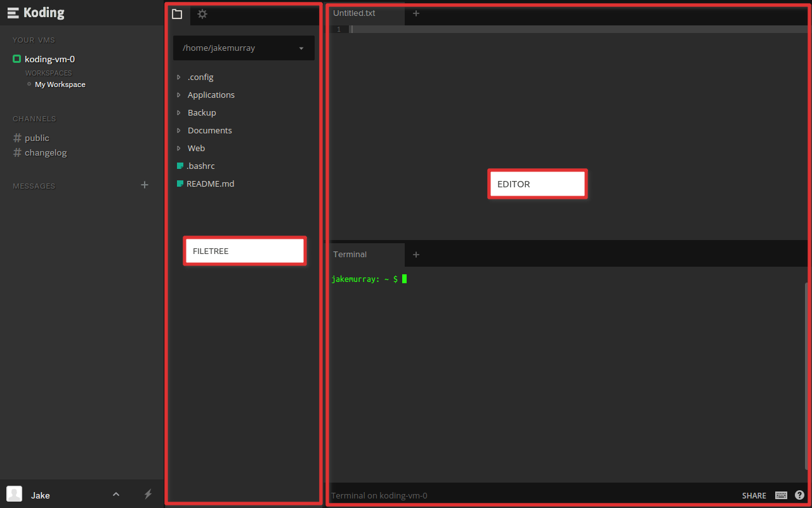
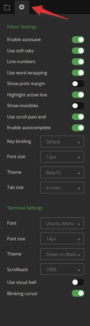
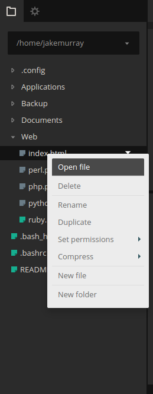
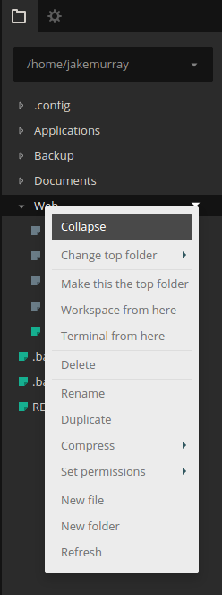
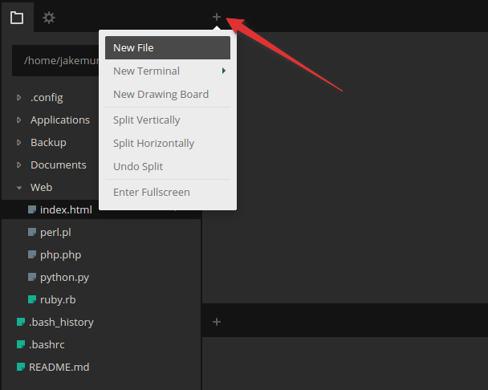
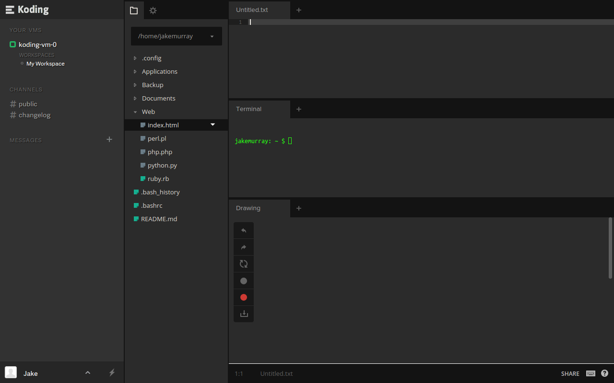
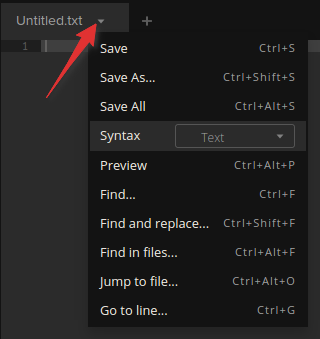
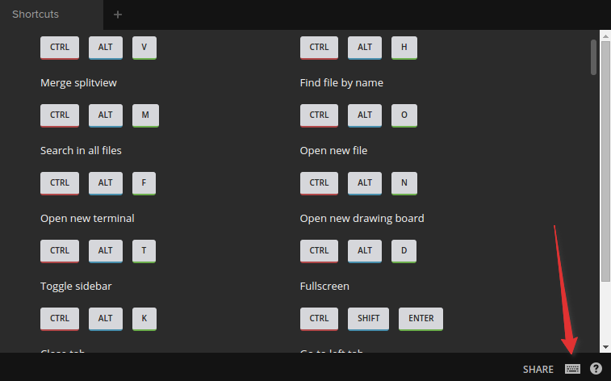
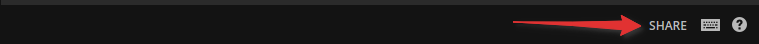

# Koding IDE Introduction

In this guide we’ll go over the Koding Integrated Development Environment or IDE for short. We'll try to explain how it works, how to use it and in end share some useful tips that you can use to be more productive.

## Getting started

To access your IDE, select your Virtual Machine on the left hand side as pictured bellow.

> type:warning
> If you have a Developer or Professional account then select the VM you want to start, from the list.

Then click on the `Turn it on` button in the modal.

After the VM has started, you’ll see your Koding IDE.

## Usage

The Koding IDE consists of two main parts: the FileTree, and the Editor.

The IDE can be customized by clicking on the little cog icon and then modifying the seetings based on your needs.

> type:tip
> You can also customize the Koding Terminal from here

The FileTree, on the left, enables file navigation around your VM. You can drag files or folders from one location to another one and if you right click files and folders you'll yield shortcuts to various actions as exemplified in the bellow images.

* File actions

* Folder actions

The Editor, that sits on the right of the FileTree, is the main driving force behing the Koding IDE. It allows you to edit a wide variaty of files types, such as .php, .rb, .html, .css just to name a few.

By default the editor will be opened in a horizontal two pane view. Panes can be opened, split and merged at will. They can also be made full screen.

You can open a new tab, in a pane, by clicking on the plus button and then chosing the type of tab you want to open, either a new Terminal tab, a new drawing board or a new file.

If you choose to open a new file tab you'll have access to some actions on that tab. Clicking on the little arrow next to the tab name wil bring up a menu with multiple actions.

Choosing the Terminal tab will open the Terminal to your Koding VM. We won't go into much detail about the Terminal in this guide. Head over to [this guide](/guides/terminal-introduction) for a more in depth explanation of the Terminal.

The Drawing board tab is there to help you draft ideas / share them with others or when you want to doddle the next big thing.

Everything has a keyboard shortcut as well. A shortcut reference, can be located by clicking the keyboard icon in the lower right.

The Koding IDE can be used when you are in the collaboration mode. You can share your VM by click on the `Share` button in the bottom right corner of the IDE.

This will share the VM with your teammate(s) or friend(s). Learn more about the collaboration feature [here](/collaboration).

## Tips

1. Use the `Ctrl(Cmd) + Alt + M` keyboard shortcut to merge all panes.
2. Never worry about saving files again. Enable the autosave feature from the IDE settings.
3. Double click on the sidebar and FileTree deviders to minimize them and make more room for the Editor.

The Koding IDE is a simple, yet powerful, editor for your browser based development.

Explore it today and if you ever need help with the IDE you can just click on the bottom right corner questions mark icon and the support modal will pop-up or email us at [support@koding.com](mailto:support@koding.com) and we'll gladly help.