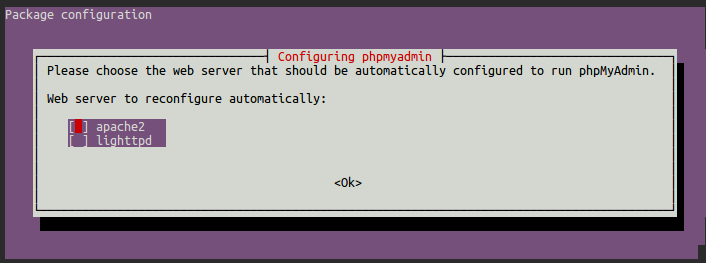
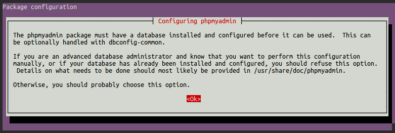
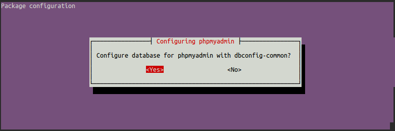
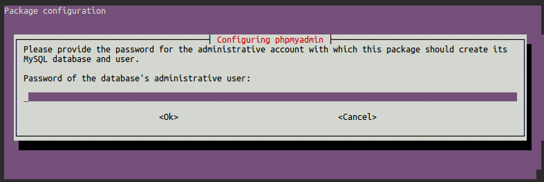
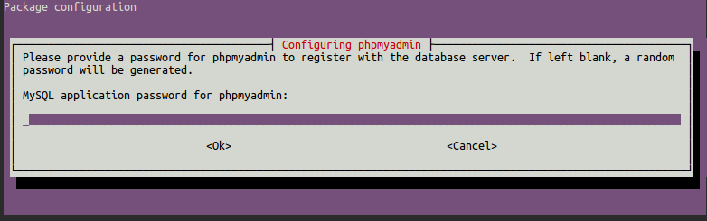

# How to install phpMyAdmin

This guide will walk you through the steps you need to take in order to get **phpMyAdmin** installed on your Koding VM.

Just follow the steps and you should get phpMyAdmin installed in no time.

## Step 1

The first thing that we need to do is to update our package list. We can do that using the following command.

```
sudo apt-get update
```

After that we can go ahead and install phpmyadmin using the following command:

```
sudo apt-get install phpmyadmin
```

## Step 2

During the installation process you will be prompted to answer some questions in order to configure the installation properly.

When asked to choose the server, you need to select **apache2**.



For the next question select **Ok**.



You need to select **Yes** for the next step in order to set up the database using `dbconfig-common`.



Choose a password for your root user.



And then a password for the phpmyadmin installation.



Last step is to confirm that password.

## Step 3

After the installation process has finished we have to make sure that the Apache server is serving phpmyadmin properly. In order to do that we need to edit the Apache configuration file. You can use the following command.

```
sudo nano /etc/apache2/apache2.conf
```

And at the very bottom of the file we need to include the following line.

```
Include /etc/phpmyadmin/apache.conf
```

Save the file.

One more thing that we need to do before we can see everything working is to enable the **mcrypt** extension. We can do that using the following command.

```
sudo php5enmod mcrypt
```

## Step 4

Restart the Apache server using the following command and you should see everything working.

```
sudo service apache2 restart
```

You will now be able to access phpmyadmin by following a similar URL:

```
http://KODING_USERNAME.koding.io/phpmyadmin
```

Find out more about your VM hostname [here](http://learn.koding.com/faq/vm-hostname/).

And that's it.

If you encounter any issues or have any questions please drop an email [here](mailto:support@koding.com).

