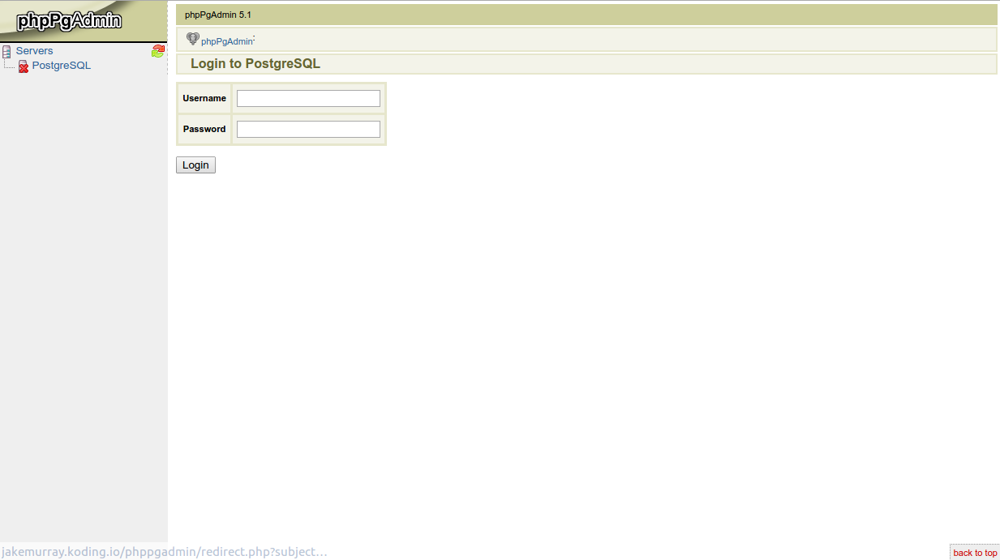

# How to install phpPgAdmin

Before you continue reading this guide why not try a more easy way, using the [Koding Package Manager (kpm)](http://learn.koding.com/guides/getting-started-kpm/) and install phpPgAdmin using just one command:

```
kpm install phppgadmin
```

***

This guide will walk you through the steps you need to take in order to get **phpPgAdmin** installed on your Koding VM.

Just follow the steps and you should get phpPgAdmin installed in no time.

## Getting started

Before you begin please make sure you have PostgreSQL installed on your VM. Follow [this guide](http://learn.koding.com/guides/installing-postgresql) to learn how to install PostgreSQL on your Koding VM.

## Step 1

The first thing that you need to do is to update you package list. You can do that using the following command.

```
sudo apt-get update
```

After that you can go ahead and install phpPgAdmin using the following command:

```
sudo apt-get install phppgadmin
```

## Step 2

After the installation process has finished you have to make sure that the Apache server is serving phpPgAdmin properly. In order to do that you need to edit the Apache configuration file. You can use the following command:

```
sudo nano /etc/apache2/conf.d/phppgadmin
```

Make sure the file looks like this:

```
Alias /phppgadmin /usr/share/phppgadmin
 
<Directory /usr/share/phppgadmin>
 
DirectoryIndex index.php
# AllowOverride None
 
order deny,allow
deny from all
allow from 127.0.0.0/255.0.0.0 ::1/128
allow from all
 
<IfModule mod_php5.c>
  php_flag magic_quotes_gpc Off
  php_flag track_vars On
  #php_value include_path .
</IfModule>
<IfModule !mod_php5.c>
  <IfModule mod_actions.c>
    <IfModule mod_cgi.c>
      AddType application/x-httpd-php .php
      Action application/x-httpd-php /cgi-bin/php
    </IfModule>
    <IfModule mod_cgid.c>
      AddType application/x-httpd-php .php
      Action application/x-httpd-php /cgi-bin/php
    </IfModule>
  </IfModule>
</IfModule>
 
</Directory>
```

Save the file.

Now you'll need to create a symlink to be able to access phpPgAdmin correctly:

```
ln -s /usr/share/phppgadmin /var/www/phppgadmin
```

## Step 3

Restart the Apache server using the following command:

```
sudo service apache2 restart
```

You will now be able to access phpPgAdmin by following a similar URL and you should see everything working:

```
http://KODING_USERNAME.koding.io/phppgadmin
```



Find out more about your VM hostname [here](http://learn.koding.com/faq/vm-hostname/).

And that's it.

If you encounter any issues or have any questions please drop an email [here](mailto:support@koding.com).
