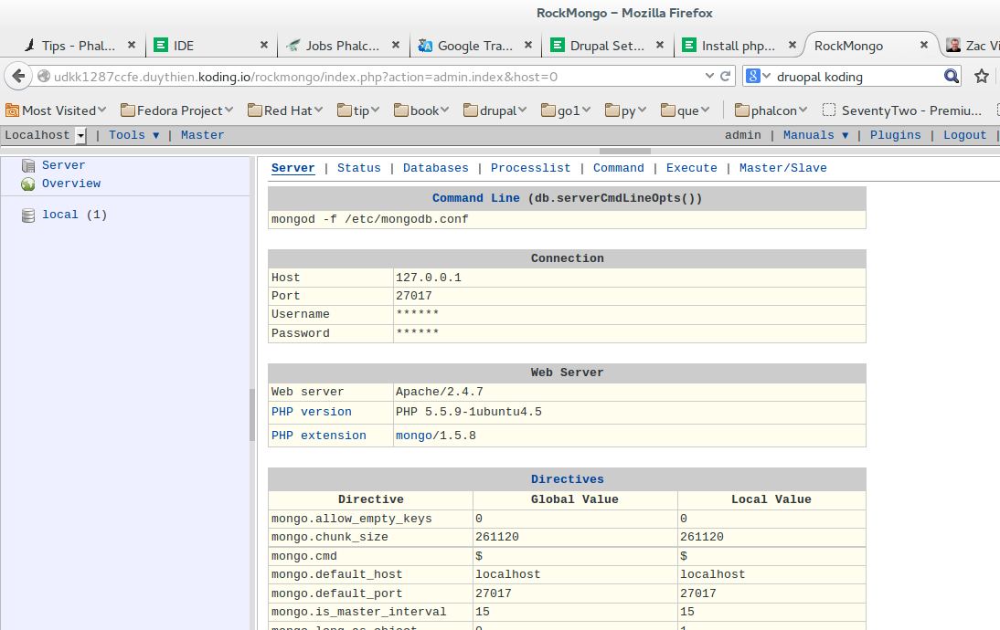

# How to install Rockmongo

Before you continue reading this guide why not try a more easy way, using the [Koding Package Manager (kpm)](http://learn.koding.com/guides/getting-started-kpm/) and install Rockmongo using just one command:

```
kpm install rockmongo
```

***

## What is Rockmongo

Rockmongo is a MongoDB administration tool that can be used to manage servers, databases, collections, documents, indexes etc. It provides a very user-friendly way for reading, writing and creating documents. It is very similar to [phpMyAdmin](http://learn.koding.com/guides/install-phpmyadmin/).

### Step 1

The first thing you need to do is to open up your [Koding](https://koding.com/IDE) Terminal and type in the following command:

```
cd Web
```

### Step 2.
Next up, you need to download the Rockmongo version that you're planing on using. In this case, you are going to use the latest version:

```
git clone --depth=1 https://github.com/iwind/rockmongo.git
```

### Step 3

Open the config.php file and change the following things:

* Host - should be set to 0.0.0.0
* Port - choose a desired port
* Chose a username and password. Note that by default they are set to `admin` and `admin`.

### Step 4

Now Mongodb will need the PHP driver to work. You need to install it by running this command:

```
sudo pecl install mongo

```

After that you will need to edit the file `20-mono.ini`, that is located at this path `/etc/php5/apache2/conf.d/`, and you you will need to add this line at the very end:

```
extension=mongo.so
```

### Step 5

Restart the Apache server using the following command and you should see everything working.

```
sudo service apache2 restart
```

You will now be able to access Rockmongo by following a similar URL:

```
http://YOUR_KODING_USERNAME.koding.io/rockmongo
```

If everything is working properly, you should see the following screen in your browser:



And that's it!

If you encounter any issues or have any questions please drop an email [here](mailto:support@koding.com).
