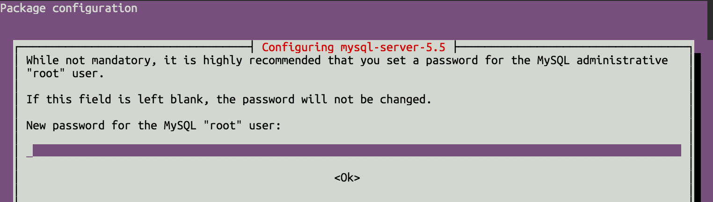

# Installing MySQL

Before you read the guide why not try a more easy way using the [Koding Package Manager (kpm)](getting-started-kpm) and install mySQL using just one command:

```
kpm install mysql
```

In this guide we will cover the basics on how you can install MySQL and 
the latest version of PHP-MySQL modules on your [Koding][koding] VM.

## Installation via apt-get

First open up your [Koding IDE][ide] and paste the following command into 
your Terminal. This will ensure that your [apt-get](https://help.ubuntu.com/community/AptGet/Howto) 
database is at the latest level. 

```
sudo apt-get update
```

Now, type in the command below to install mysql, and it's dependencies.

```
sudo apt-get install mysql-server mysql-common mysql-client
```

As part of the installation process, you'll be presented with the 
following screen.



This is to create your **MySQL Root user passphrase**. Enter a passphrase 
of your choice, and repeat it at the next screen.

## Logging into MySQL

Afterwards, you can confirm your installation by running the following 
command.

```
mysql -u root -p
```

When prompted, enter the MySQL root user passphrase that you created 
above.

## PHP MySQL Extensions (Optional)

A popular addition to this installation process, are the PHP extensions 
needed to use MySQL form PHP. This is optional, and if you don't use PHP, 
you can ignore these.

To install the PHP MySQL Extension, simply run the following command.

```
sudo apt-get install php5-mysql
```

After that, you'll need to restart Apache to make use of this extension.  
This can be done with the following command.

```
sudo service apache2 restart
```

That's it!


[koding]: https://koding.com
[ide]: https://koding.com/IDE
