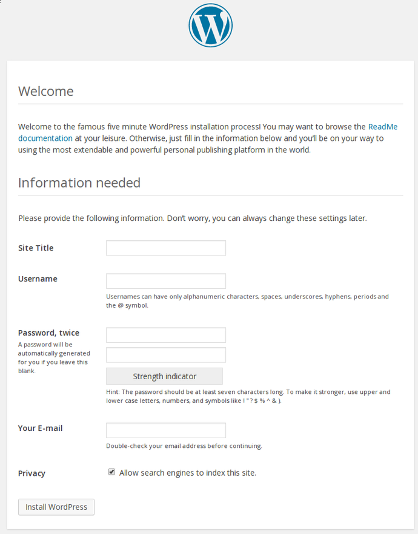

# How to install WordPress

This guide will help you install a fresh WordPress instance. Just follow the steps outlined below and you'll be done in not time. Let's cut to the chase.

## Step 1 - Database creation

The first thing we need for our WordPress installation to work is a new database. We can create one using either the command line or use [phpMyAdmin](http://learn.koding.com/guides/install-phpmyadmin/).

For the sake of this guide we are going to use the command line, to create a database for our WordPress installation.

Please make note that you should have mySQL installed on your VM for this work. If you don't know how to get mySQL installed just follow [this guide](http://learn.koding.com/guides/installing-mysql/) and then comeback here to continue with the rest of the install.

The commands that you should use to set up a database from the command line are as follows.

* Login to mySQL as the root user:

```
mysql -u root -p
```

* Create a new database:

```
CREATE DATABASE wordpress;
```

* Create a new user and assign a password:

```
CREATE USER dbuser@localhost IDENTIFIED BY 'your_password';
```

* Give that user permission to access that database using the following command:

```
GRANT ALL PRIVILEGES ON wordpress.* TO dbuser@localhost;
```

* Apply the changes so that mySQL knows about them:

```
FLUSH PRIVILEGES;

exit
```

## Step 2 - Configuring WordPress

The first thing we need to do is to head over to our Web folder like so:

```
cd Web
```

After that we need to download the latest WordPress release. We can do that using the following command.

```
wget http://wordpress.org/download/latest.zip
```

We now need to unzip it. This command should do the trick. Don't worry it will automatically create a folder named **wordpress** that you can rename afterwards.

```
unzip latest.zip
```

The last thing we need to do before we can start the installation process is to set up the link between WordPress and the database we created earlier. We can achieve this by inputing the following commands:

* Head over to the wordpress folder:

```
cd wordpress
```

* Rename the default config file:

```
cp wp-config-sample.php wp-config.php
```

* Edit the config file via the command line:

```
nano wp-config.php
```

* Add the proper database info into the config file and then save it:

```
// ** MySQL settings - You can get this info from your web host ** //
/** The name of the database for WordPress */
define('DB_NAME', 'database_name');

/** MySQL database username */
define('DB_USER', 'username');

/** MySQL database password */
define('DB_PASSWORD', 'password');
```

The above variables: *database_name*, *username*, *password* should be replaced with the values you set when creating the database on [Step 1](#step-1).

The last thing that we need to do before we begin the install, is to set up the uploads folder. That can be achieved like so:

* From the command line we create a folder:

```
mkdir wp-content/uploads
```

* We need to give the server writing capabilities like so:

```
sudo chown -R :www-data wp-content/uploads
```

## Step 5 - Installing WordPress

Navigate to your VM hostname, in a new browser tab, and add **/wordpress** at the end. If you don't know what you VM hostname is, follow [this guide](http://learn.koding.com/faq/vm-hostname/) to find out.

You should see the initial configuration page. It should look like this:



Now you just need to follow the guide and install WordPress.

If you encounter any issues or have any questions regarding WordPress on Koding you can email us at [support@koding.com](mailto:support@koding.com) and we'll gladly help.