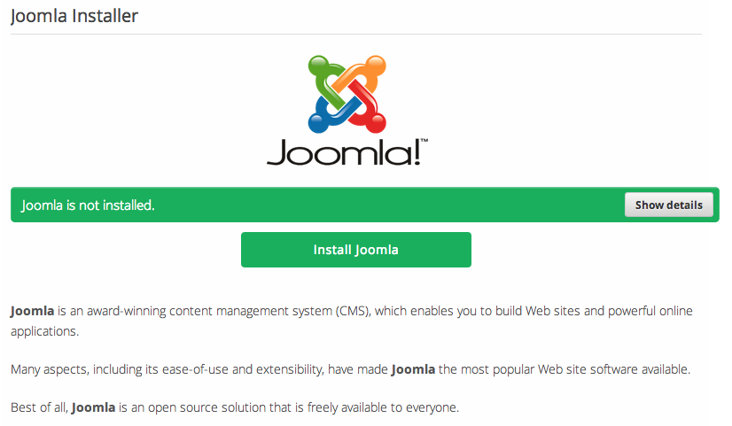
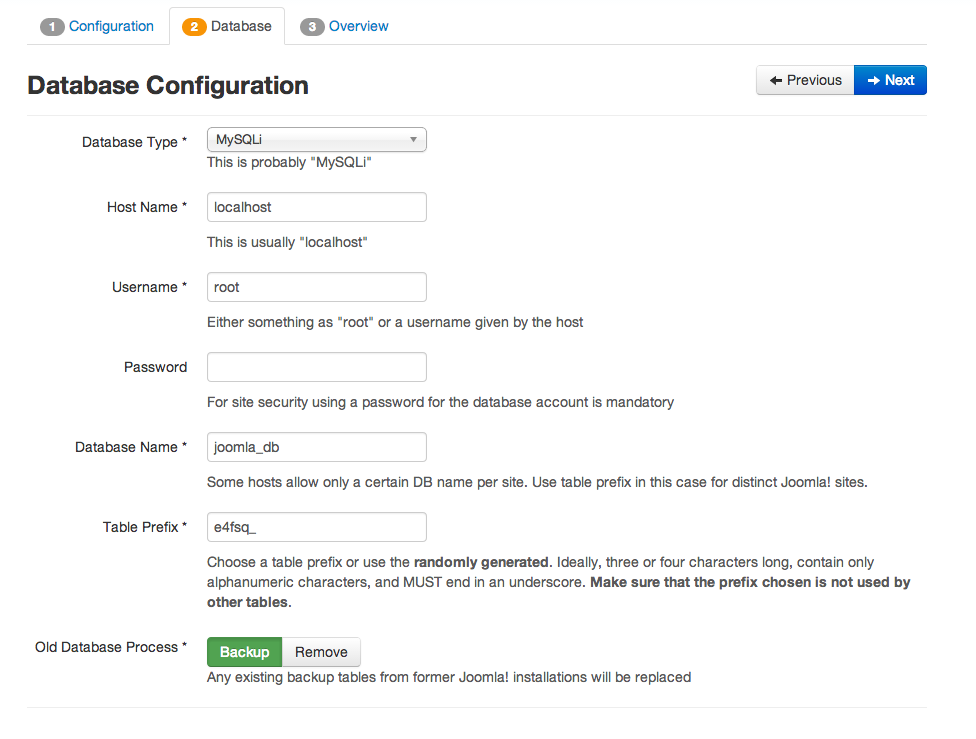
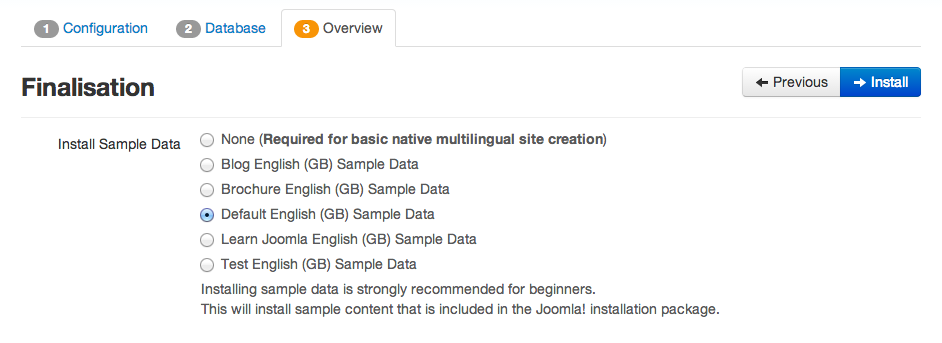
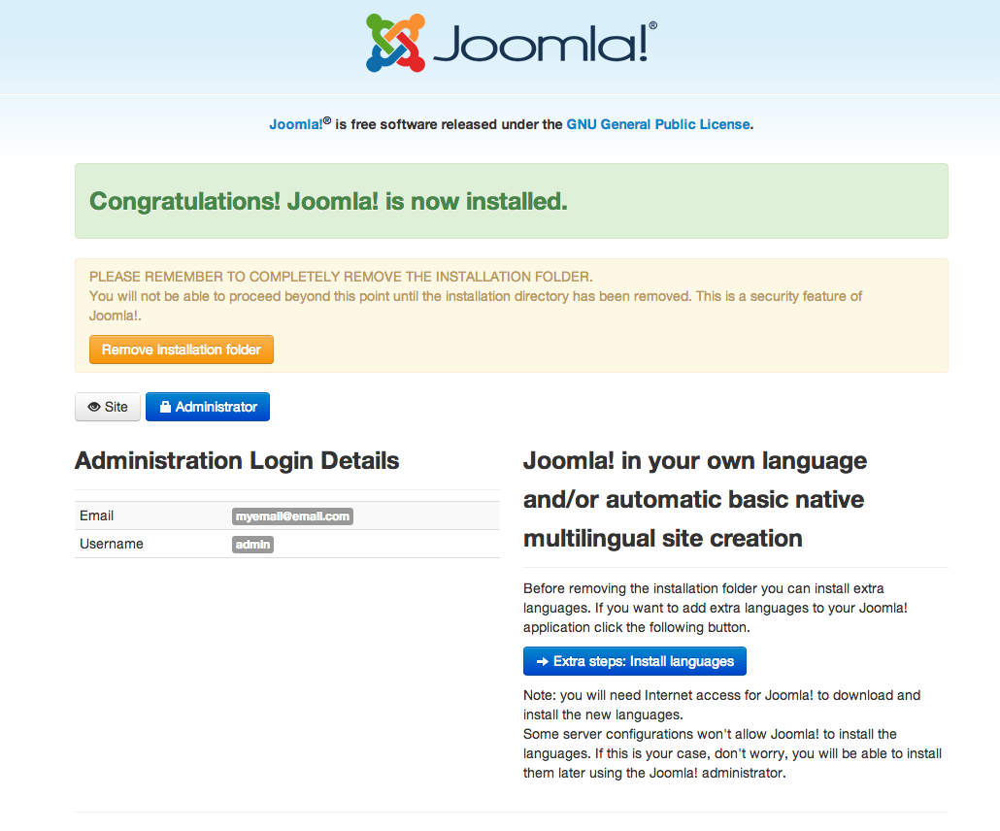
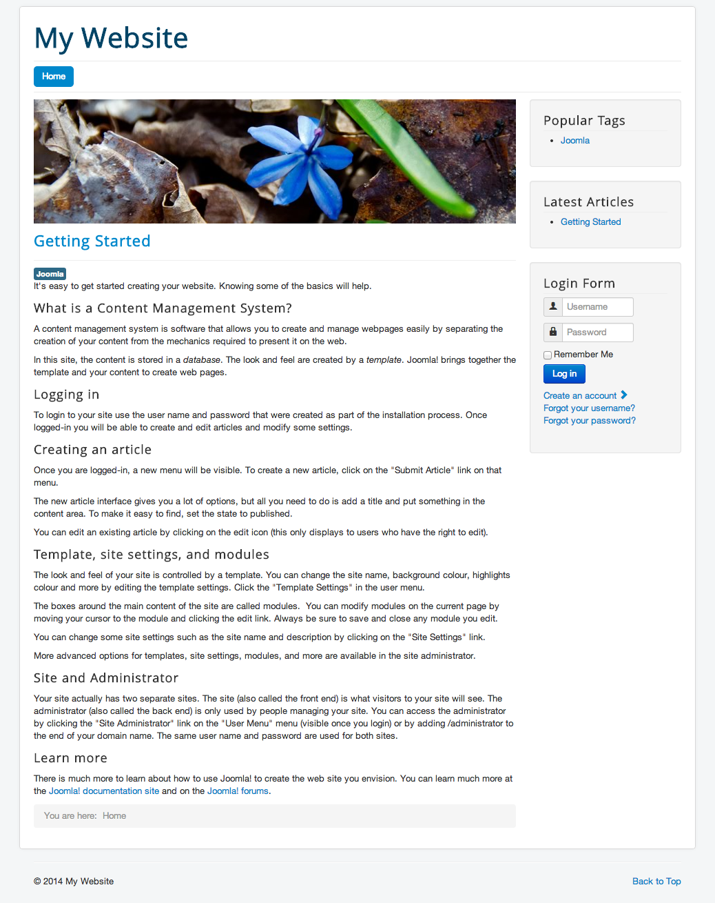
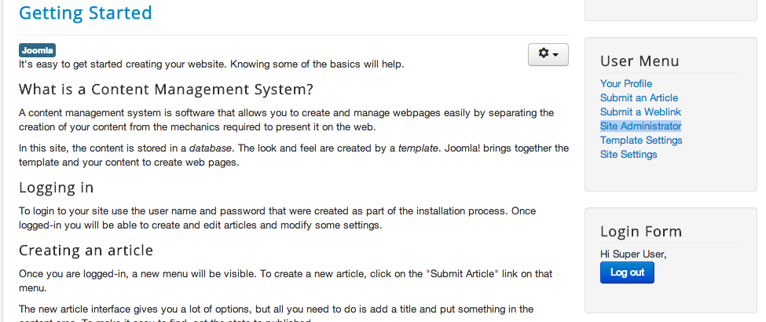
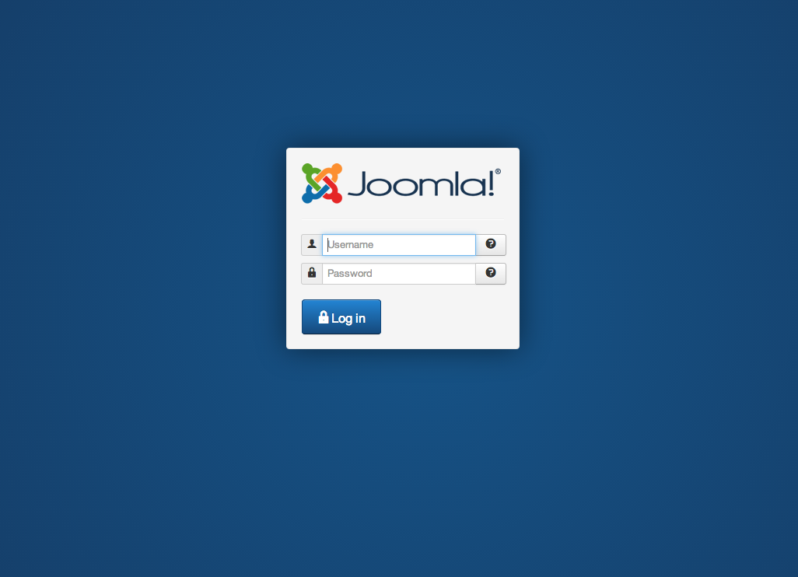
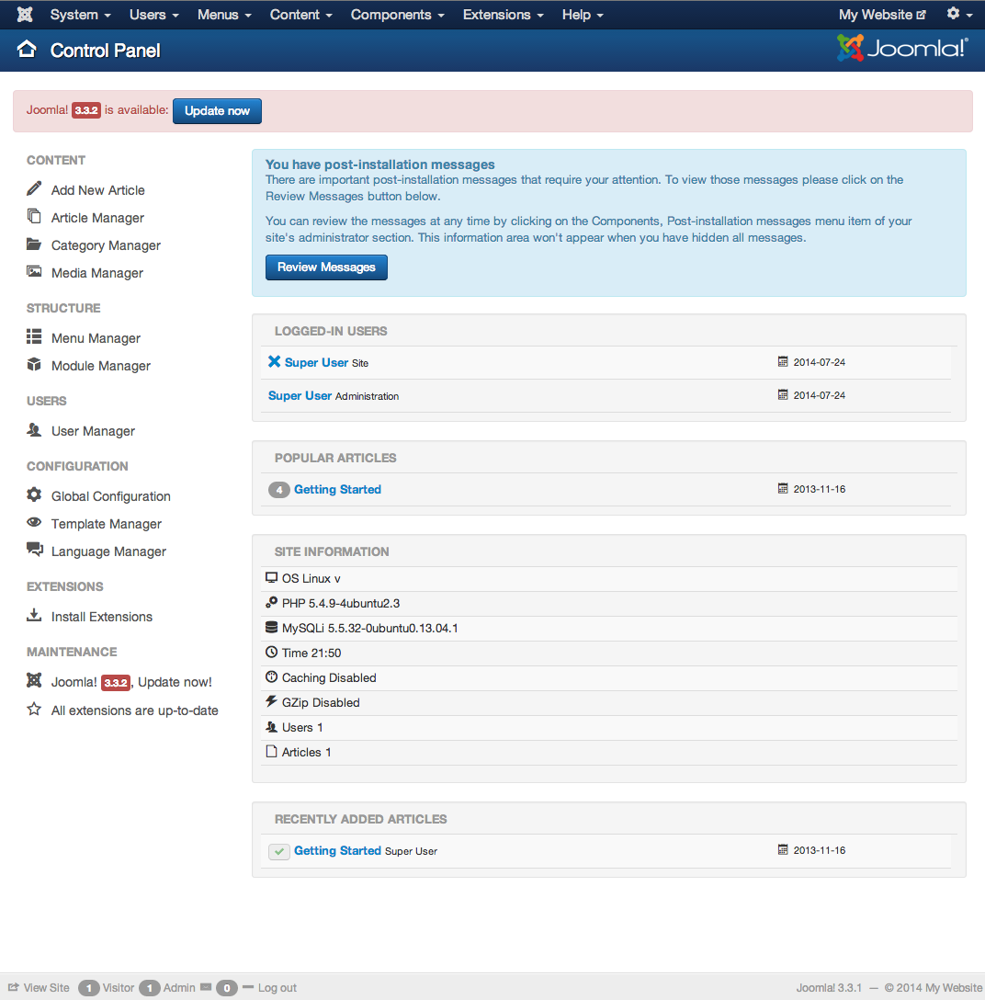

# 5 Easy steps to setup Joomla on Koding

**What is Joomla?** 
Joomla is an award-winning content management system (CMS), which enables you to build Web sites and powerful online applications.

Many aspects, including its ease-of-use and extensibility, have made Joomla the most popular Web site software available.

Best of all, Joomla is an open source solution that is freely available to everyone.

Getting started with Joomla on [**Koding**](https://koding.com) is as simple as following these 5 steps!

**Step 1: **
Run the **[Joomla Installer App](https://koding.com/Joomla)**. [Note: you have to be 
logged into your [Koding account](https://koding.com/Login) in order to run the app.]

This is what you will see when you launch the app.

___

**Step 2: **
When the setup is complete, a link will be appear. If you click on it, it will bring you to the main configuration page show below. Go ahead and fill out the neccessary information.

___

**Step 3: **
Next, you will be brought to the data configuration page.

Enter **root** for **Username** and do NOT enter a password unless you have changed your MySQL password. 

Enter any database name you like.

___

**Step 4: **
Next you will be brought to the finalization page. If you are new to Joomla, select 'Default English (GB) Sample Data' and click 'Install':

___

**Step 5: **
Congrats! Your Joomla installation is now complete! Click 'Remove Installation folder' in order to be able to visit your sites:

___

You are now able to visit your site by clicking "site":

___

After you log in, a user menu will appear on the right, from which you could access the admin site by clicking 'Site Administrator':

___

You will be brought here after clicking 'Site Adminstrator': 

___

And this what you will see on the admin site after you log in:

___

That's it for the Joomla guide! Go ahead and try it out!