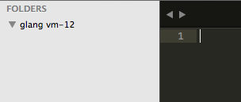

# Koding with Sublime Text

## What you will need

- Your [Koding](https://koding.com) username
- Your [Koding](https://koding.com) VM Number
- [Sublime Text](https://www.sublimetext.com/) 2 or 3

## Getting Down to Business

1. Download [Package Control](https://sublime.wbond.net/installation#st2) and use the Package Control: Install Package command from the command palette. The command palette is opened via ctrl+shift+p on Windows and Linux, and cmd+shift+p on OS X.

  

2. Once you run the Package Control: Install Package command, a list of packages will appear. Type in SFTP and hit enter. Using Package Control ensures Sublime SFTP will stay up to date automatically.

  

3. Open the folder that you want to sync with your VM using Sublime Text

  

4. Right click the folder in the sidebar and select `SFTP/FTP` -> `Map to Remote`

  

5. You should now see `sftp-config.json` opened.

  

6. Configure your `sftp-config.json` file and save it.

  ```
  "host": "<vm-number>.<username>.koding.kd.io",
  "user": "<username>",
  "password": "<koding_password>",
  //"port": "22",
    
  "remote_path": "/home/<username>/",
  ```

  

   Modify the other configurations if you wish. I personally find the option to `upload_on_save` very handy.
   
  

7. Right click the folder, select `SFTP/FTP`. You will now see many more options than before.

  

8. (**IMPORTANT**) Chose whether you want to `Sync Local -> Remote` or `Sync Remote -> Local`. Be very careful about which you choose.

   `Sync Local -> Remote` overwrites what you have in your remote directory that you specified in you `sftp-config.json` file with what you have in your local directory.
   
   `Sync Remote -> Local` overwrites what you have in your local directory with what you have in your remote directory that you specified in you `sftp-config.json` file.
   
  

9. (**IMPORTANT**) Check what is about to be performed in the box below before confirming your actions!

  

10. And there you have it, a folder synced with your Koding VM.

  