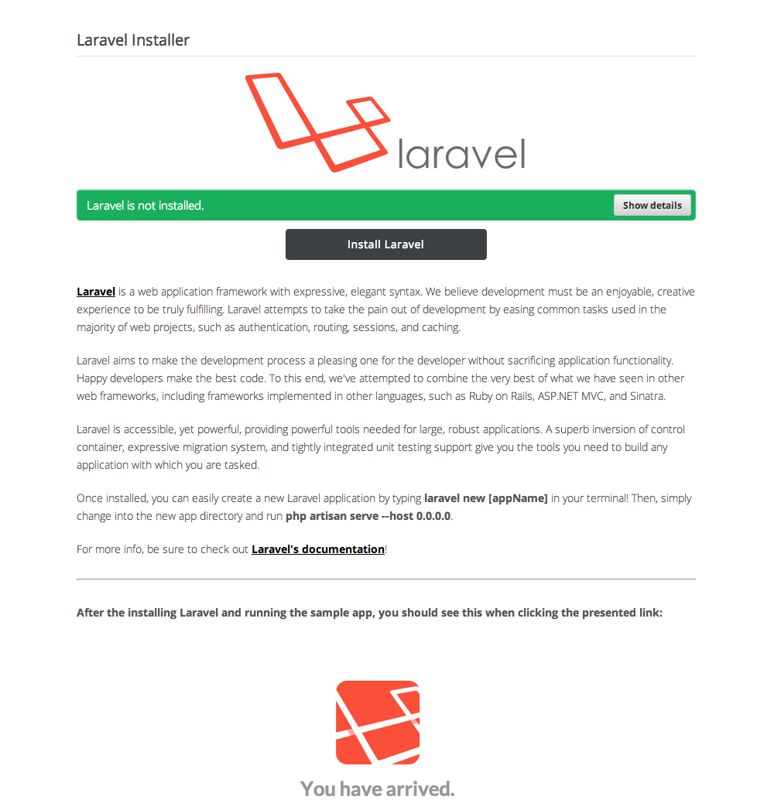
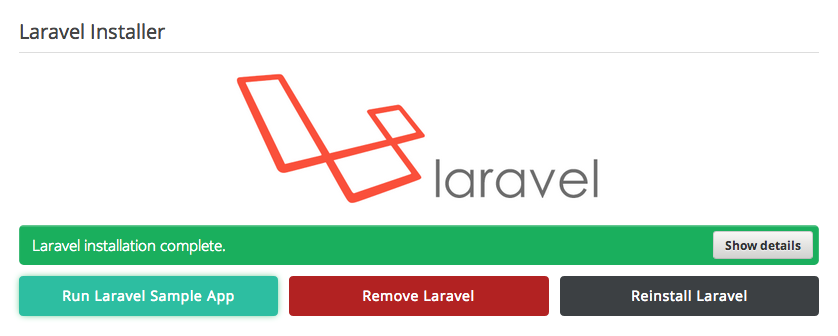
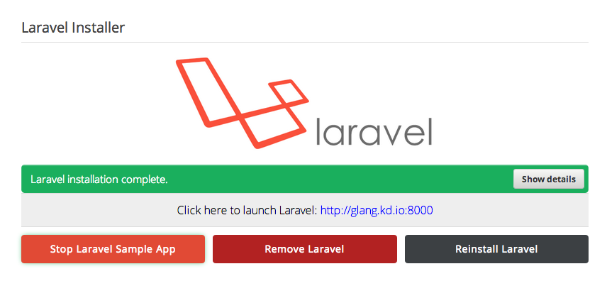
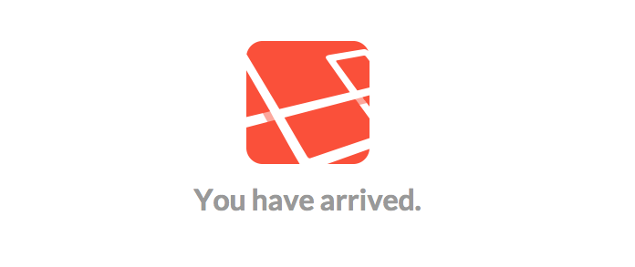

# 3 Easy steps to get started with Laravel on Koding

**What is Laravel?** 
Laravel is a web application framework with expressive, elegant syntax. They believe development must be an enjoyable, creative experience to be truly fulfilling. Laravel attempts to take the pain out of development by easing common tasks used in the majority of web projects, such as authentication, routing, sessions, and caching.

Laravel aims to make the development process a pleasing one for the developer without sacrificing application functionality. Happy developers make the best code. To this end, they've attempted to combine the very best of what they have seen in other web frameworks, including frameworks implemented in other languages, such as Ruby on Rails, ASP.NET MVC, and Sinatra.

Laravel is accessible, yet powerful, providing powerful tools needed for large, robust applications. A superb inversion of control container, expressive migration system, and tightly integrated unit testing support give you the tools you need to build any application with which you are tasked.

___

Getting started with Laravel on [**Koding**](https://koding.com) is as simple as following these 3 steps!

**Step 1: **
Run the [**Larevel Installer App**](https://koding.com/Laravel) on [**Koding**](https://koding.com), which will install Laravel and its dependencies on your VM. [Note: you have to be 
logged into your [Koding account](https://koding.com/Login) in order to run the app.]

This is what you will see when you launch the app from the Koding App Store:

___

**Step 2: **
Once the installation is complete, you will have the option to run a sample Laravel app. Go ahead and click the **Run Laravel Sample App** button.

___

**Step 3: **
A link should now be appear, from which you can visit a page genereated by the sample laravel app. Go ahead a click on that link.

___

You have successfully install Laravel on your Koding VM and ran a sample Laravel app. Congrats!

___

That's it for the Laravel on Koding Guide! Have fun!