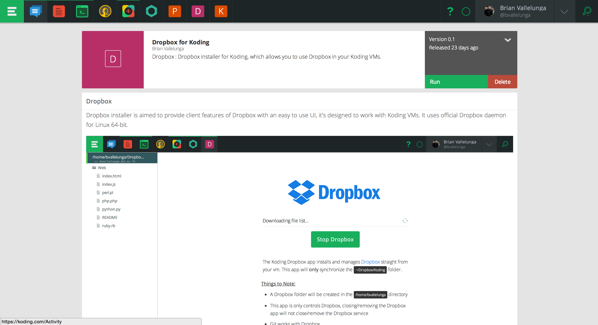
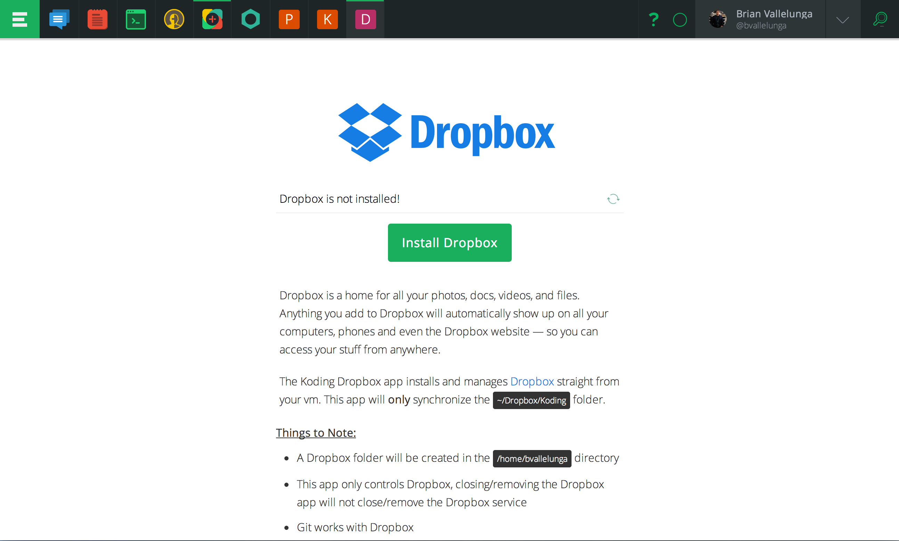
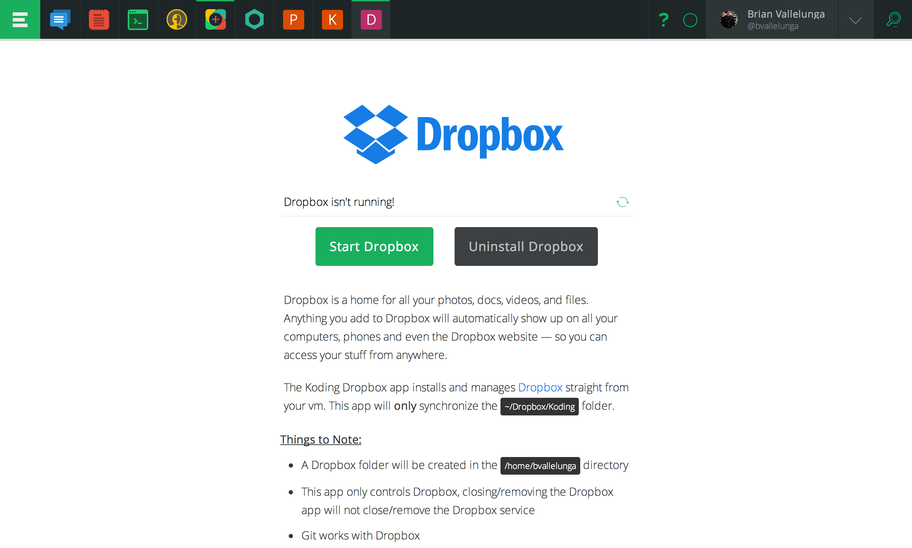
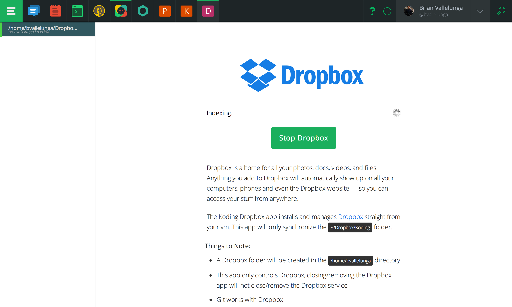

# Localhost Development

At Koding we get asked a lot if you can code on your local computer with a Koding vm. The answer has alway been **yes** and we would recommend a service like `ftp`. Today we offer a new service, [Dropbox](https://dropbox.com)!

# Steps to Install

1. Go to the [Koding App Store](https://koding.com/Apps) and select the Dropbox app. 
2. Click the **Run** button in the upper right corner
3. Enter your password! 
4. Click the **Install** button 
5. Click the **Start** button 
6. Authorize with Dropbox by clicking the link 
7. Your files should start syncing in a second, **it may take a minute or two** 

# What is Dropbox

Dropbox is a home for all your photos, docs, videos, and files. Anything you add to Dropbox will automatically show up on all your computers, phones and even the Dropbox website — so you can access your stuff from anywhere.

# Dropbox on Koding

The Koding Dropbox app installs and manages Dropbox straight from your vm. The app will only **only** synchronize the `~/Dropbox/Koding` folder, so please put all your code in the `Koding` folder. The [Dropbox app](https://koding.com/Apps/bvallelunga/Dropbox) can be installed from the [App Catalog](https://koding.com/Apps).

# Benefits of using Dropbox on Koding

Any file in the `Koding` folder in your Dropbox account will get syncronized immediately when a file is saved. Since Dropbox handles the synchronization, you don't have to russle with `ftp` or remember to send your changes up to your vm. And if there are any conflicts with your files, Dropbox will alert you and handle the problem gracefully

# Things to Note

- The Dropbox folder will be created in the `/home/<user>` directory
- The app only controls Dropbox, closing/removing the Dropbox app will not close/remove the Dropbox service
- Feel free to use git in the Dropbox folder, all changes in your repo will synced on the fly

# Technical Notes

The Dropbox Koding app only syncs the `Koding` folder in the users Dropbox account. To achieve this, we exclude files in 3 steps. 

1. For a 30 secounds we run the excluder script every 2 seconds (excludes top level folders)
2. When deamon gives the status, "Up to date" for the first time (excludes files)
  - We do this because Dropbox only shows files after downloading the file listing
3. Bash script runs every 5 minutes (excludes future files)
