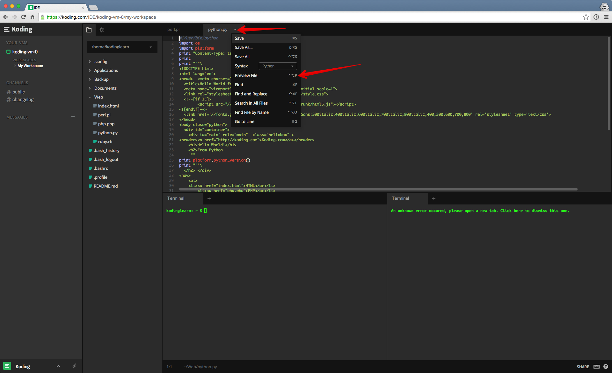

Since a Koding VM is essentially a Linux machine, we support all programming languages that are
supported on Linux. To get you started with programming, we have also written a series of ["Hello
World" guides](http://learn.koding.com/guides/hello-world/) for several different programming languages.

### Previewing command line applications
Once you have written your code, previewing it is the next step. If you are writing a command
line application then preview will happen on the command line itself when you run the application.

### Previewing web applications
To preview your web app, you can use the "Preview" option in the drop down menu of each editor tab.
This will open a new browser tab and show you a preview of that file.

