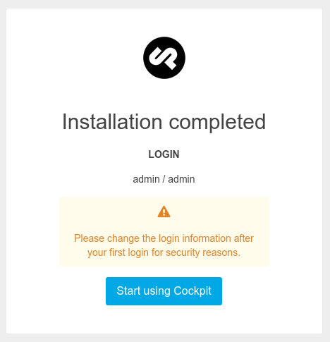

# Setup Cockpit on Koding

Before you continue reading this guide why not try a more easy way, using the [Koding Package Manager (kpm)](http://learn.koding.com/guides/getting-started-kpm/) and install Cockpit using just one command:

```
kpm install cockpit
```

***

# What is Cockpit?

Cockpit was born out of the need of building a simple dynamic site. Cockpits goal is to be simple, but yet powerful and designed in that way that you can spend less time trying to squeeze your site into a theme or template.

## Getting started

Before you can start the Cockpit install process, you'll need to update all of the apt-get packages:

```
sudo apt-get update
```

Make sure you have the PHP SQLite package installed on your VM before you continue. You can install it using this command:

```
sudo apt-get install php5-sqlite
```

Last but not least restart Apache:

```
sudo service apache2 restart
```

## Step 1

Run the below commands, which will install Cockpit on your VM:

Download the latest version:

```
curl -Lo /tmp/cockpit-0.13.0.tar.gz https://github.com/aheinze/cockpit/archive/0.13.0.tar.gz
```

Untar the archive and move it:

```
tar -C /tmp -zxf /tmp/cockpit-0.13.0.tar.gz

mv /tmp/cockpit-0.13.0 ~/Web/cockpit
```

Set the proper permissions for the storage folder and its subfolders:

```
cd Web
chmod 777 -R cockpit/storage
```

Clean up using the following command

```
sudo rm /tmp/cockpit-0.13.0.tar.gz
```

The set up has finished, you now need to complete the installation by heading over to a similar URL as this one and finish the installation:

```
http://KODING_USERNAME.koding.io/cockpit/install
```

Find out more about your VM hostname [here](http://learn.koding.com/faq/vm-hostname/).

## Step 2

If everything was successful this is the first thing your should see:



And that's it!

If you encounter any issues or have any questions please drop an email [here](mailto:support@koding.com).
