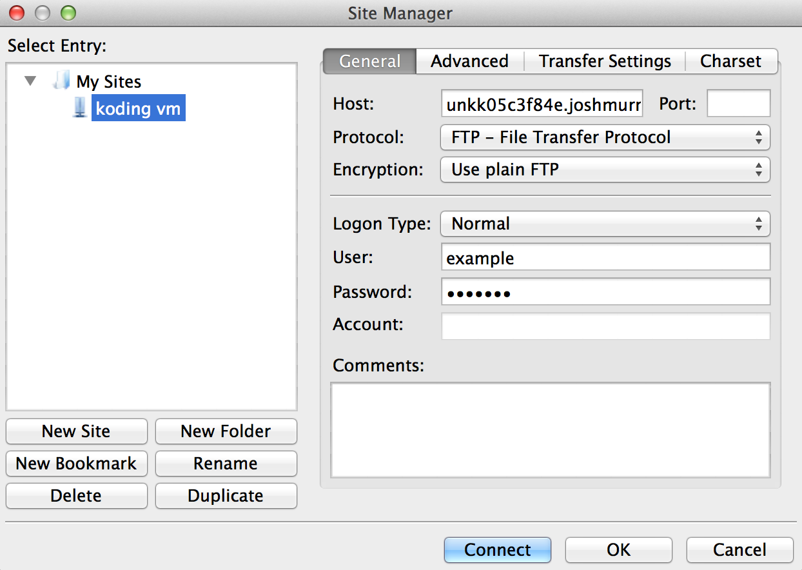

# Setting up FTP on Koding

Before you continue reading this guide why not try a more easy way, using the [Koding Package Manager (kpm)](http://learn.koding.com/guides/getting-started-kpm/) and install FTP using just one command:

```
kpm install ftp
```

***

In this guide you'll go over how to get your FTP Client connected to your VM's FTP Server. You will be using [FileZilla][filezilla] as the FTP Client, but any client should be able to connect to your FTP Server successfully.

## What you will need

In this tutorial you will need the following.

1. A [Koding][koding] account, and your Koding Username.
2. The Address of the VM you'd like to connect to. Instructions can be [found here][vm address].

## Update your software sources
Before getting started, make sure you have the latest sources locked down. Type in:

```
sudo apt-get update
```

and let the update process complete. It should not require any input.

## Installing ProFTPd

First off, you'll need to install ProFTPd. This can be done by pasting the following command into your [Koding IDE][ide]'s Terminal.

```
sudo apt-get install proftpd
```

During the install process you will be asked to choose to run your VPS as an inetd or standalone server. Choose the **standalone** option.

## Setting up the FTP User

After ProFTPd has been successfully installed, you need to set a FTP password for your user. To do this, paste the following command into your Terminal.

```
sudo passwd KODING_USERNAME
```

Make note to replace `KODING_USERNAME` with your actual Koding username.

After hitting enter, you'll be prompted for the **FTP** password you wish to use. *Not* your Koding password.

## Connecting to your FTP Server

Finally, in your FTP Client of choice paste your VM Address into the hostname. If you're not sure what that is, instructions to find it can be [found here][vm address].

After the hostname, enter your Koding username, and FTP Password that you chose in the above commands. An example image from FileZilla can be seen below.



## Additional Resources

- [FileZilla](https://filezilla-project.org/)
- [FileZilla Download](https://filezilla-project.org/download.php?type=client)


[filezilla]: https://filezilla-project.org/
[download]: https://filezilla-project.org/download.php?type=client
[koding]: https://koding.com
[ide]: https://koding.com/IDE
[vm address]: /faq/vm-address
