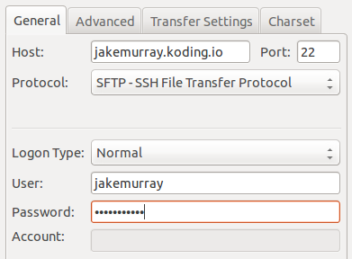

# Setting up SFTP on Koding

In this guide you'll go over how to get your SFTP Client connected to your VM's SFTP Server. You will be using [FileZilla][filezilla] as the SFTP Client, but any client should be able to connect to your SFTP Server successfully.

## What you will need

In this tutorial you will need the following.

1. A [Koding][koding] account, and your Koding Username.
2. The Address of the VM you'd like to connect to. Instructions can be [found here][vm address].

## Update your software sources
Before getting started, make sure you have the latest sources locked down. Type in:

```
sudo apt-get update
```

and let the update process complete. It should not require any input.

## Installing

First off, you'll need to install `openssh-server`. This can be done by pasting the following command into your [Koding IDE][ide]'s Terminal.

> type:good
> The `openssh-server` package comes preinstalled on all Koding VMs.

```
sudo apt-get install openssh-server
```

## Configure

After the install process has finished you'll need to configure the SFTP server. Start by editing the following file `/etc/ssh/sshd_config` like so:

```
sudo nano /etc/ssh/sshd_config
```

Find the below line:

```
Subsystem sftp /usr/lib/openssh/sftp-server
```

and replace it with:

```
Subsystem sftp internal-sftp
Match group root
ChrootDirectory %h
X11Forwarding no
AllowTcpForwarding no
ForceCommand internal-sftp
```

finally comment the below line:

```
#UsePAM yes
```

After you have performed this steps you'll need to restart the service using this command:

```
sudo service ssh restart
```

## Copy your Public Key

Now you need to allow access via ssh. So the first thing you need to do is to, copy your Public Key, usually found in `~/.ssh/id_rsa.pub`, and copy it in its entirety. Note the `.pub` in the filename. This is the **public** key, and it is very important that you copy this one. It will look something like this.

```
ssh-rsa AAAAB3NzaC1yc2EAAAADAQABAAABAQCyhKankDE4DRM86JqZ3JPdWDeqg+Tbzlql
TLfOKTeokhRoMgy5WoMY/ZWUVES3d2vSHHwW3cwWlELmVdc3Ow57boZv3fOsPhybYHVRTClX
Yr1ncSxyTvjvCfvV5q22aIxHPWQ353543ssda87sa+85XEa4VnveJsEzxBZl4oJ4GB0AGa48
+UdIqutrgZu7D7JCK+Yl228X+3bJf3ddlqDaKaVXPivvvYqImK6ZwFsxh2lNO4E8IOd3OSK9
zv6i+io8PxWmwP0tLFokxulAI8Td1sOPBE9s9bdJ5c2T/GfGjKF+aNKsd33TsYEjjc/plMZm
RRrOgQwre6OAkgMvyV2X foo@bar.baz
```

## Adding to your Authorized Keys

Next, we need to create a file called `authorized_keys` **on your Koding VM**, and paste the previously copied key into it. Run the following commands in your **Koding Terminal**.

```
mkdir -p ~/.ssh
touch ~/.ssh/authorized_keys
```

Now, open up the `authorized_keys` file that you just created, and paste in your public key. To open the file you can use a Terminal editor such as Nano or Vim, or simply use the File Explorer on the left hand side to open the `~/.ssh/authorized_keys` file.

Once the key has been pasted in, save the file.

## Setting up the SFTP user

After the configure process has been completed, You need to set a SFTP password for your user. To do this, paste the following command into your Terminal.

```
sudo passwd KODING_USERNAME
```

Make sure to replace `KODING_USERNAME` with your actual Koding username.

After hitting enter, you'll be prompted for the **SFTP** password you wish to use. *Not* your Koding password.

## Connecting to your SFTP Server

Finally, in your SFTP Client of choice paste your VM Address into the hostname. If you're not sure what that is, instructions to find it can be [found here][vm address].

After the hostname, enter your Koding username, and SFTP password that you chose in the above commands. An example image from FileZilla can be seen below.

> type:warning
> The default port for a SFTP connection is 22. Make sure to specify this when you input the connection details.



## Additional Resources

- [FileZilla](https://filezilla-project.org/)
- [FileZilla Download](https://filezilla-project.org/download.php?type=client)


[filezilla]: https://filezilla-project.org/
[download]: https://filezilla-project.org/download.php?type=client
[koding]: https://koding.com
[ide]: https://koding.com/IDE
[vm address]: /faq/vm-address
