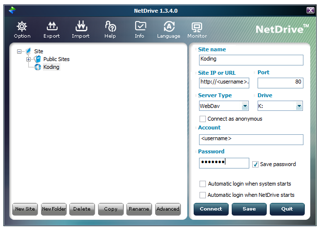

# Setting up WebDav on Koding

This tutorial will cover the basics on how to set up WebDav on Koding and then connect to it using a Mac, Windows or Ubuntu machine. We already know how to set up [FTP](/faq/how-do-i-set-up-my-ftp/) and [SSH](http://learn.koding.com/ssh-into-your-koding-vm/), but what about WebDav? Just follow the steps below.

# Steps

The first step is to open up the Terminal app and type the following commands.

    sudo a2enmod dav
    sudo a2enmod dav_fs
    sudo nano /etc/apache2/sites-enabled/000-default

When the file opens from the last command, we just paste in this configuration and save it.

    Alias /webdav1 /var/www/WebDAV1
    <Directory /var/www/WebDAV1/>
     Options Indexes MultiViews
     AllowOverride None
     Order allow,deny
     allow from all
     </Directory>
    <Location /webdav1>
     DAV On
     AuthType Basic
     AuthName "webdav1"
     AuthUserFile /etc/apache2/webdav.password
     Require valid-user
    </Location>

The third step is to create the folder that will be used to store the files. You can do this by entering these commands:

    cd ~/Web
    mkdir WebDAV1
    chown -R www-data.www-data WebDAV1

The last step is to set up a password, of your choosing, and after that to restart the Apache server. You can do this by entering the commands below, where is your Koding username.

    sudo htpasswd -c /etc/apache2/webdav.password <USERNAME>
    sudo service apache2 reload

Just remember to restart the Apache server so that all the settings that
we made so far are remembered, and you're good to go. Now, what about
connecting to it? Sure. It's super simple stuff. We can check if our
WebDAV works by heading over to
**http://<hostname>.<username>.koding.io/webdav1** and then when the box
pops up we just enter our username and the password we set up earlier.  
For local connection you can follow these steps.

# On Mac OS

The Apple support website offers the quickest solution to our problem. Just follow the guide located [here](http://support.apple.com/kb/PH10744).

# On Windows OS

On a Windows machine we need NetDrive. You can download it by clicking this
[link](https://s3.amazonaws.com/_NetDrive/NetDrive-SETUP.exe). After we install
and open it, we need to add a **New Site**.  The
settings are as followed:

  * Site Name: **Koding**
  * Site IP or URL: **http://<hostname>.<username>.koding.io/webdav1**
  * Server Type: **WebDav**
  * Drive: **<choose one>**
  * Account: **<username>**
  * Password: **<password we set earlier>**
We then hit connect and it should work.

# On Ubuntu

On Ubuntu we can quickly test and use our newly created WebDav by using just the command line. First we need to install cadaver. Cadaver is a command line WebDav client.

    sudo apt-get install cadaver

After that we connect to our WebDav like this

    cadaver http://<hostname>.<username>.koding.io/webdav1/

After the connection is established we enter our username and password and we're good to go.

    cadaver http://<hostname>.<username>.koding.io/webdav1
    Authentication required for test on server
    `http://<hostname>.<username>.koding.io/webdav1`:
    Username: <username>
    Password: *******
    dav:/webdav1/> quit
    Connection to `http://<hostname>.<username>.koding.io/webdav1`
closed.

That is all. If you have any issues setting up WebDav you can drop an email at [support@koding.com](mailto:support@koding.com)
