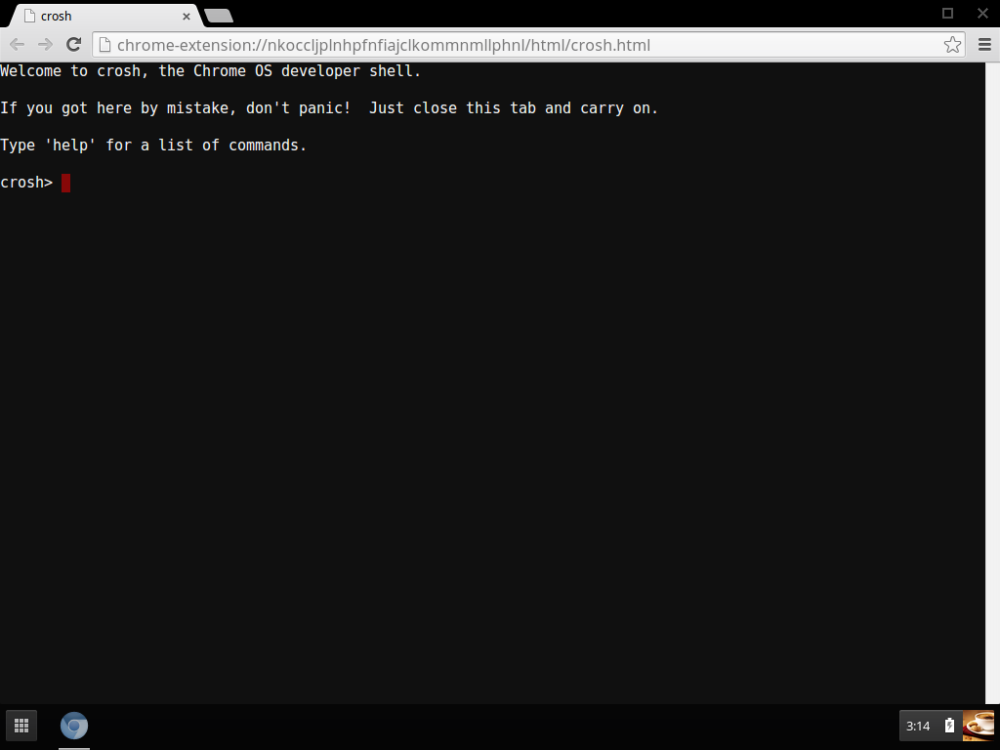
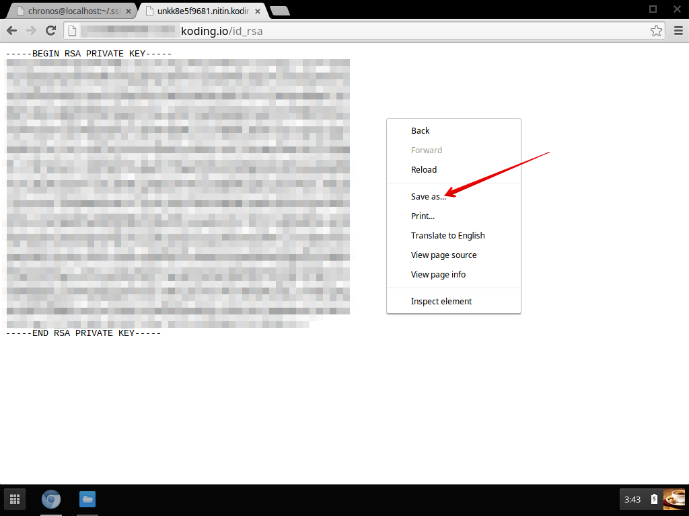
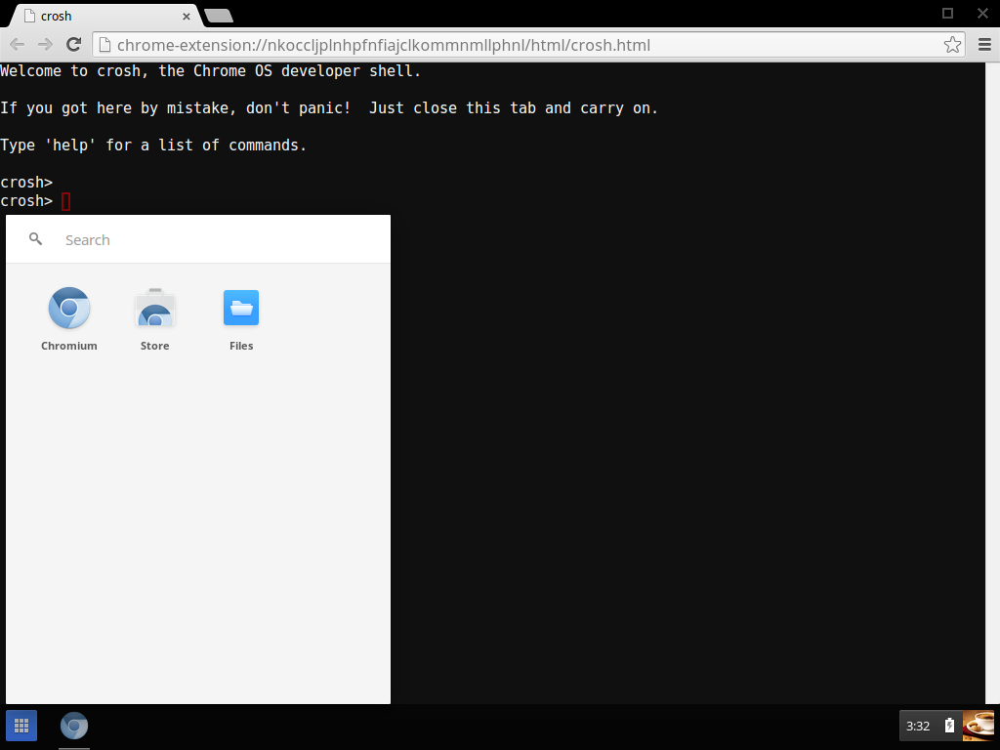
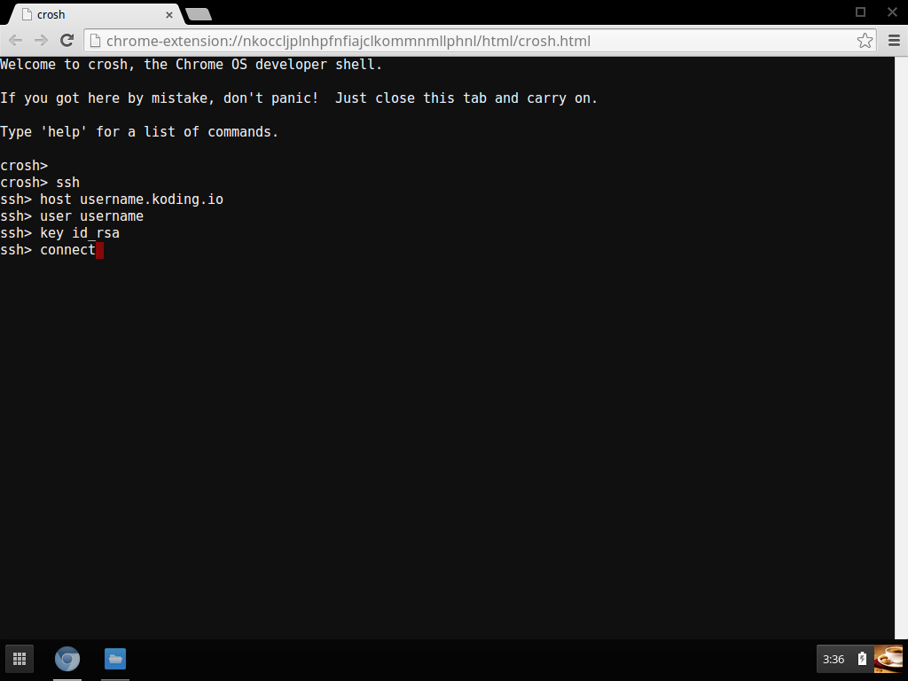
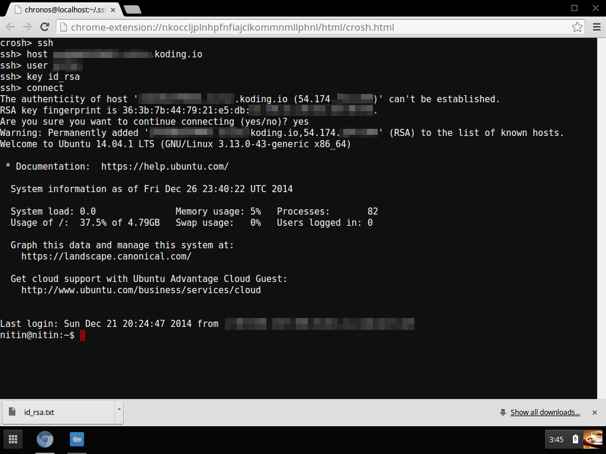

In this guide, we will cover how to set up ssh on your Chromebook. There are
two ways you can use SSH on a Chromebook. You can either install [Google's SSH
Chrome extention](https://chrome.google.com/webstore/detail/secure-shell/pnhechapfaindjhompbnflcldabbghjo)
or use the native SSH client that is built into the Chrome OS. For the purposes
of this guide, we will use the native SSH client method as it does not
require the installation of any new software.

### Step 1: Verify you have crosh installed
Before beginning, make sure that you have a newer build of Chrome OS (build 32 or above)
and that your particular build supports the built in `crosh` shell which contains
the SSH client that we will use. To check, press `ctrl-alt-T` on your keyboard
and you should be greeted with a screen similar to the one below.


If you do not get the above screen, chances are high that you either have an older
build of Chrome OS or that your device manufacturer has opted to remove crosh from
their customd build of the Chrome OS.

### Step 2: Generate the required ssh private and public keys on your VM
> type:tip
> If you already have a private and public key generated, you can
skip the section below

Open up Terminal on your Koding VM and type in the following command:
```
ssh-keygen
```
You will be presented with a few choices, accept all defaults until
you end up with something like this:
```
Generating public/private rsa key pair.
Enter file in which to save the key (/home/your_username/.ssh/id_rsa):
Created directory '/home/your_username/.ssh'.
Enter passphrase (empty for no passphrase):
Enter same passphrase again:
Your identification has been saved in /home/your_username/.ssh/id_rsa.
Your public key has been saved in /home/your_username/.ssh/id_rsa.pub.
The key fingerprint is:
7a:36:29:6d:9d:5c:45:5a:8b:53:c0:1a:61:29:3f:ce your_username@your_username
The key's randomart image is:
+--[ RSA 2048]----+
|          o+..+  |
|        ..o .* . |
|         o o+ o  |
|          +  o   |
|        So ..    |
|       o +Eo     |
|      o B +      |
|       = .       |
|                 |
+-----------------+
```

### Step 3: Copy the generated public key to authotized_keys file on your VM
Doing this allows your Chromebook to be recognized as a valid host (once we copy
over the private keys, which is the next step).

Create an `authorized_keys` file (if it does not exist)
```
touch ~/.ssh/authorized_keys
```

Copy the public key into it.

```
cat ~/.ssh/id_rsa.pub >> ~/.ssh/authorized_keys
```

### Step 4: Moving the generated private key to your Chromebook
To achieve this, we will first copy over the private key to
our Web folder so that we can download it over the browser.

> type:alert
> After downloading the private key you should immediately
delete if from your Web folder. This is not the most secure way
of copying over your file but is the easiest. If you prefer, you
can also upload the file to your Google Drive account and then
download it your Chromebook.

Copy the private key to your Web folder:
```
cp ~/.ssh/id_rsa ~/Web/.
chmod 655 ~/Web/id_rsa
```

Now hop over to your Chromebook and type in the Web URL of your VM to
download this file. The Web URL of your VM usually is:
```
yourusername.koding.io/id_rsa
```


Make sure you have the file without the .txt extension. You can check/rename
the file by using the `Files` app on your Chromebook (as seen in the screenshot
below).


As soon as the file is downloaded on your Chromebook, delete it from
the Web folder of your VM
```
rm ~/Web/id_rsa
```

At this point, you now have the generated private key on your Chromebook
and are ready to connect.

Press `ctrl-alt-T` to bring up `crosh` and then on the crosh shell, type `ssh`
Use the following commands to set up ssh:
```
host = your_koding_username.koding.io
user = your_koding_username
key = id_rsa
```


Once you press enter, you should be dropped into your Koding VM!

