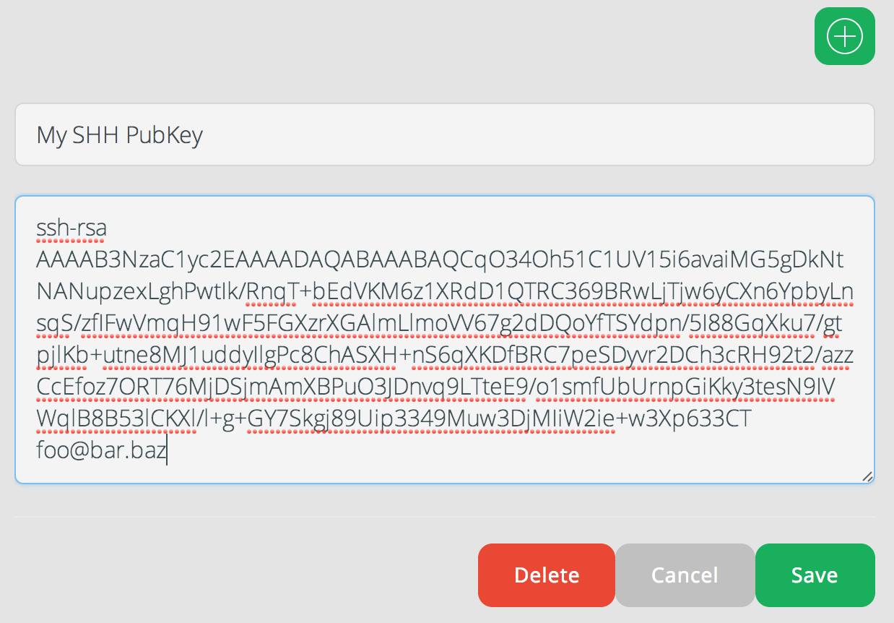

# Connect with SSH, from Unix

Connecting to your VM with SSH will allow you to use another Terminal, outside 
of Koding, to interact with your Koding VM. This is also required if you're 
interested in using SSH Tunneling. If you're connecting with PuTTY, have a look 
[here][connect windows]. If you're using Cygwin, these instructions will work 
fine for you.

We are going to use the terminology "local" to represent the machine that 
you're connecting to Koding with.

## What you will need

- Your [Koding][koding] username
- Your [Koding][koding] VM Number
- Generated SSH Keys on your local machine. If you need to generate them, 
  Github has an awesome tutorial found [here][github keygen].

## Connecting with OpenSSH or Cygwin

1. First, copy your Public Key, usually found in `~/.ssh/id_rsa.pub`, and copy 
  it in its entirety! It will look something like this:
  ```
  ssh-rsa AAAAB3NzaC1yc2EAAAADAQABAAABAQCyhKankDE4DRM86JqZ3JPdWDeqg+TbzlqlTLf 
  OKTeokhRoMgy5WoMY/ZWUVES3d2vSHHwW3cwWlELmVdc3Ow57boZv3fOsPhybYHVRTClXYr1ncS 
  xyTvjvCfvV5q22aIxHPWQ353543ssda87sa+85XEa4VnveJsEzxBZl4oJ4GB0AGa48+UdIqutrg 
  Zu7D7JCK+Yl228X+3bJf3ddlqDaKaVXPivvvYqImK6ZwFsxh2lNO4E8IOd3OSK9zv6i+io8PxWm 
  wP0tLFokxulAI8Td1sOPBE9s9bdJ5c2T/GfGjKF+aNKsd33TsYEjjc/plMZmRRrOgQwre6OAkgM 
  vyV2X foo@bar.baz
  ```
2. Next, paste this entire Public Key into your SSH Keys section of your 
Account settings. This can be found by going to 
[Koding/Account](https://koding.com/Account) and clicking SSH Keys under the 
DEVELOP. Click the Plus button on the right side of the page, and paste your 
Public Key into this. Below is a screenshot of this area for clarification.  

  

3. Now go back to your local machine, and create the file `~/.ssh/config` 
  _(assuming it's not already created)_. Add the following code into that file:

  ```
  Host *.kd.io
    User <username>
    ProxyCommand ssh %r@ssh.koding.com nc %h %p
  ```

  Where `<username>` is your username, without the `<>`.

4. Next, on your local machine and connect to your VM! This can be done by 
typing:

  ```
  ssh <vm-Number>.<username>.koding.kd.io
  ```

  An example, here is my connection command:

  ```
  ssh vm-0.leeolayvar.koding.kd.io
  ```

  You will have to enter your local SSH password, if you chose one when you 
  created your key. After that, presented with `username@vm-X:~$`, signaling that 
  you have connected successfully.This step has quite a few Gotchas so please 
  review them below.Two likely gotchas, are Agent Failure and 
  ssh_exchange_identification, which can be seen in the Possible Gotchas section 
  below.

5. ### Alternate id_rsa

  If you're using an alternately named `id_rsa` file, you can modify your 
  config to support this with the following example.

  ```
  Host *.kd.io User <username>
    IdentityFile ~/.ssh/alternate
    ProxyCommand ssh -i ~/.ssh/alternate %r@ssh.koding.com nc %h %p
  ```

  Note the `IdentityFile ~/.ssh/alternate` and `-i ~/.ssh/alternate`, they tell 
  SSH the location of your public key, and are required. Replace the file 
  location with the location of your alternate key.

## Important note

If you're having trouble SSH-ing into your VM, after pasting your SSH key in the box described above, make sure there are **NO SPACES** in the key other than the one after ``ssh-rsa`` and one before your email address.


[koding]: https://koding.com
[github keygen]: https://help.github.com/articles/generating-ssh-keys
[connect windows]: /guides/connect-with-ssh-windows
