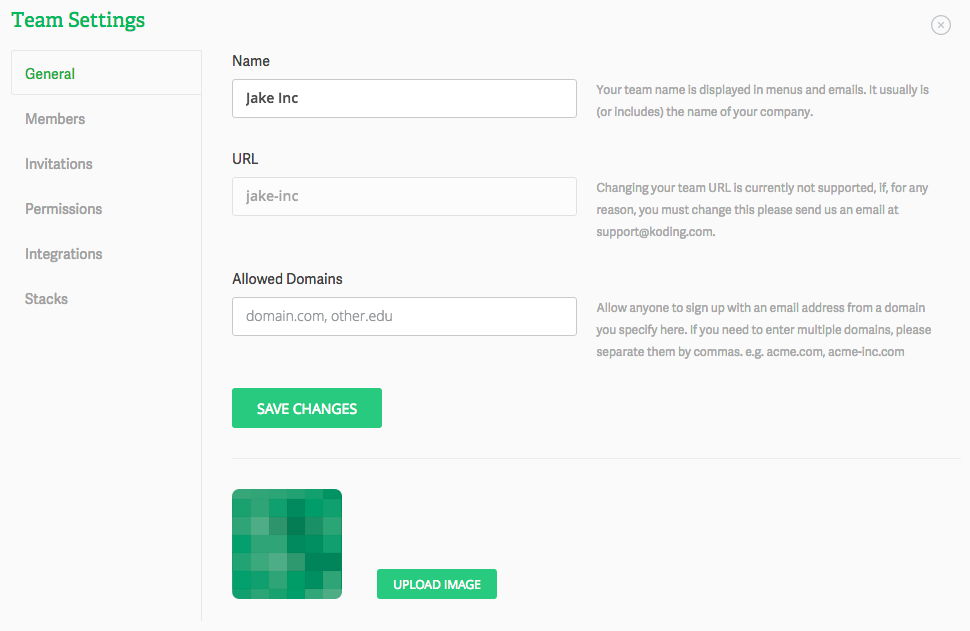

# Editing the Team general settings

In this guide will cover the basics of how to edit your Team’s general settings.

### Name:

In this view you’ll be able to set your Team’s name. The name is (or includes) the name of your company.

### URL:

You can also view the Team url. When you first set up your team you’ll set this URL. 

> type:tip
> The Team URL cannot be changed after you created the Team.

### Allowed Domains:

Here you can specify a domain that is pre-approved for team membership. If someone registers for your team using an email address with this domain, they are automatically added to your team. This saves a lot of time for those teams that have a lot of members. If you need to enter multiple domains, you can separate them by commas. e.g. acme.com, acme-inc.com.

### Image:

You can personalize your Team by uploading an image. This is usually your company or team logo.

Check out the other guides that will help you to [set up your team](/guides/teams/new-team).

You have now made the first steps into personalizing your Team. If you have any questions or have any issues don’t hesitate to drop at [support@koding.com](mailto:support@koding.com) and will gladly help.
