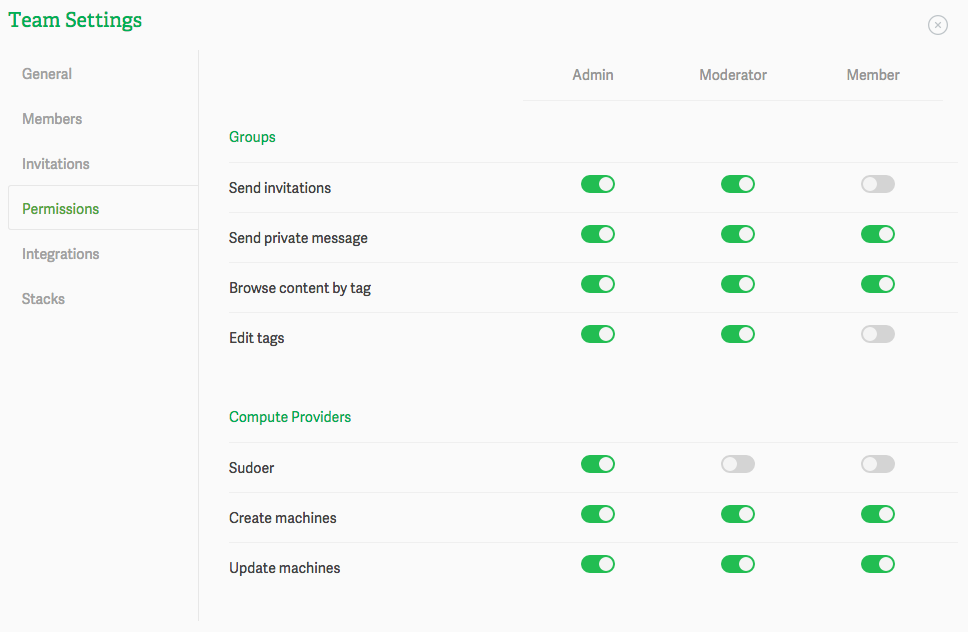

# Granting user permissions

Koding for Teams allows you to set granular level of permissions for the three levels of roles that are offered (Admin, Moderator, Member). Depending on how our team operates, you can fine tune the features and level of access for each role. This gives you more control over how your team engages with the product.

> type:tip
> Checkout the Understanding the Team settings guide for more info regarding Team settings.

To enable or disable a permissions just click on the toggle and if the toggle is green then that means the respective user role has the ability to perform that action. If, on the other hand it’s grayed out, then he can’t perform that specific action.

If you have any questions or have any issues don’t hesitate to drop at [support@koding.com](mailto:support@koding.com) and will gladly help.
