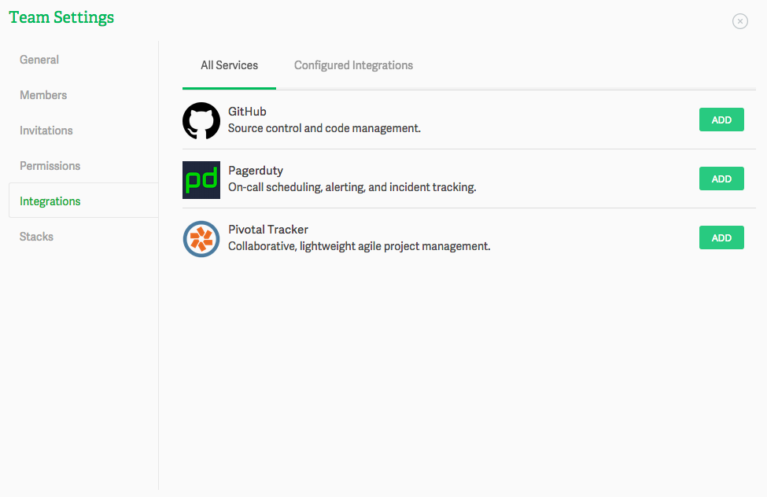
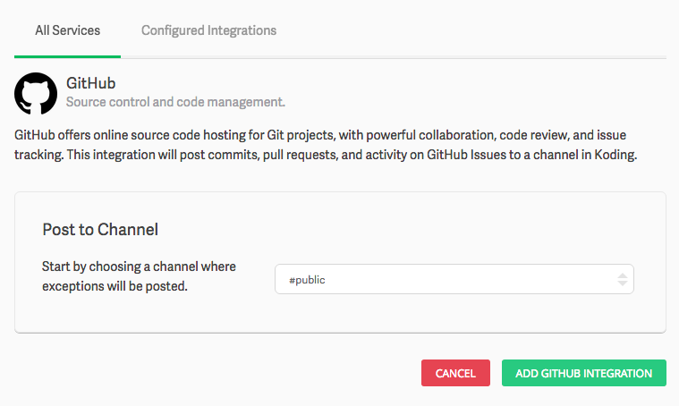

# Integrating services into your Team

When you set up your Team on Koding you’ll have the ability to integrate popular services to increase productivity. When you integrate a service, status updates from that service are posted to the Koding channel that you select to receive the update for that particular integration.  Integrations are a great way for you and your Team to be able to monitor your overall activity and the status of your projects.

> type:tip 
> More integrations coming soon! If you have a specific integration you would like to 
> see, please send us a note: [integrations@koding.com](mailto:integrations@koding.com)

## Basics

Once you click the Add button you’ll be able to choose the channel where the updates will be posted.

Next you’ll need to click on the *Add SERVICE_NAME integration* to continue the integration setup.

Keep in mind that each service has different settings and each one behaves differently. In some case you mind find yourself just authorizing your account, because we did all the work in the back so as to make it easier for you to integrate and in other cases you’ll need to do a bit of customizing for it the services to work as you would expect.

You can always come to back to this tab and preview your already configured integrations. Clicking on the Configured Integrations will show you a list of active services for your Team.

If you have any questions or have any issues don’t hesitate to drop at [support@koding.com](mailto:support@koding.com) and will gladly help.
