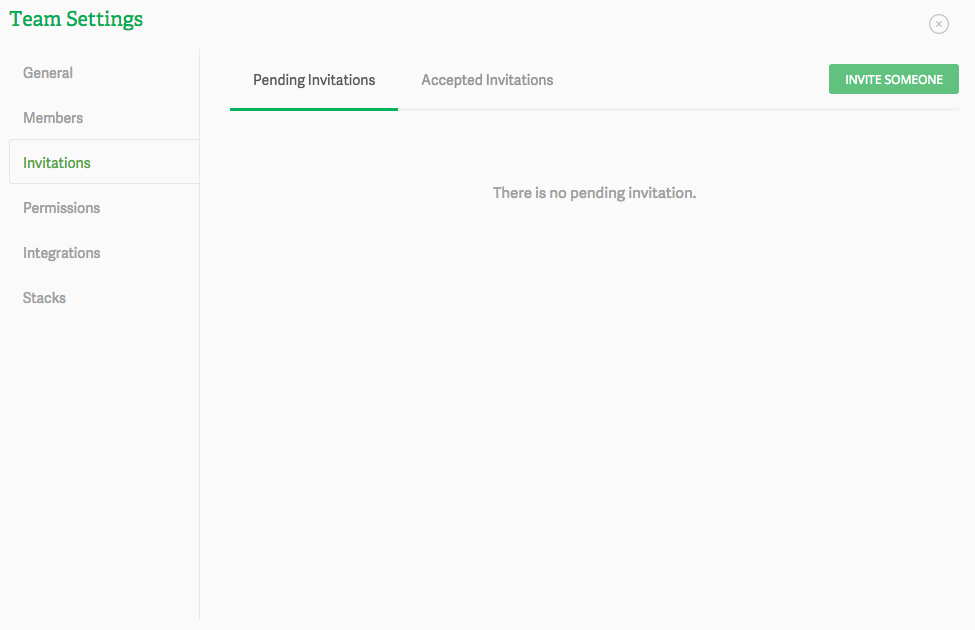
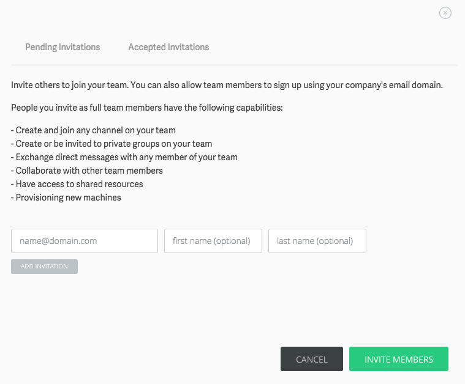

# Inviting users to your Team

## Basics

Inviting someone to your Team is as really easy. Simply click on the Invite Someone button and you’ll be able to fill in the email address, first name and last name, of your teammate(s). You can also send out multiple invitations at once.

Keep in mind that people you invite, as full team members, have the following capabilities:

* Create and join any channel on your team
* Create or be invited to private groups on your team
* Exchange direct messages with any member of your team
* Collaborate with other team members
* Have access to shared resources
* Provisioning new machines

> type:tip
> Checkout the Editing your team’s general settings for more info

## Invitation management

As soon in the image image, in Pendin Invitations tab you’ll be able to sort all the invitations using different criteria.

For any invite in pending state, you can revoke or resend the invite, as shown in the image below.

If you have any questions or have any issues don’t hesitate to drop at [support@koding.com](mailto:support@koding.com) and will gladly help.
