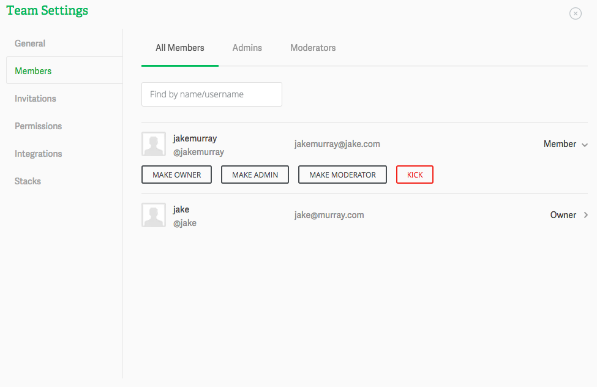

# Managing Team users

The Members tab contains all users who are members of your Koding team. You can view them by their role by selecting one of the tabs at the top. Each of these roles have certain permissions set. This means that they can each perform a number of actions in your team.

> type:tip
> Checkout the Permissions tab for more info on user permissions.

## Actions

You can change the role assigned to any team member by clicking on the action arrow (towards the right hand side of each user) and selecting a new role for them.

You can also kick the user from your Team. Keep in mind that this action is irreversible. Once kicked out, the user has to be invited again. 

If you have any questions or have any issues don’t hesitate to drop at [support@koding.com](mailto:support@koding.com) and will gladly help.
