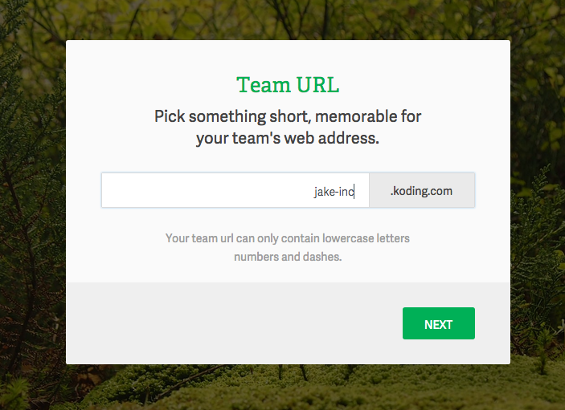
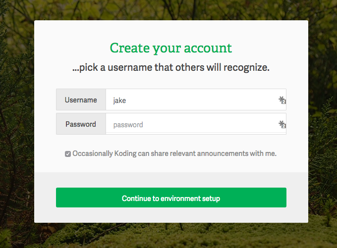
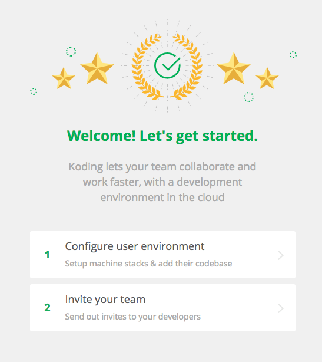

# What is Koding for Teams?

Koding for Teams allows your team to get your own version of Koding. This means that you get to define, configure and deploy your own development stack. This gives your team the best cloud-based development environment where they can easily create and collaborate without the need to worry about configuring and installing anything.

Some additional benefits are:

1. You can onboard current and new team members to your dev environments in minutes (vs days or weeks).
2. allow team members to be productive starting from day 1.
3. collaborate with remote team members without messy installs.
4. have full control over your dev environments from a single dashboard.
5. audit and update your team’s deployed infrastructure as your needs evolve.
6. version control your infrastructure and take action on the outliers.
7. introduce open development principles within your team and organization.
8. super-charge the aging developer localhost based workspace with new capabilities which in turn boosts your overall team productivity.
9. easily integrate 3rd party services and applications like GitHub, Pivotal, Asana, etc.

## Creating a team

In order to create your own Team you’ll need to head over to the [Team’s sign up page](https://koding.com/Teams) and follow the step outlined bellow.

Note: Koding for Teams is “invite-only” for now. To get access, please sign up.

Fill in the initial details to get started and click the *Sign up* button. Upon clicking the signup button you’ll be redirected to the Team's creation setup.

After you have selected a web address for your Team click next to finalize the setup.

The last step in creating your Team is to create your own owner account, illustrated below.

Congratulations you just created your own Team within Koding! Now, checkout our other guides to learn how to set up your Team, add users and configure your development stack.

If you have any questions or have any issues don’t hesitate to drop at [support@koding.com](mailto:support@koding.com) and will gladly help.

