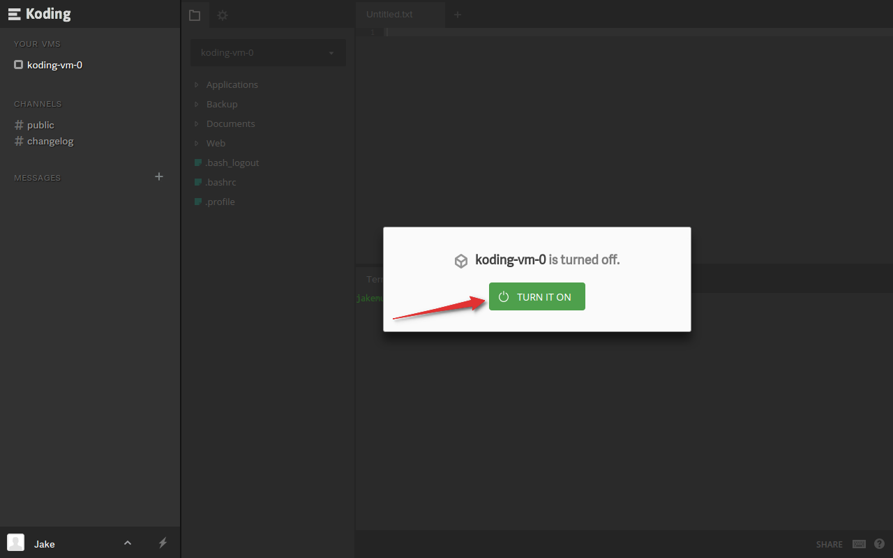
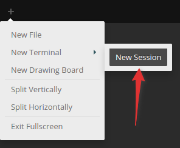

# Koding Terminal Introduction

In this guide we'll go over the Koding Terminal. We'll try to explain how it works, how to use it and in end share some useful tips that you can use to be more productive.

## Getting started

To access a Koding Terminal, select your Virtual Machine on the left hand side as pictured bellow.

> type:warning
> If you have a Developer or Professional account then select the VM you want to start, from the list.

Then click on the `Turn it on` button in the modal.

After the VM has started, you'll see your Koding IDE.

> type:tip
> The IDE will remember what files / tabs you had opened last time and the FileTree will remember the folder location.

By default after your VM is started, you will see a Terminal prompt in the lower right portion of your Integrated Development Environment (IDE). 

## Usage

With the Terminal, you are able to run commands on your Ubuntu Linux VM. All programs and languages are supported, and you have full sudo access, so you can customize your VM however you want.

> type:tip
> `sudo` is a program for Unix-like computer operating systems that allows users to run programs with the security privileges of another user (normally the superuser, or root).

The Terminal itself is fast and responsive. Vim, Nano, Tmux and anything else you throw at it, will work right out of the box.

By clicking the plus button next to the Terminal tab, you are able to create multiple Terminal sessions that are basically multiple Terminals where you can run commands separately.

> type:tip
> Terminal sessions are remembered when turning the VM on again.

Because the Terminal is in a tab in the IDE you can also split, merge splits, and even make the terminals fullscreen.

## Tips

The Koding Terminal comes preinstalled with some useful programms that can be run using these commands.

* `fish` - is a smart and user-friendly command line shell for OS X, Linux.
* `mc` - Midnight Commander is a powerful file manager. GNU Midnight Commander is a text-mode full-screen file manager.
* `vi` - is a highly configurable text editor built to enable efficient text editing.
* `nano` - text editor for the command line.
* `emacs` - GNU Emacs is an extensible, customizable text editor.

Bellow you can read more about some other useful commands that you can use in your Koding Terminal.

* `sudo` - most of the bellow commands will need to be prefaced with the sudo command. This elevates privileges to the root-user administrative level temporarily, which is necessary when working with directories or files not owned by your user account.

### File & Directory Commands

The tilde (~) symbol stands for your home directory. If you are user, then the tilde (~) stands for `/home/user`

* `pwd` - The `pwd` command will allow you to know in which directory you're located. A useful gnemonic is "present working directory."
* `ls` - The `ls` command will show you ('list') the files in your current directory.
* `cd` - The `cd` command will allow you to change directories. Eg. to navigate into the root directory, use `cd /`.
* `cp` - The `cp` command will make a copy of a file for you. Example: "cp file foo" will make an exact copy of "file" and name it "foo", but the file "file" will still be there.
* `mv` - The `mv` command will move a file to a different location or will rename a file. Examples are as follows: "mv file foo" will rename the file "file" to "foo".
* `rm` - Use this command to remove or delete a file in your directory.
* `rmdir` - The `rmdir` command will delete an empty directory. To delete a directory and all of its contents recursively, use `rm -r`.
* `mkdir` - The `mkdir` command will allow you to create directories. Example: "mkdir demo" will create a directory called "demo".
* `man`- The `man` command is used to show you the manual of other commands.

### System Information Commands

* `df` - The `df` command displays filesystem disk space usage for all mounted partitions. "df -h" is probably the most useful - it uses megabytes (M) and gigabytes (G) instead of blocks to report. (-h means "human-readable")
* `du` - The `du` command displays the disk usage for a directory.
* `free` The `free` command displays the amount of free and used memory in the system. "free -m" will give the information using megabytes.
* `top` - The `top` command displays information on your Linux system, running processes and system resources, including CPU, RAM & swap usage and total number of tasks being run. To exit top, press "q".
* `uname -a` - The `uname` command with the -a option prints all system information, including machine name, kernel name & version, and a few other details.
* `lsb_release -a` - The `lsb_release` command with the -a option prints version information for the Linux release you're running.
* `ifconfig` - reports the systems network interfaces.

The Koding Terminal is an essential component for development, right in your browser.

Explore it today and if you ever need help with the Terminal you can just click on the bottom right corner question mark icon and the support modal will pop-up or email us at [support@koding.com](mailto:support@koding.com) and we'll gladly help.