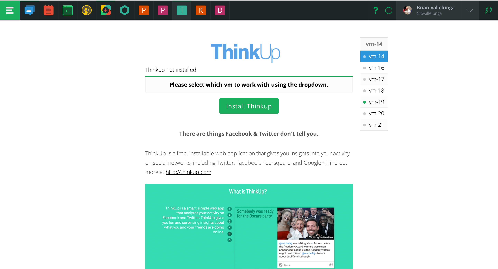
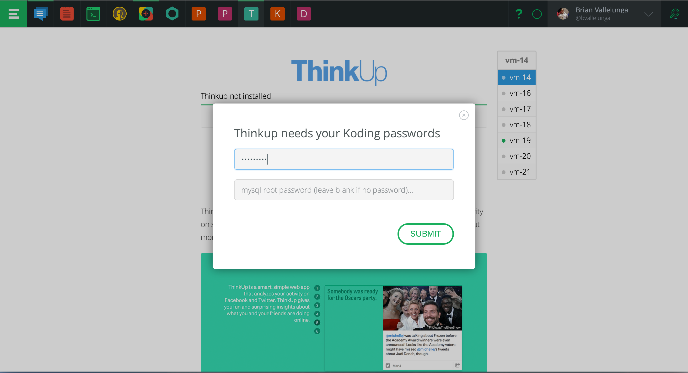

# What is Thinkup?

ThinkUp gives you insights about your social networks that you can't
find anywhere else. ThinkUp is a smart, simple web app that analyzes
your activity on Facebook and Twitter. ThinkUp gives you fun and
surprising insights about what you and your friends are doing online.

ThinkUp’s insights come any way you want them. Check them any time on
your phone, tablet, or computer at your personal ThinkUp address. Get
an email telling you what's up with your friends and followers every
day (or less often if you prefer).

# Steps to Install

1. Select the target vm from the dropdown on the right 
2. Click "Install Thinkup" button
3. Enter you Koding passwords 
4. Ensure that your Thinkup account is configured 
5. Click the link to open up Thinkup
5. Log into Thinkup with the credentials provided 
6. Thinkup is now installed and configured. Congrats! 
